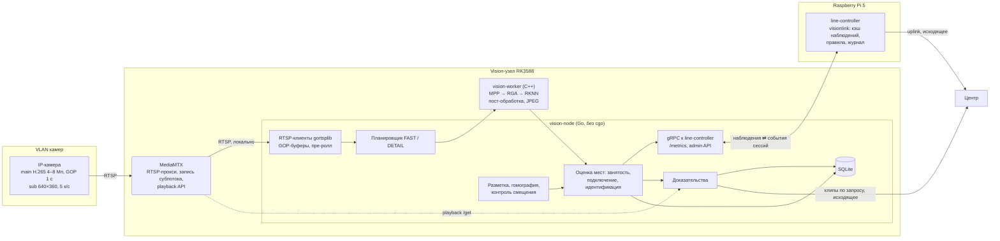
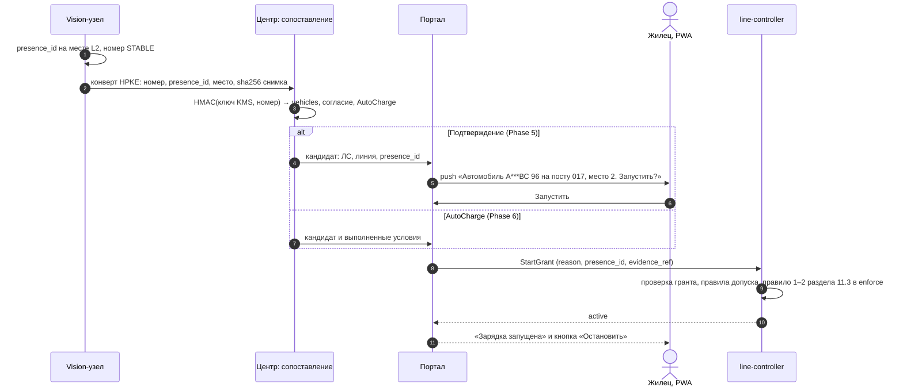

# Архитектура видеоконтроля и автоматизации AC EV-зарядок на Radxa RK3588/NPU

Версия 0.2 · 26 сентября 2026 года · Статус: предлагаемая архитектура, до реализации и стендовой проверки.

Контекст:
- [дорожная карта EVcomm 0.4](roadmap_evse_line_control_go_2026-09-25.md): сессии, гранты портала, PWA, журнал;
- [Type 2 / EKEPC2-S](roadmap_type2_evse_controller_2026-09-26.md) и [шина EKEPC2, линия GB/T + Type 2](roadmap_ekepc2_multidrop_bus_2026-09-26.md);
- [observability](observability_sre_architecture_2026-09-25.md);
- [discovery](hardware_discovery_provisioning_architecture_2026-09-25.md).

Числа — начальные проектные значения. «Проверить» означает, что значение подтверждается на стенде или в пилоте. Версии ПО, цены и лицензии сверены с первоисточниками 26.09.2026 (раздел 32).

Изменения относительно 0.1:
- **Роль vision-узла.** Он стал сенсором `line-controller`, а не backend-ом площадки. Сессии, журнал, гранты и допуск включения остаются в `line-controller` на Raspberry Pi 5 по дорожной карте 0.4. В 0.1 всё это жило на Radxa вместе с PostgreSQL.
- **Сверка решений 0.1.** Все решения прошлой версии разобраны: что оставлено, что заменено и почему (раздел 3).
- **Подключение кабеля.** Для Type 2 подключение к автомобилю определяет CP от EKEPC2, а не камера. Instance segmentation кабеля заменена классификатором порта и детектором коннектора (раздел 9.2).
- **Видеотракт.** Декодирование, масштаб и инференс идут на аппаратных блоках RK3588 без копий: MPP → RGA → RKNN. Основной поток декодируется только по событию (раздел 8).
- **Модели и лицензии.** Модели выбраны с учётом закрытого продукта: Ultralytics YOLO распространяется по AGPL-3.0 (раздел 9.7).
- **Изоляция вендорского кода.** cgo и бинарные библиотеки вендора вынесены в отдельный процесс `vision-worker`. Go-часть узла собирается без cgo (раздел 15).
- **Новые разделы:**
  - требования к камерам и плотности пикселей (раздел 6);
  - контроль смещения камеры (9.4);
  - персональные данные и 152-ФЗ (раздел 22);
  - data engine (раздел 24).
- **Модель состояния.** Состояние места разделено на независимые автоматы: занятость, подключение, идентификация (раздел 11). Голосование окном заменено байесовским фильтром с гистерезисом (раздел 12).
- **AutoCharge.** Теперь это грант портала по номеру. Зрение само разрешений не выдаёт (раздел 13.5).

## 1. Главное

1. **Компьютерное зрение — сенсор, а не источник разрешений.** Линию включает только подписанный порталом грант, который проверяет `line-controller`. Контактором зрение не управляет ни прямо, ни косвенно. Оно может:
   - пометить старт без автомобиля на месте, а после пилота — отклонить такой старт;
   - запустить остановку по уходу автомобиля, если это не противоречит электрическим данным;
   - дать доказательства к сессии.
2. **Vision-узел — отдельное устройство площадки.** Pi 5 с циклом управления видео не обрабатывает: зависший цикл означает истёкшую аренду и OFF постов. Отказ, перезагрузка или обновление vision-узла на зарядку не влияют. Без него EVcomm работает по правилам дорожной карты 0.4.
3. **Что зрение закрывает в EVcomm** (раздел 2):
   - уход без остановки и подмену автомобиля во время сессии — это известное ограничение дорожной карты, 6.6;
   - ветку GB/T, где CP не виден;
   - проверку присутствия автомобиля при старте;
   - статус места в PWA;
   - доказательства в спорах по начислению.
4. **Платформа — RK3588:**
   - NPU 6 TOPS на 3 ядрах;
   - декодер H.265 до 8K@60, это ≈ 32 потока 1080p30.
   
   Проектная ёмкость узла — 32 камеры, до 48 после замеров. Ограничивают декодер и накопитель, а не NPU. Рекомендуемое исполнение — промышленное: ROCK 5T Industrial на RK3588J или CM5 на промышленной плате. RKNN-Toolkit2 не обновлялся с апреля 2025 года (v2.3.2), поэтому бэкенд NPU скрыт за контрактом worker-а. Запасные пути — Axera AX8850 (M.2 AX-M1) и Hailo-8 (раздел 14).
5. **Видеотракт целиком на аппаратных блоках:**
   - декодирование — MPP;
   - вырезка и масштаб — RGA;
   - инференс — RKNN через DMA-BUF.
   
   FAST работает на субпотоке. Основной поток декодируется только в окнах DETAIL, начиная с GOP-буфера. Для редкого опроса декодируются только I-кадры. CPU видео не декодирует.
6. **Модели по умолчанию — с разрешительными лицензиями:**
   - детекция — YOLOX или PP-YOLOE+ (Apache-2.0, в официальном RKNN model zoo);
   - классификаторы — MobileNetV3 (BSD-3);
   - опциональная маска кабеля — PP-LiteSeg;
   - номера — LPRNet или PP-OCRv5.
   
   Ultralytics YOLO26 — только после покупки коммерческой лицензии и проверки экспорта в RKNN INT8. По опубликованным замерам YOLO26n на RK3588 не быстрее YOLO11n: 41 мс против 17 мс, хотя условия замеров различаются.
7. **Подключение кабеля определяется по-разному для двух веток:**
   - **Type 2** — состояние CP B/C от EKEPC2;
   - **GB/T** — классификатор состояния порта, детектор коннектора у автомобиля и ток ветки по WB-MAP12E.
   
   Маска кабеля — опция: она нужна для проверки «кабель к соседнему месту» и для доказательств.
8. **Номер автомобиля в нашей системе — персональные данные,** потому что связан с ЛС. На площадке он существует только в памяти узла и в конверте, зашифрованном для центра. Сопоставление с жильцом выполняется только в центре. Биометрии и распознавания лиц нет.
9. **Доказательства хранятся в двух видах:**
   - MediaMTX 1.21 непрерывно пишет субпоток;
   - клипы основного потока вокруг событий сессии собираются из пре-ролла в ОЗУ.
   
   Хеши клипов и снимков попадают в журнал `line-controller`. Сроки хранения задают решение общего собрания собственников (ОСС) и юрист.
10. **Порядок работ:**
    1. занятость и здоровье камер;
    2. доказательства сессии;
    3. связь порт–автомобиль и остановка по уходу (GB/T);
    4. ANPR в режиме наблюдения;
    5. подтверждение по номеру в PWA;
    6. AutoCharge через грант.

## 2. Место видеоконтроля в EVcomm

### 2.1. Какие пробелы закрывает зрение

| Пробел EVcomm | Где описан | Что даёт зрение | Чем подтверждается |
|---|---|---|---|
| Жилец ушёл, не остановив сессию, и к линии подключился другой автомобиль. Энергия уходит на чужой ЛС | [Дорожная карта](roadmap_evse_line_control_go_2026-09-25.md), 6.6, «Известное ограничение» | `presence_ended` на месте линии во время `active` → остановка. Новый `presence_id` в той же сессии → инцидент `vehicle_changed` | Type 2: CP → A. GB/T: ток ветки упал до нуля |
| Ветка GB/T — чёрный ящик: EVcomm не видит CP и не знает, отключён ли кабель | [Шина EKEPC2](roadmap_ekepc2_multidrop_bus_2026-09-26.md), 5.10 | Состояние порта: коннектор в держателе или вынут; коннектор у автомобиля | Ток ветки Ch1 WB-MAP12E |
| Физическое присутствие у поста при старте не проверяется | Дорожная карта, 6.3 | Автомобиль на месте линии в момент гранта | — |
| Статус линии в PWA («свободна» / «занята») известен только по сессии | Дорожная карта, 6.3 | Место свободно; место занято автомобилем без зарядки | — |
| Спор по начислению энергии на ЛС | Дорожная карта, 6.8 | Снимки и клипы сессии, привязанные к `session_id`, с хешами в журнале | Журнал, снимки энергии |
| Кабель протянут к соседнему месту | Дорожная карта, 6.3 (подтверждение линии в PWA) | Связь «порт линии N → автомобиль на месте M» | Ток ветки линии N |

### 2.2. Чего зрение не делает

- Не включает линию и не продлевает аренду. Не участвует в правилах режимов, бюджета фаз и блокировок.
- Не заменяет CP/PP, RCMU, НЗ-обратную связь контакторов и аварийную цепь.
- Не отменяет электрические факты. Когда зрение и электрика расходятся, решение принимается по электрике, а расхождение становится инцидентом (раздел 11.3).
- Не служит NVR объекта. Если на площадке есть VMS с API архива, узел хранит только ссылки на её записи.
- Не распознаёт лица и не устанавливает личность людей.

## 3. Актуализация решений версии 0.1

Обозначения: ✅ оставлено, ⚠️ оставлено с изменениями, ❌ заменено, ➕ не было в 0.1.

| # | Решение 0.1 | Вердикт | Решение 0.2 | Основание |
|---|---|---|---|---|
| 1 | Radxa-узел держит Go backend, Session Manager, Authorization Engine, PostgreSQL | ❌ | Vision-узел — сенсор. Сессии, журнал и гранты находятся в `line-controller` на Pi 5. В узле нет Authorization Engine и Port Controller | Дорожная карта 0.4: источник истины сессии — контроллер, старт только по гранту портала |
| 2 | Платформа RK3588 / RK3588S | ✅ ⚠️ | RK3588 в промышленном исполнении, 32 камеры на узел. RK3576 — для площадок до 8 камер. Запасные пути — Axera AX8850 или Hailo-8 в M.2 за тем же контрактом | RK3588 в производстве (datasheet Rev 2.2, 12.2025). Следующее поколение Rockchip ещё не поставляется (раздел 14) |
| 3 | RKNN Runtime, INT8, `.rknn` | ✅ ⚠️ | RKNN-Toolkit2 и librknnrt 2.3.2, драйвер rknpu 0.9.8, BSP-ядро 6.1. Для чувствительных слоёв — `auto_hybrid`. Mainline Rocket пока только наблюдаем | SDK не обновлялся с 09.04.2025. Rocket в Linux 6.18 ускоряет только свёртки на 200 МГц |
| 4 | Go + cgo, `libevvision.so` в процессе backend-а | ⚠️ | Go-часть узла собирается без cgo. MPP, RGA и RKNN работают в отдельном процессе `vision-worker` (C++), обмен — protobuf по Unix-сокету. go-rknnlite — только для прототипа | Сбой бинарного блоба вендора не роняет узел. Тот же принцип «без cgo», что у `line-controller`. У go-rknnlite копирующий API и нет версий |
| 5 | Декодирование видео не описано | ➕ | MPP → RGA → RKNN через DMA-BUF. FAST — на субпотоке. Основной поток декодируется только в окнах DETAIL из GOP-буфера | Иначе CPU декодирует десятки потоков, а VPU не хватит на постоянное декодирование всех основных потоков |
| 6 | Instance segmentation кабеля, связь port → cable → connector → vehicle геометрией | ❌ | Type 2 — CP EKEPC2. GB/T — классификатор порта, детектор коннектора у автомобиля и ток ветки. Семантическая маска кабеля на кропе полного разрешения — опция | Маска YOLO-seg строится в 1/4 разрешения входа. Кабель толщиной 3–5 px в кадре 4K исчезает после уменьшения до 640. CP даёт факт подключения без зрения |
| 7 | Модели не названы (подразумевался YOLO) | ⚠️ | По умолчанию Apache/BSD: YOLOX, PP-YOLOE+, MobileNetV3, PP-LiteSeg, LPRNet, PP-OCRv5. YOLO26 — при покупке Enterprise-лицензии | Код и обученные веса Ultralytics — AGPL-3.0. DEIMv2 с 24.08.2026 — только некоммерческое использование |
| 8 | MediaMTX как медиашлюз | ✅ | MediaMTX 1.21.x: RTSP-прокси, запись субпотоков в fMP4, playback API (`/list`, `/get`), хуки сегментов, Control API v3, метрики | Проект активный (1.21.1 от 20.09.2026), MIT, написан на Go, не перекодирует |
| 9 | Evidence Recorder: fMP4 на NVMe, 30 дней | ⚠️ | Три уровня: пре-ролл основного потока в ОЗУ; непрерывный субпоток 7 суток; клипы и снимки сессий со своим сроком (раздел 20) | 30 дней непрерывной записи 8 Мп при 4 Мбит/с — ≈ 1,3 ТБ на камеру и лишний износ NVMe |
| 10 | Голосование окном: 5–10 наблюдений, 3 подтверждения | ⚠️ | Байесовский фильтр (log-odds): вес по качеству кадра, гистерезис, минимальное время пребывания. При устаревании — UNKNOWN | Учитывает уверенность и неравномерную частоту кадров, даёт вероятность |
| 11 | `tracker.go` без алгоритма | ⚠️ | Занятость оценивается без трекера, по каждому месту. Трекер (ByteTrack или OC-SORT, своя реализация на Go) работает только в окнах DETAIL: приезд, отъезд, выбор кадра номера | При 1 FPS припаркованный автомобиль неподвижен. Трекеры рассчитаны на 25–30 FPS |
| 12 | Линейный автомат FREE → IDENTIFIED → CONNECTED → AUTHORIZED → CHARGING | ❌ | Независимые автоматы: занятость, подключение по ветке, идентификация. Сессия и линия остаются в `line-controller` | В 0.1 подключение требовало распознанного номера. В реальности события идут в разном порядке |
| 13 | ANPR: plate detector, OCR, нормализация, голосование | ⚠️ | Номер ищет общий детектор, регрессор находит 4 угла, номер выравнивается, CTC-OCR дообучается на RU. Коды регионов — в конфиге | Nomeroff Net — GPL-3.0. fast-plate-ocr не обучен на RU. Код 166 введён с 10.06.2026 |
| 14 | Таблица `vehicles` с `plate_normalized` и `plate_hmac` в БД площадки | ❌ | Таблица только в центре, `plate_hmac` считается ключом из KMS центра. Открытым текстом номер на площадке не хранится | Номеров ≈ 2·10⁸, поэтому HMAC с ключом на устройстве перебирается быстро |
| 15 | `events/bus.go`, общая структура Event | ⚠️ | Внутри процесса — типизированные каналы. Наружу — gRPC-поток к `line-controller` и outbox. Имена событий — по каталогу observability | MQTT-брокер из EVcomm исключён (дорожная карта 0.4) |
| 16 | PostgreSQL client на узле | ❌ | На узле SQLite (`modernc.org/sqlite`, без cgo). Факты сессии — в журнал `line-controller`. В центре — PostgreSQL и S3-хранилище, но не MinIO Community Edition | Узел без своей СУБД проще в эксплуатации. MinIO CE заархивирован 25.04.2026 |
| 17 | Prometheus metrics `vision_*` | ⚠️ | Метрики `evcomm_vision_*`, стек VictoriaMetrics из observability. Загрузка NPU — из debugfs. Добавлены SLI качества зрения | Единый каталог метрик и алертов парка |
| 18 | AutoCharge: Vision → Authorization Engine → Port Controller | ⚠️ | AutoCharge — грант портала по номеру с согласием жильца. Контроллер проверяет его как любой грант | На площадке нет другого разрешающего механизма, кроме гранта |
| 19 | Камера не специфицирована, «4 места на камеру» | ⚠️ | Для номера нужно ≥ 250 px/м. Кабель анализируется только на кропах полного разрешения. Число мест на камеру (2–4) — по расчёту (раздел 6) | Ширина номера ≥ 130 px (Axis), ≥ 120 px (Macroscop) |
| 20 | Статическая разметка при вводе камеры | ✅ ⚠️ | Добавлен автоматический контроль смещения камеры по эталонному кадру | Сдвиг камеры незаметно ломает все полигоны |
| 21 | Dataset hard examples | ⚠️ | Data engine: слабые метки из CP и тока, CVAT с SAM 2.1, синтетические номера, активное обучение | Электрика даёт бесплатную разметку состояния порта |
| 22 | OTA и откат (Phase 8) | ⚠️ | Подписанные манифесты моделей, shadow-режим, кольца выкатки | Смена модели меняет поведение системы так же, как смена бинарника |
| 23 | — | ➕ | Персональные данные: решение ОСС, таблички, отдельное согласие, уведомление Роскомнадзора (РКН) | 152-ФЗ, ЖК РФ ст. 44 и 46 |
| 24 | — | ➕ | VLM разбирает спорные случаи асинхронно в центре. На узле — только в виде исключения (RKLLM 1.3.0) | Qwen3-VL-2B на RK3588 отвечает за ≈ 2–4 с и конкурирует за NPU |

## 4. Базовые принципы

1. **Зрение не выдаёт разрешений.** Старт возможен только по гранту портала и правилам контроллера. Зрение может сузить допуск (отклонить старт без автомобиля) или запустить остановку. Остановка — безопасное направление, но и она требует подтверждения (раздел 11.3).
2. **Электрика главнее камеры.** CP, ток ветки и НЗ — факты, а наблюдение зрения — вероятность. Расхождение превращается в инцидент, а не в решение в пользу камеры.
3. **У наблюдения есть качество и возраст.** Устаревшее наблюдение, нечитаемый ночной кадр или кадр после смещения камеры дают UNKNOWN. UNKNOWN никогда не означает «свободно» или «отключено».
4. **Отказ зрения не влияет на зарядку.** Без vision-узла EVcomm работает по дорожной карте 0.4. Правила, которые используют зрение, пропускаются с пометкой в журнале.
5. **Не делать NVR,** если на объекте уже есть VMS или NVR с API архива.
6. **Не обрабатывать видео постоянно с полной частотой.** FAST — 1 кадр/с с субпотока. DETAIL — только по событию и на ROI.
7. **Видео декодирует VPU, масштабирует RGA, считает NPU.** CPU остаётся для Go-логики, геометрии и сети.
8. **Статику не распознавать нейросетью.** Места, порты, держатели и зоны задаются при вводе камеры и привязываются к идентификаторам реестра (`post017/L2/gbt`). Смещение камеры контролируется автоматически.
9. **Go — основной язык, cgo — только в изолированном процессе.** `line-controller` и Go-часть vision-узла собираются с `CGO_ENABLED=0`. Бинарные библиотеки вендора (librknnrt, MPP, RGA) живут в `vision-worker`.
10. **Решение принимается по серии наблюдений,** а не по одному кадру.
11. **У любой сессии есть доказательный временной диапазон.** Клипы и снимки связаны с `session_id` журнала, их хеши входят в цепочку журнала.
12. **Минимум персональных данных.** Номер открытым текстом не покидает память узла, кроме конверта, зашифрованного для центра. Лица не распознаются.
13. **Лицензии проверяются до обучения.** Для закрытого продукта модель, веса и датасет берутся только с разрешительной или купленной лицензией.

## 5. Физическая схема площадки

```text
                        Центр (хостинг в РФ)
   портал, PWA, gis-sync, приём телеметрии, S3 доказательств,
   сопоставление номеров (KMS), очередь проверки (VLM + оператор)
                ▲                                   ▲
                │ uplink: гранты, сессии            │ телеметрия, клипы по запросу,
                │ (исходящее, mTLS)                 │ конверты номеров (исходящее, mTLS)
┌───────────────┴───────────────────────────────────┴────────────────┐
│ Площадка                                                            │
│                                                                     │
│  Raspberry Pi 5                              Vision-узел RK3588     │
│  line-controller  ◄──── gRPC, mTLS ────►    MediaMTX                │
│  сессии, гранты,                             vision-node (Go)       │
│  журнал, аренда                              vision-worker (C++)    │
│        │                                     NVMe 2–4 ТБ            │
│        │ Modbus TCP / мост                         ▲                │
│        ▼                                           │ RTSP           │
│  VLAN постов:                              VLAN камер:              │
│  WB-MGE → MR6C, EKEPC2,                    PoE-коммутатор,          │
│  WB-MAP12E, счётчики                       IP-камеры без выхода     │
│                                            в интернет               │
└─────────────────────────────────────────────────────────────────────┘
```

### 5.1. Сети и время

- **VLAN камер изолирован.** Камеры видят только vision-узел, VMS (если есть) и NTP площадки. Выхода в интернет у них нет, облачные P2P-сервисы (Hik-Connect, EZVIZ, Dahua P2P и аналоги) выключены. Для RTSP заведена отдельная учётная запись только на чтение.
- **Vision-узел подключён к двум сетям:** к VLAN камер и к сети управления, где стоит Pi 5. Маршрутизации между VLAN камер и VLAN постов нет. Порты 502–504 шлюзов с узла недоступны по принципу одного владельца транспорта ([observability](observability_sre_architecture_2026-09-25.md), раздел 3).
- **Связь Pi ↔ узел.** gRPC с mTLS, сертификаты от CA площадок, как у телеметрии. Входящих соединений из центра нет. Запросы клипов узел забирает сам по своему исходящему каналу.
- **Время.** Pi, узел и камеры синхронизируются от NTP площадки. Отметка кадра ставится при приёме на узле. Расхождение с часами камеры — метрика `evcomm_vision_camera_clock_skew_seconds`. Интервалы доказательств строятся по времени узла и сверяются с журналом контроллера по `session_id`.

### 5.2. Масштаб

- Узел владеет фиксированным набором камер из инвентаря. Проектное значение — 32 камеры, то есть 96–128 мест.
- Предел ёмкости задают одновременные окна DETAIL на основных потоках, ОЗУ под пре-ролл и накопитель. NPU предел не задаёт (бюджет — раздел 8.3).
- Площадке на 600 мест нужно 5–7 узлов и резервный комплект.
- На старте HA нет. При отказе узла места его камер переходят в UNKNOWN, а зарядка продолжается.

## 6. Камеры и геометрия

### 6.1. Требования к плотности пикселей

| Задача | Требование | Основание |
|---|---|---|
| Занятость места | Автомобиль ≥ 60–80 px по короткой стороне в кадре FAST (640×360) | Типично для детекторов класса YOLOX-s. Проверить на стенде |
| Номер (ANPR) | Ширина номера ≥ 130 px (однострочный), ≥ 70 px (двухстрочный). Угол к оси ≤ 30°, наклон ≤ 5° | Axis License Plate Verifier. У Macroscop: номер ≥ 120×20 px, высота символа ≥ 15 px |
| Номер, пересчёт | 130 px / 0,52 м ≈ 250 px/м на дальнем месте | Номер типа 1 — 520×112 мм (ГОСТ Р 50577-2018). Совпадает с уровнем «identify» EN/IEC 62676-4 |
| Состояние порта и держателя | Коннектор ≥ 24–32 px (проверить) | Анализ на кропе полного разрешения |
| Кабель (опционально) | Толщина в кадре ≥ 3–4 px | Диаметр кабеля 32 А ≈ 12–16 мм (проверить у поставщика) |

### 6.2. Расчёт для ряда мест

Типовое машино-место — 5,3 × 2,5 м. Ширина ряда из N мест с запасом 1 м равна 2,5·N + 1 м. Расчёт ниже — для фронтального вида. Наклон и дисторсия объектива уменьшают плотность на дальнем краю. Поэтому при вводе `camera-probe` измеряет реальные px/м по номеру известного размера.

| Камера | 3 места (8,5 м) | 4 места (11 м) |
|---|---|---|
| 4 Мп (2560 px) | 300 px/м: номер 157 px, кабель 14 мм ≈ 4 px | 233 px/м: номер 121 px, кабель ≈ 3 px |
| 8 Мп (3840 px) | 452 px/м: номер 235 px, кабель ≈ 6 px | 349 px/м: номер 181 px, кабель ≈ 5 px |

Выводы:
- **8 Мп на 4 места или 4 Мп на 3 места.** ANPR на 4 места с камеры 4 Мп — на грани. В этом случае нужна отдельная ANPR-камера или меньше мест на камеру.
- **Кабель анализируется только на кропах полного разрешения.** В кадре FAST шириной 640 px на 11 м приходится 58 px/м, и кабель занимает меньше пикселя.

### 6.3. Требования к камере

- **ONVIF Profile T.** Приём на сертификацию по Profile S прекращается 31.03.2027. Profile M желателен, если используется аналитика камеры.
- **Основной поток:** H.265, 4–8 Мп, фиксированный GOP 1 с, то есть I-кадр каждую секунду. Без «умных» кодеков с переменным GOP (H.265+, Smart Codec и аналоги): они ломают вырезку клипов и задерживают старт декодирования. H.264 допустим только как исключение: для него ёмкость декодера RK3588 вдвое меньше.
- **Субпоток:** 640×360 или 704×576, 5 кадров/с, GOP 1 с.
- **Изображение:**
  - матрица не меньше 1/1.8" или эквивалент для слабого света;
  - WDR ≥ 120 дБ против фар и засветки у въезда;
  - ИК-подсветка на нужную дальность;
  - вариофокальный объектив, чтобы подогнать плотность пикселей.
- **Ночной ANPR:** короткая выдержка и ИК. Если камера обзора не даёт 250 px/м, ставится отдельная ANPR-камера.
- **Снимок по HTTP** (`GetSnapshotUri`) — нужен для ввода в эксплуатацию.
- **Исполнение для открытой парковки:** IP66/67, IK10, PoE (802.3af/at). Для Екатеринбурга рабочий диапазон не уже −40…+50 °C (проверить у модели).
- **Эксплуатация:** синхронизация по NTP, отключаемые облачные сервисы, обновляемая прошивка.

### 6.4. Размещение

- **Подземный паркинг.** Свет стабилен, осадков нет. Но низкий потолок (2,5–3 м) даёт крутой угол к номеру. Камеру ставят на стену напротив передних номеров или на пост и проверяют, что угол не больше 30°.
- **Открытая парковка.** Снег на номерах и объективе, низкое зимнее солнце, наледь. Нужны козырёк и подогрев, качество кадра контролируется (раздел 9.4).
- **Что камера должна видеть:**
  - места целиком;
  - порты и держатели своих линий;
  - зону зарядного разъёма автомобиля — у моделей Geely и BYD на площадке она расположена по-разному, проверить;
  - передний номер.

## 7. Логическая архитектура



- **MediaMTX — единственный клиент камеры.** Камера отдаёт по одному соединению на поток, а MediaMTX раздаёт их vision-node, записи и живому просмотру. Это важно для камер с малым лимитом RTSP-сессий.
- **Разделение `vision-node` и `vision-worker`.** Go-процесс не знает о RKNN. Worker не знает о местах, сессиях и правилах.
- **Решения по электрике принимает контроллер.** `line-controller` получает наблюдения мест и сам сопоставляет их с CP, током и сессией.

## 8. Видеотракт

### 8.1. Потоки

| Поток | Путь | Декодирование | Назначение |
|---|---|---|---|
| Субпоток 640×360, 5 к/с | камера → MediaMTX → vision-node → worker | Постоянно, MPP. В NPU идёт 1 кадр/с | FAST: занятость, движение в зоне места |
| Основной 4–8 Мп, GOP 1 с | камера → MediaMTX → vision-node | Только в окнах DETAIL, с последнего I-кадра из GOP-буфера. Для редкого опроса — только I-кадры | DETAIL: порт, коннектор, номер, снимки |
| Основной, пре-ролл | vision-node, ОЗУ | Не декодируется | Клипы вокруг событий сессии (раздел 20) |
| Субпоток, запись | MediaMTX → fMP4 на NVMe | Не декодируется | Непрерывное покрытие для разбора |

**GOP-буфер.** vision-node хранит access units основного потока каждой камеры за последние 30 с. Это пре-ролл: ≈ 15 МБ на камеру при 4 Мбит/с. Когда открывается окно DETAIL, в worker уходят кадры начиная с последнего I-кадра. Первый кадр готов после декодирования не более 25–30 кадров, на VPU это заметно меньше секунды. Затем в течение окна worker получает все кадры, а в NPU уходят 3–5 кадров/с. После окна подача прекращается, а контекст декодера возвращается в пул.

**Редкий опрос без P-кадров.** При GOP 1 с каждую секунду приходит независимый I-кадр. Для снимка раз в 5–15 минут во время сессии декодируется один I-кадр, без цепочки P-кадров.

### 8.2. Цепочка без копий

1. vision-node передаёт access unit (Annex-B) в worker по Unix-сокету. Поток основного видео — ≈ 4 Мбит/с, так что копировать несколько сотен КБ/с дёшево.
2. MPP декодирует в DMA-BUF (NV12) из внешней группы буферов. Дескриптор берётся через `mpp_buffer_get_fd`.
3. RGA: `importbuffer_fd` → `improcess`. В одном вызове вырезается ROI, меняется масштаб и формат NV12 → RGB888 во второй DMA-BUF. Буферы выделяются из dma32 heap: ядро RGA2 работает только с памятью ниже 4 ГБ.
4. RKNN: `rknn_create_mem_from_fd` и `rknn_set_io_mem`, нативный вход NHWC с учётом `w_stride`.
5. Пост-обработка выполняется в worker на C++: декодирование голов, NMS или top-k, маски. Код берётся из rknn_model_zoo.
6. Результат возвращается в vision-node: боксы, классы и уверенность, при необходимости RLE-маска и JPEG-кроп. JPEG кодирует аппаратный энкодер MPP.

Для прототипа (Phase 0) годятся ffmpeg-rockchip (`hevc_rkmpp`, `scale_rkrga`) и go-rknnlite. У go-rknnlite копирующий API и предобработка через GoCV. Для production это не подходит.

### 8.3. Бюджет узла

Ориентир для 32 камер, проверяется в `vision-bench`.

| Ресурс | На камеру | 32 камеры | Возможности RK3588 |
|---|---|---|---|
| VPU, постоянно: субпоток 640×360@5 | ≈ 0,02 × 1080p30 | ≈ 0,6 × 1080p30 | H.265 8K@60 ≈ 32 × 1080p30 (по пиксельной скорости) |
| VPU, окно DETAIL: 8 Мп@25 | ≈ 3,3 × 1080p30 | 4–6 одновременных окон ≈ 13–20 × 1080p30 | То же; для H.264 вдвое меньше |
| VPU, I-кадры для снимков | 0,2 к/с × 8 Мп | ≈ 0,9 × 1080p30 | — |
| NPU, FAST: 1 инференс/с | YOLOX-s INT8 ≈ 27 мс на ядре | ≈ 0,9 ядра | 3 ядра, по контексту на ядро |
| NPU, DETAIL: 3–5 к/с × 2–4 модели на ROI | — | 4–6 окон ≈ 1 ядро (проверить) | — |
| ОЗУ, пре-ролл 30 с | ≈ 15 МБ | ≈ 0,5 ГБ | 16 ГБ |
| Сеть: основной 4 + суб 0,5 Мбит/с | 4,5 Мбит/с | ≈ 145 Мбит/с | 2,5 GbE |
| NVMe (раздел 20.3) | — | ≈ 185 ГБ/сут записи, ≈ 1,6 ТБ занято | 2–4 ТБ |

Цифры NPU у вендора (YOLO11n — 60 к/с на ядре) измерены без пред- и пост-обработки на максимальной частоте. Критерий приёмки — сквозная задержка от кадра до результата, а не `rknn.run`. Поддерживать нужно только H.265: H.264-камеры вдвое сокращают запас декодера.

## 9. Что распознаём и чем

### 9.1. Задачи и модели

| Задача | Где | Модель по умолчанию (лицензия) | Вход | Частота |
|---|---|---|---|---|
| Автомобиль, человек (занятость, перекрытие) | FAST | YOLOX-s или PP-YOLOE+-s INT8 (Apache-2.0, RKNN zoo), дообучение | Кадр субпотока 640×384 | 1 к/с |
| Занятость места — второй голос для трудной геометрии | FAST | MobileNetV3-Small (BSD-3, torchvision), классификатор кропа места | Кроп места после гомографии, 224×224 | 1 к/с |
| Состояние порта линии: в держателе / вынут / перекрыт | DETAIL | MobileNetV3-Small, классификатор | Кроп порта полного разрешения, 160–224 px | 3–5 к/с в окне, затем I-кадр раз в 5 мин |
| Коннектор у автомобиля | DETAIL | YOLOX-tiny INT8, класс `connector_head` | Кроп зоны разъёма автомобиля | В окне |
| Маска кабеля (опция) | DETAIL | PP-LiteSeg (Apache-2.0, RKNN zoo) или PIDNet / DDRNet (MIT), бинарная маска | Тайлы полного разрешения 512–1024 px | По запросу |
| Номер: детекция | DETAIL | Класс `plate` в детекторе DETAIL | Кроп автомобиля полного разрешения | В окне |
| Номер: углы | DETAIL | Регрессор 4 углов на MobileNetV3 (BSD-3) | Кроп номера | В окне |
| Номер: OCR | DETAIL | CTC-распознаватель: LPRNet (Apache-2.0, RKNN zoo) или PP-OCRv5 `eslav` rec (Apache-2.0), дообучение на RU | Выровненный номер 94×24 или 320×48 | В окне |
| Внешний вид автомобиля | DETAIL | Эмбеддинг MobileNetV3 (веса ImageNet, BSD-3) и цветовая гистограмма | Кроп автомобиля | Приезд, старт, раз в 5 мин |
| Качество кадра и смещение камеры | worker, CPU | Классические методы: дисперсия лапласиана, гистограмма, ORB + RANSAC-гомография | Кадр субпотока | Раз в 1–5 мин |

### 9.2. Связь «порт → автомобиль»

В 0.1 связь искали через маску кабеля и геометрию. Это заменено сочетанием электрики и дешёвых классификаторов. Причины:
- **Маска слишком грубая.** Маска YOLO-seg строится в 1/4 разрешения входа (160×160 при входе 640). Кабель толщиной несколько пикселей распадается на куски или исчезает.
- **Маска кабеля ненадёжна даже для крупных моделей.** Это подтверждают работы по тонким деформируемым объектам.
- **Для Type 2 факт подключения уже известен из CP.**

**Ветка Type 2:**
- `PLUGGED` — EKEPC2 в состоянии B или C (регистр 141, по карте прошивки). Это факт.
- Зрение уточняет, к какому месту идёт кабель: коннектор не в держателе своей линии и находится у автомобиля на месте этой линии.
- Если на месте линии автомобиля нет, а EKEPC2 в B, кабель протянут к соседнему месту → `cable_to_other_spot`.

**Ветка GB/T:**
- До начала потребления электрического признака подключения нет. Зрение даёт `PLUGGED_VISUAL`: порт «вынут» и коннектор у автомобиля на месте линии.
- После старта ток ветки Ch1 выше порога подтверждает подключение.
- Ток упал до нуля одновременно с `presence_ended` → автомобиль отключился и уехал.

**Маска кабеля (опция).** Скелет маски строится в Go, затем проверяется связность от якоря порта до маски автомобиля. Нужна для `cable_to_other_spot` и как иллюстрация в доказательствах.

**Слабые метки.** Состояние CP EKEPC2 и ток ветки размечают кадры порта бесплатно. Это основной источник данных для обучения классификатора порта (раздел 24.4).

### 9.3. Номер

Подробно — раздел 21.

### 9.4. Качество кадра и смещение камеры

**При вводе в эксплуатацию** сохраняются:
- эталонные кадры, дневной и ночной;
- маска статических областей: стены, колонны, посты, без самих мест;
- ключевые точки.

**Контроль смещения раз в 1–5 минут.** Ключевые точки ORB или AKAZE ищутся по статической маске, затем RANSAC строит гомографию к эталону.
- Смещение меньше `drift_auto_px` (например, 8 px): полигоны пересчитываются по гомографии, событие пишется в журнал.
- Смещение больше `drift_alert_px` (например, 25 px) или мало совпадений: `LAYOUT_DRIFT`. Места камеры переходят в UNKNOWN, сервисной службе уходит заявка.

**Деградация кадра** даёт `camera_degraded` и снижает вес наблюдений. Признаки:
- размытие: дисперсия лапласиана ниже базовой линии камеры;
- засветка или чернота: по гистограмме;
- залипший кадр: одинаковый хеш подряд;
- паутина и капли в ИК-свете: рост размытия ночью.

### 9.5. Непрерывность автомобиля

Номер читается не всегда. Чтобы заметить подмену без номера, узел запоминает эмбеддинг внешнего вида при `presence_started` и при старте сессии. Эмбеддинг хранится только в памяти и удаляется при закрытии сессии.

Каждые 5 минут и после перекрытия он сравнивается с текущим. Резкое изменение вместе с разрывом присутствия даёт `vehicle_changed`. Эмбеддинг внешнего вида автомобиля не является биометрией и не идентифицирует человека.

### 9.6. Опциональные классы

- **person** — только для учёта перекрытий и как контекст в доказательствах. Личность не устанавливается.
- **smoke** — классификатор кадра с подтверждением во времени. Даёт только уведомление и в аварийную цепь не входит.
- **obstacle** и **open_cabinet_door** — классификатор ROI шкафа.
- Open-vocabulary детекторы (YOLOE — AGPL-3.0, YOLO-World — GPL-3.0) применяются только офлайн для разметки.

### 9.7. Лицензии и совместимость с RKNN

| Семейство | Лицензия | RKNN INT8 на RK3588 | Решение |
|---|---|---|---|
| Ultralytics YOLO11 / YOLO26, YOLOv8-seg / -pose | AGPL-3.0 для кода и обученных весов, либо Enterprise (цена по запросу) | YOLO11 — в zoo, 60 к/с на ядре (n). YOLO26 — INT8 только для детекции. TopK не поддерживается, поэтому нужен community-экспорт с top-k на CPU. YOLO26n — 41 мс, YOLO26s — 37–62 мс | Только при покупке Enterprise. Проверить, возможна ли оплата из РФ |
| YOLOv12 / YOLOv13 | AGPL-3.0 | Нет: тяжёлое внимание | Не использовать |
| **YOLOX, PP-YOLOE+** | **Apache-2.0** | **В zoo, INT8: yolox_s — 37 к/с, ppyoloe_s — 32,5 к/с на ядре** | **По умолчанию** |
| RF-DETR N–L (det / seg) | Apache-2.0; XL/2XL — PML-1.0 | Полного экспорта нет: деформируемое внимание и `grid_sample`. Декодер на CPU ≈ 200 мс | В центре и для разметки |
| D-FINE, DEIM v1, RT-DETRv2/v4, LW-DETR | Apache-2.0 | `GridSample` не поддерживается | Не для RKNN; кандидаты при переходе на Axera |
| DEIMv2, EdgeCrafter | С 24.08.2026 — только некоммерческое использование | — | Не использовать |
| PP-LiteSeg | Apache-2.0 | В zoo, 35,7 к/с | Маска кабеля |
| PIDNet, DDRNet | MIT | Проверить | Альтернатива PP-LiteSeg |
| SegFormer | Лицензия NVIDIA, некоммерческая | — | Не использовать |
| LPRNet, PP-OCRv4 / v5 | Apache-2.0 | LPRNet — в zoo (FP16, 586 к/с). PP-OCRv4 rec — FP16. v5 — проверить | OCR номера |
| fast-plate-ocr | MIT | Конвертация не проверена, RU не обучен | Кандидат после дообучения |
| Nomeroff Net | GPL-3.0, построен на Ultralytics | — | Не использовать; перенять подход с 4 углами |
| SAM 2.1 | Apache-2.0 | — | Разметка |
| SAM 3 / 3.1, DINOv3 | Коммерческое использование разрешено, но есть условие Trade Controls | — | Только после юридической оценки |

## 10. Событийная модель FAST / DETAIL

**FAST** работает постоянно: 1 кадр/с с субпотока каждой камеры. На выходе — вероятность занятости по каждому месту и признак движения в его зоне.

**DETAIL** запускается по событию. Окно — 3–5 кадров/с основного потока, анализ только по ROI нужных мест.

| Триггер | Источник | Окно |
|---|---|---|
| Кандидат на приезд или уход: вероятность места пересекла порог | FAST | 10–20 с |
| Грант принят, линия `ARMED`/`ON`, старт сессии | `line-controller` | 15 с + снимок |
| CP EKEPC2: A ↔ B ↔ C | `line-controller` | 10 с |
| Ток ветки начал или прекратил расти | `line-controller` | 10 с |
| Остановка сессии, линия OFF | `line-controller` | 15 с + снимок |
| Состояние порта UNKNOWN или конфликт слияния | vision-node | 10 с |
| Плановый снимок во время сессии | Таймер | 1 I-кадр раз в 15 мин (проверить) |
| Запрос оператора | admin API | По запросу |

Правила планировщика:
- Одновременных окон на узел не больше `detail_max_windows`, начальное значение — 6.
- Приоритет: конфликт слияния > события сессии > приезд и уход > плановые снимки.
- При перегрузке снижается частота кадров в окнах. Окна событий сессии не отбрасываются.

## 11. Состояние места и слияние с телеметрией

### 11.1. Автоматы

Вместо одного линейного автомата 0.1 работают независимые автоматы. Сессия и линия остаются в `line-controller`.

**Занятость места** (vision-узел):

```text
UNKNOWN ──P ≥ θ_on дольше T_arrive──► OCCUPIED(presence_id)
UNKNOWN ──P ≤ θ_off дольше T_depart──► FREE
FREE ──P ≥ θ_on дольше T_arrive──► OCCUPIED(новый presence_id)
OCCUPIED ──P ≤ θ_off дольше T_depart──► FREE (presence_ended)
любое ──устаревание, деградация, смещение камеры──► UNKNOWN
```

`presence_id` — ULID одного присутствия автомобиля на месте. Он живёт от приезда до ухода и связывает наблюдения, снимки, номер и сессию.

**Подключение** по ветке линии (`post017/L2/gbt`, `post017/L2/type2`):

| Состояние | Смысл | Кто устанавливает |
|---|---|---|
| `UNPLUGGED` | Коннектор в держателе | Зрение; для Type 2 также CP A |
| `PLUGGED_VISUAL` | Коннектор вынут и находится у автомобиля на месте линии | Зрение |
| `PLUGGED` | Электрический факт: CP B/C (Type 2) или ток ветки выше порога | `line-controller` |
| `UNKNOWN` | Нет свежих данных или порт перекрыт | — |

**Идентификация** присутствия:
- `NONE` → `CANDIDATE` (есть чтения номера) → `STABLE` (голосование сошлось, раздел 12).
- Затем в центре: `MATCHED` или `UNMATCHED`. Сам номер в автомате не хранится.

### 11.2. Источники

| Источник | Сигналы | Частота | Владелец |
|---|---|---|---|
| Зрение | Занятость, `presence_id`, состояние порта, коннектор у автомобиля, связь с местом, идентификация, качество | 1 с (FAST), события | vision-узел |
| EKEPC2 (Type 2) | Код 141 → A / B / C / авария / стоп, PP, замок, RCMU | 0,5–1 с | `line-controller` |
| WB-MAP12E | Irms и энергия по ветке | 1 с | `line-controller` |
| MR6C | coil, real state, НЗ Kx | 100 мс | `line-controller` |
| Сессия | Грант, состояние, `session_id` | События | `line-controller` |

### 11.3. Правила слияния

Правила вычисляет `line-controller`, потому что только у него есть электрика. У каждого правила есть режим:
- `observe` — только запись в журнал;
- `advise` — подсказка в PWA и инцидент;
- `enforce` — влияет на старт или остановку.

В `enforce` правило переводится только после пилота по утверждённым показателям (раздел 25, Phase 3).

| # | Ситуация | Зрение | Электрика | Вывод и действие | Режим на старте |
|---|---|---|---|---|---|
| 1 | Грант на линию L | Место L `OCCUPIED`, качество `OK` | — | Присутствие подтверждено. Запись `vision_presence_at_start` | observe |
| 2 | Грант на линию L | Место L уверенно `FREE`, камера здорова | — | Автомобиля нет. `advise`: PWA спрашивает «На месте 2 не видно автомобиля. Продолжить?». `enforce`: `start_failed: no_vehicle` | observe |
| 3 | Грант на линию L | `UNKNOWN` | — | Данных нет. Старт по обычным правилам, флаг `vision_unknown` | — |
| 4 | Сессия `active`, GB/T | `presence_ended` подтверждён | Ток ветки ниже порога | Автомобиль уехал. Остановка, `stop_reason: vehicle_departed` | advise |
| 5 | Сессия `active` | `presence_ended` | Ток выше порога | Противоречие. Без остановки: инцидент `fusion_conflict: departed_with_current`, окно DETAIL | — |
| 6 | Сессия `active` | Новый `presence_id` после ухода | Ток снова вырос | Подмена. Остановка, инцидент `vehicle_changed`, push владельцу сессии | advise |
| 7 | Сессия `active`, Type 2 | — | CP → A | Кабель отключён. Работает логика EKEPC2, зрение даёт доказательства | — |
| 8 | Сессии нет | Порт вынут, коннектор у автомобиля | Ток 0 | Подключён без сессии. Статус в PWA: «подключён, не запущен» | advise |
| 9 | Сессии нет | — | Ток ветки выше порога | Ток без авторизации: существующий `safety.violation`, плюс клип и снимки | — |
| 10 | Линия `ARMED`/`ON` | Место `FREE` подтверждено дольше `T_empty` | — | Порт включён без автомобиля: инцидент `port_on_no_vehicle`. Для GB/T — остановка | advise |
| 11 | Type 2 в B/C | На месте линии автомобиля нет, на соседнем есть | — | Кабель к другому месту: инцидент `cable_to_other_spot`, запрос подтверждения в PWA | advise |
| 12 | Место `OCCUPIED` дольше `T_idle_parking` | Без подключения и сессии | Ток 0 | Место занято без зарядки. Статус в PWA, отчёт УК; не штраф | observe |
| 13 | Качество деградировало | `UNKNOWN` | Любая | Правила, которым нужно зрение, пропускаются, в журнал пишется `vision_unknown` | — |

Параметры (начальные, проверить):
- `T_depart` = 60 с. Прохожий или манёвр не должны вызывать остановку.
- `T_empty` = 120 с.
- `T_idle_parking` = 30 мин.
- Порог тока ветки — выше шума канала WB-MAP12E.

**Зрение не останавливает сессию, пока идёт ток.** Автомобиль, который уехал, ток потреблять не может, поэтому такое сочетание означает ошибку зрения.

### 11.4. Инциденты

| Инцидент | Смысл |
|---|---|
| `port_on_no_vehicle` | Линия включена, место подтверждённо свободно |
| `vehicle_departed_session_active` | Автомобиль уехал при активной сессии (до остановки по правилу 4) |
| `vehicle_changed` | Во время сессии на месте другой автомобиль |
| `cable_to_other_spot` | Кабель линии ведёт к соседнему месту |
| `fusion_conflict` | Зрение противоречит электрике; подвид — в `kind` |
| `camera_degraded`, `layout_drift`, `vision_unknown` | Качество зрения недостаточно для решений |

Из списка 0.1 убраны:
- `CONTACTOR_ON_NO_CURRENT`. Для Type 2 пауза C → B — нормальная работа ([шина EKEPC2](roadmap_ekepc2_multidrop_bus_2026-09-26.md), раздел 2). Для GB/T этот случай закрывает `idle_start_timeout` дорожной карты.
- `EV_NOT_ACCEPTING_POWER`. Это тот же `idle_start_timeout`, отдельного инцидента не нужно.
- `CURRENT_WITHOUT_AUTHORIZATION`. Он уже есть в контроллере как `safety.violation`.

## 12. Временная фильтрация

**Для каждого места и признака** (занятость, состояние порта) ведётся логарифм отношения шансов:

```text
L_t = clamp(λ · L_{t−1} + w_q · log(p_t / (1 − p_t)), −L_max, L_max)
P_t = 1 / (1 + e^(−L_t))
```

- `p_t` — калиброванная уверенность модели на кадре.
- `w_q` — вес качества кадра: `OK` = 1, `DEGRADED` = 0,3, место перекрыто человеком или движущимся автомобилем = 0.
- `λ < 1` тянет L к нулю, когда наблюдений нет. Без свежих кадров P стремится к 0,5, и состояние уходит в UNKNOWN.
- `L_max` ограничивает инерцию: смена состояния после долгой стоянки не должна требовать сотен кадров.
- Порог включения θ_on (P ≥ 0,95) не равен порогу выключения θ_off (P ≤ 0,05). Это гистерезис.
- Переход засчитывается, только если порог выдержан `T_arrive` (10 с) или `T_depart` (60 с).
- Наблюдение старше `stale_after` (5 с для FAST) не учитывается.

По сравнению с окном 0.1 фильтр учитывает уверенность, неравномерную частоту кадров и перекрытия, а на выходе даёт вероятность. Она уходит в `line-controller` и в журнал.

**Голосование по номеру** идёт в пределах одного присутствия:
1. Каждое чтение нормализуется: латинские двойники переводятся в кириллицу, проверяется формат и список регионов (раздел 21).
2. Вес чтения = уверенность OCR × качество кадра, которое зависит от ширины номера в px и угла.
3. Если длина и формат совпадают, голосование идёт по позициям символов. Иначе — по строкам целиком.
4. `STABLE` наступает, когда выполнены все условия:
   - вес лидера ≥ `W`;
   - отрыв от второго кандидата ≥ `M`;
   - не меньше `K` чтений из кадров, разнесённых во времени хотя бы на 1 с.

## 13. Интеграция с line-controller

### 13.1. Контракт VisionLink

`line-controller` — gRPC-клиент vision-узла. Поток двунаправленный: контроллер отправляет события сессий и линий (для DETAIL и доказательств), узел отвечает состоянием мест.

```proto
service VisionLink {
  rpc Session(stream ControllerEvent) returns (stream VisionUpdate);
}

message SpotView {
  string spot = 1;                 // "post017/L2" — идентификатор из реестра
  Occupancy occupancy = 2;         // FREE / OCCUPIED / UNKNOWN
  string presence_id = 3;          // ULID присутствия; пусто при FREE
  float p_occupied = 4;
  repeated PortView ports = 5;     // по веткам: gbt, type2
  IdentityState identity = 6;      // NONE / CANDIDATE / STABLE — без номера
  Quality quality = 7;             // OK / DEGRADED / CAMERA_FAULT / LAYOUT_DRIFT
  google.protobuf.Timestamp observed_at = 8;
  uint32 layout_version = 9;
  string model_set = 10;           // версия набора моделей
  string snapshot_ref = 11;        // последний снимок, sha256
}

message PortView {
  string port = 1;                 // "post017/L2/gbt"
  PortState state = 2;             // HOLSTERED / OUT / OCCLUDED / UNKNOWN
  bool connector_at_vehicle = 3;
  string connected_spot = 4;       // место, у автомобиля которого коннектор
  float confidence = 5;
}

message VisionUpdate {
  uint64 seq = 1;                  // монотонный номер узла: пропуски видны
  oneof kind {
    SpotView spot = 2;             // при изменении и как heartbeat раз в 2 с
    EvidenceLinked evidence = 3;   // клипы и снимки сессии с sha256
    VisionIncident incident = 4;
  }
}

message ControllerEvent {
  oneof kind {
    SessionEvent session = 1;      // authorized, active, stopping, closed
    LineEvent line = 2;            // ARMED, ON, OFF
    EvseEvent evse = 3;            // CP A/B/C, авария
    BranchCurrent current = 4;     // начало и конец потребления
    EvidenceRequest evidence = 5;  // запрос доказательств по session_id
  }
}
```

Правила на стороне контроллера:
- **Приём.** Пакет `internal/visionlink` принимает поток в своей goroutine и публикует неизменяемый снимок мест через атомарный указатель. Такт управления читает только снимок и никогда не ждёт сеть, как метрики в [observability](observability_sre_architecture_2026-09-25.md), раздел 6.2.
- **Возраст** считается по монотонным часам контроллера в момент приёма. Если снимок старше `vision_stale_after` (5 с), место считается `UNKNOWN`.
- **Обрыв потока** переводит все места в `UNKNOWN`, `evcomm_vision_link_up` = 0. Переподключение — с джиттером.
- **Очереди событий к узлу ограничены.** При переполнении сначала отбрасываются события тока, события сессий сохраняются.

Привязка линии к месту и режимы правил задаются в реестре. Пример (формат уточняется вместе с `internal/registry`):

```yaml
posts:
  - id: post017
    lines:
      - id: L2
        vision:
          spot: post017/L2
          rules:                        # observe | advise | enforce
            presence_at_start: observe
            departure_stop: observe
            vehicle_changed: observe
            port_on_no_vehicle: observe
            cable_to_other_spot: observe
```

### 13.2. Новые записи журнала

| Запись | Содержимое |
|---|---|
| `vision_presence_at_start` | `session_id`, `SpotView` на момент гранта (занятость, P, `presence_id`, качество), `layout_version`, `model_set`, sha256 снимка |
| `stop_requested` с `stop_reason` = `vehicle_departed`, `vehicle_changed` или `port_on_no_vehicle` | Плюс `presence_id`, ссылка на доказательства, sha256 |
| `vision_incident` | Вид, место, `presence_id`, ссылки на снимки и клипы |
| `evidence_linked` | `session_id`, ссылки на клипы и снимки, их sha256 |

Хеши доказательств входят в цепочку хешей журнала. Подмена клипа или снимка после сессии обнаруживается при проверке журнала.

### 13.3. Статус линии для PWA

К статусу линии в канале площадка–центр добавляются:
- `place`: `free`, `occupied`, `unknown`;
- `plugged`: `yes`, `no`, `unknown`.

PWA показывает «место занято, зарядка не идёт» и подсказывает «кабель подключён — запустите сессию». Номер и снимки в статус не входят.

### 13.4. Отказы

| Отказ | Поведение |
|---|---|
| Узел недоступен, поток оборван | Все места `UNKNOWN`, правила зрения пропускаются, зарядка идёт по правилам 0.4. Алерт |
| Перезапуск worker | Наблюдения устаревают до восстановления (цель ≤ 30 с), systemd перезапускает процесс |
| Камера недоступна или деградировала | Места камеры `UNKNOWN`, заявка сервисной службе |
| Смещение камеры | Места камеры `UNKNOWN`, пока разметку не подтвердят или не пересчитают |
| Модель выдаёт мусор (видно по shadow-режиму и конфликтам) | Откат набора моделей по манифесту (раздел 24.2) |
| Нет WAN | Всё работает локально, клипы и конверты номеров копятся в очереди узла |

### 13.5. Подтверждение по номеру и AutoCharge

**На площадке нет компонента, который по номеру включает линию.** Номер только помогает порталу выдать обычный грант.



Условия AutoCharge. Все проверяются в центре. Присутствие, подключение и готовность линии контроллер проверяет повторно, при исполнении гранта:
- номер `STABLE` и сопоставлен с автомобилем жильца, у которого включён AutoCharge и дано отдельное согласие;
- права Z/A/U действуют, лимит сессий ЛС не превышен;
- место линии `OCCUPIED` с тем же `presence_id`, камера здорова, смещения нет;
- внешний вид совпадает с эталоном автомобиля, если эталон есть. Это защита от поддельного номера;
- подключение: для Type 2 — CP B; для GB/T — `PLUGGED_VISUAL`, и AutoCharge на GB/T включается только после пилота;
- линия свободна, пост в состоянии `ready`.

Меры против клонированного номера:
- по умолчанию AutoCharge выключен;
- на первом этапе — только Type 2 с CP;
- проверяется внешний вид;
- жилец получает push с кнопкой «Остановить»;
- у первой автосессии ограничены энергия и длительность;
- спор разбирается по доказательствам.

## 14. Платформа vision-узла

### 14.1. Варианты

| Вариант | NPU | Аппаратное декодирование | Цена и наличие (26.09.2026) | Оценка |
|---|---|---|---|---|
| **RK3588: ROCK 5T Industrial (RK3588J, −40…+85 °C, 2×2,5 GbE, PoE, 2× M.2) или CM5 на промышленной плате** | 6 TOPS, 3 ядра. YOLO11n INT8 — 60 к/с на ядре (вендор), 162 к/с на трёх ядрах сквозь MPP и RGA (сообщество) | H.265 8K@60 ≈ 32 × 1080p30; H.264 8K@30 ≈ 16 × 1080p30 | ROCK 5T: $79,5 на старте, сейчас $179,9, нет в наличии. Radxa заявляла поставки CM5 минимум до 09.2032 | **Рекомендуется** |
| RK3576 (ROCK 4D) | 6 TOPS с учётом разреженности, 2 ядра; YOLO11n — 78 к/с на ядре | H.265 4K@120 ≈ 16 × 1080p30; H.264 ≈ 8×. PCIe 2.1 ×1 | $30–100 на старте, нет в наличии | Площадки до 8 H.265-камер |
| RK3588 + Radxa AICore AX-M1 (Axera AX8850, M.2) | +24 TOPS INT8. Трансформеры через Pulsar2; есть готовые YOLO26 | +16 × 1080p30 | $109 (4 ГБ) | Запасной путь, если RKNN застынет, и для DETR/ViT |
| RK3588 + Hailo-8 M.2 | +26 TOPS; YOLO11n — 185 к/с (batch 1, PCIe ×4) | — | ≈ $180 | Запасной путь: зрелый SDK, C API HailoRT, промышленные исполнения |
| Hailo-10H M.2 | 20 TOPS INT8 / 40 INT4, 2,5 Вт, −40…85 °C | — | ≈ $229 (8 ГБ) | Если на узле понадобятся генеративные модели |
| DEEPX DX-M1, MemryX MX3 | 24–25 TOPS | — | $139–149 | Наблюдать |
| Pi 5 + AI HAT+ / AI HAT+ 2 | Hailo-8L / Hailo-8, 13–26 TOPS; Hailo-10H | Только HEVC 4Kp60 ≈ 8 × 1080p30, H.264 программно. PCIe Gen3 ×1 | $70–130 плюс Pi 5 | Не для vision-узла. На одном Pi с `line-controller` — никогда |
| Jetson Orin Nano Super / Orin NX | 67–157 TOPS | 11–18 × 1080p30 H.265 | С 22.07.2026 цены выше на ≈ 60 % ($399; $649–999). Продажи в РФ прекращены, действует экспортный контроль | Не рекомендуется |
| Следующее поколение Rockchip (RK3668 / RK3688) | 16–32 TOPS, по анонсам 2024–2025 | До 16K30 | Плат нет, ориентир — 2027 (не подтверждено) | Пересмотреть в 2027 |
| RK1820 / RK1828 | 20 TOPS, для LLM | — | Dev kit $889–1029. На YOLO выигрыша нет | Не нужен |
| Orion O6N (CIX P1) | ≈ 30 TOPS | — | $329–649, ПО NPU незрелое | Не рекомендуется |
| Sophgo BM1684X | 32 TOPS | 32 × 1080p | В Entity List США с 16.01.2025 | Риск поставок |

С конца 2025 года цены плат растут из-за DRAM, по прогнозам дефицит продлится до 2027 года. Цены в таблице — нижняя граница.

### 14.2. Рекомендация

- **Узел:** RK3588 в промышленном исполнении. Состав:
  - 16 ГБ ОЗУ;
  - NVMe 2–4 ТБ с высоким ресурсом записи;
  - активное охлаждение: по дереву устройств BSP троттлинг начинается с 75 °C;
  - 2,5 GbE.
  
  Второй слот M.2 оставлен под ускоритель. Частоты RK3588J ниже, чем у RK3588, поэтому бенчмарк повторяется на промышленном исполнении.
- **Ёмкость:** проектное значение 32 камеры на узел, 48 — только после замеров (раздел 8.3).
- **Поставки:**
  - 26.09.2026 платы отсутствовали на складах Arace и 3Logic, закупать нужно партией и держать ЗИП;
  - другие RK3588-платы допустимы после проверки совместимости BSP, MPP и RGA;
  - в Radxa-ядре 6.1 драйвер RGA 1.3.7, а librga 1.10.6 рекомендует ≥ 1.3.13 — версию нужно согласовать.
- **Независимость от NPU.** Бэкенд NPU скрыт за контрактом `vision-worker`. Переход на Hailo или Axera меняет только worker и модели, но не Go-часть узла.

## 15. Программный стек и процессы

### 15.1. Стек

| Слой | Версия (26.09.2026) | Замечание |
|---|---|---|
| ОС и ядро | Radxa OS (Debian 12) или Armbian vendor, BSP-ядро 6.1 | Mainline для этой нагрузки пока не годится (15.4) |
| Драйвер NPU | rknpu 0.9.8 | Одна версия в ветках Rockchip 6.1/6.6/6.12 |
| RKNN-Toolkit2, librknnrt | 2.3.2 (09.04.2025) | `auto_hybrid`, W4A16, улучшенные SDPA и Norm. Toolkit, runtime и драйвер фиксируются вместе |
| MPP | 1.1.0 (11.08.2026) | Разработка активна |
| librga, драйвер RGA | 1.10.6; драйвер ≥ 1.3.13 | Буферы для RGA2 — из dma32 heap |
| MediaMTX | 1.21.1 (20.09.2026) | Запись, playback, Control API v3, метрики на :9998 |
| Go | 1.27 (как в `go.mod`) | gortsplib v5 требует ≥ 1.26 |
| gortsplib, mediacommon | v5.6.6, v2.9.5 | RTSP, депакетизация H.264/H.265, мультиплексор fMP4 |
| SQLite | `modernc.org/sqlite` | Без cgo |
| RKLLM (опция) | 1.3.0 (17.06.2026) | Qwen3-VL, Qwen3.5, InternVL3.5, SmolVLM |
| ffmpeg-rockchip | На базе FFmpeg 8.1.2 | Прототип и диагностика |

### 15.2. Процессы vision-узла

| Процесс | Язык | Отвечает за | Изоляция |
|---|---|---|---|
| `mediamtx` | Go, готовый бинарник | RTSP-прокси, запись субпотоков, playback API | `CPUWeight=200` |
| `vision-node` | Go, `CGO_ENABLED=0` | RTSP-клиенты, GOP-буферы, планировщик, разметка, фильтры, оценка мест, доказательства, VisionLink, конверты номеров, метрики | `CPUWeight=500`, `MemoryMax` по замеру |
| `vision-worker` | C++17 | MPP, RGA, RKNN, пост-обработка, JPEG, проверки кадра | `WatchdogSec`, `Restart=always`. Доступ только к `/dev/dri`, `/dev/mpp_service`, `/dev/rga`, `/dev/dma_heap` |
| `rkllm-server` (опция) | C++, вендор | VLM по запросу, OpenAI-совместимый API | `CPUWeight=20`, запуск только при свободном NPU |
| `vmagent`, Vector, `node_exporter` | — | Телеметрия, как в observability | `observability.slice` |

Перезапуск vision-сервисов безопасен для зарядки, поэтому выкатка проще, чем у `line-controller`: drain не нужен. Во время перезапуска места уходят в `UNKNOWN`.

### 15.3. Контракт worker

Вместо C ABI `libevvision.so` из 0.1 используется protobuf с префиксом длины по Unix-сокету. На стороне C++ хватает protobuf-lite, gRPC не нужен.

```proto
message WorkerRequest {
  uint64 id = 1;
  oneof kind {
    OpenStream open = 2;       // camera, stream (main/sub), codec, width, height
    AccessUnit au = 3;         // stream_id, pts, keyframe, annexb
    Infer infer = 4;           // stream_id, pts кадра, задачи: [{model, rois[]}]
    Snapshot snapshot = 5;     // stream_id, roi, качество JPEG
    FrameHealth health = 6;    // проверки кадра и смещения
    LoadModels models = 7;     // пути и sha256 из проверенного манифеста
    CloseStream close = 8;
  }
}

message WorkerResponse {
  uint64 id = 1;
  oneof kind {
    InferResult result = 2;    // боксы, классы, score, RLE-маски, время по стадиям
    Jpeg jpeg = 3;
    HealthResult health = 4;
    Error error = 5;
  }
}
```

- **Подпись моделей** проверяет vision-node (раздел 24.1). Worker перед загрузкой сверяет sha256 файла.
- **Ядра NPU.** Worker держит по контексту модели на ядро и распределяет задачи по классам: FAST, DETAIL, ANPR. `rknn_dup_context` экономит память весов.
- **Время по стадиям** (декодирование, RGA, инференс, пост-обработка) возвращается в каждом ответе и идёт в гистограммы.
- **Прототип.** Для Phase 0–1 допустим worker на Go с go-rknnlite (Apache-2.0). Тегов у проекта нет, поэтому нужно зафиксировать коммит и вендорить.

### 15.4. Почему не mainline

- **NPU.** Открытый драйвер Rocket вошёл в Linux 6.18. Вместе с Mesa Teflon он ускоряет только свёртки с поквантизацией по тензору. Частота зафиксирована на 200 МГц, модель нельзя разнести по ядрам, `.rknn` и гибридная квантизация не поддерживаются. Патчи DVFS для 7.3 пока на рассмотрении.
- **Видео.** Декодер H.264/H.265 для RK3588 вошёл в Linux 7.0, но использует одно из двух ядер.
- **Вывод.** Production на BSP 6.1. Mainline пересмотреть в 2027 году (раздел 31).

## 16. Структура репозитория

Vision-код живёт в том же модуле EVcomm, но собирается в отдельные бинарники. `line-controller` импортирует только `internal/visionlink` и сгенерированный контракт. Это правило проверяет depguard в `.golangci.yml`, как для `internal/portal`.

```text
api/
  vision/v1/
    visionlink.proto        line-controller ⇄ vision-node
    worker.proto            vision-node ⇄ vision-worker

cmd/
  vision-node/              сервис vision-узла (Go, без cgo)
  vision-bench/             бенчмарк тракта и моделей на узле
  camera-probe/             проверка камеры: RTSP/ONVIF, FPS, GOP, задержка, снимок, px/м
  vision-sim/               симулятор vision-узла для стенда line-controller

internal/
  visionlink/               в line-controller: клиент потока, снимок мест, возраст, правила 11.3
  vision/                   пакеты vision-node
    camera/                 rtsp.go, onvif.go, gop.go (GOP-буфер и пре-ролл), clock.go
    worker/                 client.go (протокол к worker), fake.go (детерминированный фейк для тестов)
    pipeline/               fast.go, detail.go, scheduler.go
    layout/                 layout.go, homography.go, drift.go
    spot/                   occupancy.go, port.go, filter.go, presence.go, appearance.go
    anpr/                   normalize.go, format_ru.go, voting.go, seal.go (HPKE)
    evidence/               preroll.go (fMP4 из ОЗУ), snapshots.go, mediamtx.go (playback), export.go
    store/                  SQLite: разметка, присутствия, переходы, доказательства, outbox
    metrics/
  sim/vision/               сценарии: приезд, уход, подмена, перекрытие, смещение камеры

native/
  vision-worker/            C++17, CMake: decoder (MPP), rga, rknn_runner,
                            postprocess/ (из rknn_model_zoo), health (OpenCV), ipc

models/
  manifests/                подписанные манифесты (раздел 24.1); файлы .rknn — в S3

training/                   Python, вне production: экспорт ONNX, калибровка, конвертация RKNN,
                            оценка, синтетика номеров

configs/cameras/            разметка камер (YAML, версионируется)
deploy/vision/              systemd-юниты и slice, шаблон mediamtx.yml, udev-правила
```

Пример разметки камеры:

```yaml
camera: cam-p017-a
site: parking-a
node: vision-a
streams:
  main: {path: cam-p017-a-main, codec: h265, size: 3840x2160, gop_s: 1}
  sub:  {path: cam-p017-a-sub,  codec: h265, size: 640x360, fps: 5}
layout_version: 3
registry_generation: 3f9c2a7d10be       # против какой ревизии реестра проверена
reference_frames: {day: "sha256:…", night: "sha256:…"}
static_mask: [[0,0],[3840,0],[3840,400],[0,400]]
spots:
  - spot: post017/L1
    polygon: [[410,1300],[1320,1280],[1500,2150],[260,2160]]
    plate_roi: [700,1500,600,300]
    inlet_rois: [[380,1400,300,300],[1200,1420,300,300]]
ports:
  - port: post017/L1/gbt
    roi: [520,820,180,220]
  - port: post017/L1/type2
    roi: [720,820,180,220]
```

## 17. Основные Go-интерфейсы

```go
// internal/visionlink — в line-controller, чистый Go.
type Source interface {
    // Последний снимок места без блокировок; ok=false, если места нет в потоке.
    Spot(line domain.LineRef) (view SpotView, ok bool)
    // Переходы мест для правил 11.3; канал с ограниченным буфером.
    Transitions() <-chan SpotTransition
    Health() LinkHealth
}

type SpotView struct {
    Occupancy  Occupancy // Free / Occupied / Unknown
    PresenceID string
    POccupied  float32
    Ports      map[domain.Branch]PortView
    Identity   IdentityState
    Quality    Quality
    ObservedAt time.Time // время узла
    ReceivedAt time.Time // монотонные часы контроллера
    LayoutVer  uint32
    ModelSet   string
}
```

```go
// internal/vision/... — vision-node.
type Worker interface {
    OpenStream(ctx context.Context, s StreamSpec) (StreamID, error)
    Feed(ctx context.Context, id StreamID, au AccessUnit) error
    Infer(ctx context.Context, req InferRequest) (InferResult, error)
    Snapshot(ctx context.Context, id StreamID, roi image.Rectangle) (JPEG, error)
    Close(id StreamID) error
}

type SpotEstimator interface {
    // Обновляет фильтр места и возвращает переходы (раздел 12).
    Update(obs SpotObservation) (SpotState, []Transition)
}

type PlateVoter interface {
    Add(presence PresenceID, read PlateRead) (IdentityState, *StablePlate)
}

type Evidence interface {
    Clip(ctx context.Context, cam CameraID, from, to time.Time) (EvidenceRef, error)
    Snapshot(ctx context.Context, cam CameraID, roi image.Rectangle) (EvidenceRef, error)
    Link(ctx context.Context, sessionID string, refs []EvidenceRef) error
}
```

Интерфейсы `Camera`, `VisionEngine`, `ParkingAnalyzer` и `ANPR` из 0.1 вошли в перечисленные выше. `AuthorizationEngine` и `PortController` из vision-узла убраны: это зона `line-controller` и портала.

## 18. События

События vision-узла записываются в JSON-логи slog с полем `event` из закрытого списка. Правила — как в [observability](observability_sre_architecture_2026-09-25.md), раздел 6.7: для каждого события увеличивается счётчик, алерты строятся по метрикам.

| `event` | Уровень | Аудитория | Ключевые поля |
|---|---|---|---|
| `vision.camera_up` / `vision.camera_down` | INFO / WARN | Сервис | `camera`, `stream`, `err_class` |
| `vision.camera_degraded` | WARN | Сервис | `camera`, `check` (blur, exposure, frozen, blackout) |
| `vision.layout_drift` | WARN / ERROR | Сервис | `camera`, `shift_px`, `action` (auto_corrected, spots_unknown) |
| `vision.spot_state_changed` | INFO | Сервис | `spot`, `from`, `to`, `presence_id`, `p` |
| `vision.presence_started` / `vision.presence_ended` | INFO | Сервис | `spot`, `presence_id`, `duration` |
| `vision.port_state_changed` | INFO | Сервис | `port`, `from`, `to`, `connected_spot` |
| `vision.identity_stable` | INFO | Сервис | `presence_id`, `reads`, `confidence` — без номера |
| `vision.fusion_conflict` | WARN | Сервис, SRE | `spot`, `kind`, `session_id` |
| `vision.evidence_created` / `vision.evidence_exported` | INFO | Учёт | `session_id`, `refs`, `sha256` |
| `vision.evidence_accessed` | INFO | Безопасность | `ref`, `actor`, `purpose` |
| `vision.worker_restarted` | ERROR | SRE | `exit_code`, `uptime` |
| `vision.model_loaded` / `vision.model_rejected` | INFO / ERROR | SRE | `model`, `version`, `sha256`, `reason` |

На стороне `line-controller` появляются:
- `stop_reason`: `vehicle_departed`, `vehicle_changed`, `port_on_no_vehicle`;
- причина отказа старта `no_vehicle` (в режиме `enforce`);
- событие `vision.link_up` / `vision.link_down`.

CloudEvents 1.0 (sdk-go v2) — формат для внешних интеграций: VMS, диспетчерская УК. Внутренние события остаются в формате каталога observability.

## 19. Данные

### 19.1. Vision-узел: SQLite

| Таблица | Поля | Срок |
|---|---|---|
| `camera_layouts` | camera_id, version, spots, ports, static_mask, reference_frames, homography, registry_generation, approved_by, approved_at | Все версии |
| `presences` | presence_id, spot, started_at, ended_at, identity_state, appearance_ref (только в памяти, в БД — флаг) | 90 сут |
| `spot_transitions` | id, spot, from, to, at, p, quality, presence_id, layout_version, model_set | 90 сут |
| `port_transitions` | id, port, from, to, at, connected_spot, confidence | 90 сут |
| `evidence` | id, session_id, camera_id, kind (clip, snapshot, sub_range), from, to, path, sha256, retention_until, incident_hold, exported_at | По разделу 20 |
| `evidence_access` | ref, actor, purpose, at | 1 год |
| `hard_examples` | id, camera_id, at, reason, frame_ref, prediction, electrical_label, layout_version, model_set | До выгрузки в центр |
| `outbox` | seq, kind, payload, created_at, acked_at | До подтверждения |

### 19.2. Журнал line-controller

Записи — в разделе 13.2. В журнал попадают только факты, которые нужны для сессии и спора. Поток наблюдений туда не пишется.

### 19.3. Центр

PostgreSQL:

```text
vehicles
  id
  account_ref            псевдоним ЛС
  user_ref
  plate_hmac             HMAC-SHA256(ключ KMS, нормализованный номер)
  plate_masked           "А***ВС 96" — для интерфейса
  plate_encrypted        номер, зашифрованный ключом KMS (для показа жильцу и УК)
  appearance_ref         эталон внешнего вида (опция)
  autocharge_enabled
  consent_id, consent_at
  created_at, revoked_at

plate_observations
  id, site, spot, presence_id, observed_at
  plate_hmac, confidence, snapshot_sha256
  match_vehicle_id, match_result

evidence_objects
  id, site, session_id, kind, s3_key, sha256, retention_until, hold, requested_by, purpose

review_queue
  id, site, kind (fusion_conflict, dispute, anpr_low_conf), refs, vlm_summary, status, reviewer
```

- **Конверты номеров** расшифровывает отдельный сервис с доступом к KMS. Номер открытым текстом живёт только в его памяти.
- **S3 для доказательств** — хранилище с размещением в РФ: свой SeaweedFS (Apache-2.0) или объектное хранилище облака в РФ. MinIO Community Edition не использовать: он заархивирован, бинарников и исправлений нет. Неизменяемость обеспечивает хеш в журнале, а не свойства хранилища.

## 20. Видеоархив и доказательства

### 20.1. Уровни хранения

| Уровень | Что | Где | Срок (предложение) |
|---|---|---|---|
| L0. Пре-ролл | 30 с основного потока каждой камеры | ОЗУ vision-node | Скользящий |
| L1. Непрерывная запись | Субпоток 640×360 | MediaMTX, fMP4 на NVMe (`recordDeleteAfter`) | 7 сут, но не больше срока из решения ОСС |
| L2. Доказательства сессии | Клипы основного потока вокруг старта, остановки и ухода. Снимки при приезде, старте, раз в 15 мин, при остановке и уходе | NVMe узла, индекс в SQLite | `evidence_retention`: 30–90 сут, утверждают юрист и ОСС |
| L3. Инцидент и спор | Нужные диапазоны L1 и L2, выгруженные в центр | S3 центра | До закрытия спора плюс срок по политике |

Если на площадке есть VMS с API архива, L1 не нужен: хранятся ссылки на её записи. L2-снимки остаются нашими.

### 20.2. Процедура

1. Окна доказательств (начальные):
   - старт: −30 с / +60 с;
   - остановка: −30 с / +60 с;
   - уход: −10 с / +30 с;
   - инцидент: −30 с / +60 с.
2. Клип основного потока собирается в vision-node из пре-ролла L0 и последующих кадров. Мультиплексор fMP4 — mediacommon; перекодирования нет. В MediaMTX нет записи по событию с пре-роллом (проверить на 1.21), а непрерывная запись основного потока изнашивает NVMe (20.3).
3. Файл → sha256 → запись `evidence` → `EvidenceLinked` в VisionLink → запись `evidence_linked` в журнал контроллера.
4. Диапазон субпотока для спора выгружается через playback API MediaMTX: `GET /get?path=…&start=…&duration=…&format=mp4`.
5. Центр кладёт запрос на выгрузку в очередь. Узел забирает его по исходящему каналу, загружает объект в S3 и подтверждает хеш.
6. `incident_hold` исключает материал из удаления до снятия.

### 20.3. Бюджет NVMe на 32 камеры

| Что | Расчёт | Объём |
|---|---|---|
| L1: субпоток 0,5 Мбит/с | 32 × 5,4 ГБ/сут × 7 сут | ≈ 1,2 ТБ |
| L2: клипы | 128 мест × 1 сессия/сут × 2 окна × 45 МБ (90 с при 4 Мбит/с) × 30 сут | ≈ 350 ГБ |
| L2: снимки | 128 × ≈ 10 снимков × 0,7 МБ × 30 сут | ≈ 27 ГБ |
| Итого | — | ≈ 1,6 ТБ: NVMe 2 ТБ минимум, 4 ТБ с запасом |
| Запись | ≈ 185 ГБ/сут | NVMe 2 ТБ на 1200 TBW — ресурса хватит на годы |

Для сравнения: непрерывная запись основного потока 8 Мп только за 24 ч — это ≈ 1,4 ТБ и ≈ 1,4 ТБ записи в сутки на 32 камеры.

Раздел накопителя с записями шифруется (LUKS). Ключ доступен узлу при загрузке, способ согласуется с безопасностью (TPM нет — проверить варианты).

### 20.4. Доступ

- **Журнал доступа.** Каждое чтение и каждая выгрузка клипа пишутся в `vision.evidence_accessed`: кто, зачем, основание.
- **Роли:**
  - оператор спора в центре;
  - УК — только по своей зоне и по запросу;
  - жилец — снимки своей сессии в PWA, без клипов (решение юриста).
- **Посторонние в выгружаемых клипах** — маскирование лиц как опция при передаче третьим лицам.

## 21. ANPR

### 21.1. Конвейер

1. Окно DETAIL, кроп автомобиля полного разрешения.
2. Детекция номера — класс `plate` в детекторе DETAIL.
3. Регрессор 4 углов → перспективное выравнивание в 94×24 (LPRNet) или 320×48 (PP-OCR).
4. CTC-OCR. Алфавит: 10 цифр и 12 букв.
5. Нормализация и проверка формата.
6. Голосование в пределах присутствия (раздел 12) → `STABLE`.
7. Конверт HPKE (RFC 9180, `crypto/hpke` в стандартной библиотеке Go с 1.26) на открытый ключ центра → outbox → центр.

### 21.2. Формат номеров РФ

Источник — ГОСТ Р 50577-2018 с изменениями, последнее — изменение 2 от 22.11.2024.

| Тип | Формат | Пример | Размер |
|---|---|---|---|
| 1 | Буква, 3 цифры, 2 буквы, регион 2–3 цифры | `А123ВС 96` | 520×112 мм |
| 1А | То же в две строки | — | 290×170 мм |
| 1Б | Такси: 2 буквы, 3 цифры, регион; жёлтый фон | `АВ123 96` | — |
| 2 | Прицепы: 2 буквы, 4 цифры, регион | `АВ1234 96` | — |
| 3, 4 | Тракторы, мотоциклы: две строки | — | — |
| 15, 20, 9/10 | Транзитные, полиция (синий фон), дипломатические (красный фон) | — | — |

- **Буквы:** только А В Е К М Н О Р С Т У Х. OCR может выдать латинские двойники (A B E K M H O P C T Y X), они переводятся в кириллицу.
- **Путаница `0` / `О`** решается по позиции в формате: буквенная или цифровая позиция.
- **Коды регионов — в конфиге, а не в регулярном выражении.** Для Свердловской области это 66, 96, 196 и новый 166 (выдаётся с 10.06.2026).
- **Для площадки ЖК достаточно типов 1, 1А и 1Б.** Остальные типы нормализуются и получают пониженный вес.

### 21.3. Данные и качество

- **Обучение OCR:**
  - в основе — синтетические номера, отрисованные по ГОСТ с шумом, бликами, грязью и наклоном: они не содержат персональных данных;
  - плюс реальные кропы с площадок — только при наличии правового основания и только в центре;
  - плюс публичные наборы, если их лицензия проверена.
- **Целевые показатели (утвердить):**
  - точность `STABLE` ≥ 99,5 % — ошибка в `STABLE` опасна для AutoCharge;
  - доля присутствий со `STABLE`: ≥ 90 % днём, ≥ 80 % ночью.

### 21.4. Альтернативы

| Вариант | Когда |
|---|---|
| ANPR в камере: HTTP-события вендора (Hikvision ISAPI, Dahua ITC) или ONVIF Profile M | Если камера с ANPR уже стоит и даёт ≥ 130 px номера. Адаптер за тем же `PlateVoter`. Метаданные номера в Profile M необязательны — проверить декларацию соответствия |
| Коммерческие SDK в РФ: Macroscop, AutoTRASSIR, Автомаршал SDK, VOCORD ParkingControl | На x86-узле или в центре. Автомаршал SDK работает только на x64 |
| Въездной ANPR жилого комплекса (шлагбаум) | Интеграция по событиям: номер при въезде, затем сопоставление с присутствием на месте по времени и внешнему виду |
| Frigate 0.18 | Только эталон детекции на стенде. Его LPR требует x86 с AVX и обучен на латинице и китайском, на RK3588 не работает |

## 22. Персональные данные и правовые условия

Это инженерные требования, а не юридическая консультация. Окончательно роли и основания определяет юрист, как в [дорожной карте](roadmap_evse_line_control_go_2026-09-25.md), раздел 6.10.

- **Номер.** По позиции РКН от 14.08.2026 номер сам по себе персональными данными не является, но становится ими при связи с человеком. У нас номер связан с ЛС, поэтому он обрабатывается как ПДн.
- **Видео** — тоже обработка ПДн. Биометрией оно становится, только если используется для установления личности. Распознавания лиц в системе нет.
- **Камеры на общем имуществе МКД** требуют решения ОСС большинством не менее 2/3 голосов (ЖК РФ ст. 46 ч. 1). Решение фиксирует:
  - места установки;
  - доступ к записям;
  - срок хранения (распространённая практика — 30 суток).
  
  Нужны таблички «ведётся видеонаблюдение» с указанием оператора.
- **Локализация.** Сбор ПДн идёт в базы на территории РФ (152-ФЗ ст. 18 ч. 5). С 01.07.2025 прямо запрещены иностранные базы при сборе. Центр и S3 размещаются в РФ.
- **Согласие отдельным документом** — с 01.09.2025 (156-ФЗ). В PWA это отдельный экран для номера автомобиля, подтверждения по номеру и AutoCharge.
- **Уведомление РКН** подаётся до начала обработки. С 30.05.2025 действуют повышенные штрафы (420-ФЗ):
  - за утечки — 3–15 млн руб.;
  - за повторные утечки — оборотные штрафы;
  - за неподачу уведомления — 100–300 тыс. руб.
- **Технические меры:**
  - на площадке номер хранится только в памяти и в конверте HPKE;
  - раздел с записями зашифрован;
  - доступ к доказательствам журналируется;
  - записи удаляются по сроку;
  - `plate_hmac` в центре считается ключом KMS;
  - в телеметрии и логах номеров нет.
- **Учебные данные с реальными номерами** — только с правовым основанием и только в центре. Основной источник для OCR — синтетика.

## 23. Наблюдаемость

Стек, транспорт и правила — из [observability](observability_sre_architecture_2026-09-25.md): `vmagent` и Vector на узле, VictoriaMetrics и VictoriaLogs в центре, префикс `evcomm_`. Метки `site`, `controller`/`node` и `env` ставятся при приёме.

**Метрики vision-узла:**

| Метрика | Тип | Метки | Смысл |
|---|---|---|---|
| `evcomm_vision_build_info` | info | `version`, `worker_version`, `rknn_runtime`, `rknpu_driver`, `mpp`, `kernel` | Версии для расследований |
| `evcomm_vision_model_info` | info | `model`, `version`, `sha256` | Загруженный набор моделей |
| `evcomm_vision_camera_up` | gauge | `camera`, `stream` | Поток жив |
| `evcomm_vision_frame_age_seconds` | gauge | `camera`, `stream` | Возраст последнего кадра |
| `evcomm_vision_rtsp_reconnects_total` | counter | `camera` | Переподключения |
| `evcomm_vision_decode_errors_total` | counter | `camera` | Ошибки декодирования |
| `evcomm_vision_stage_seconds` | histogram | `stage` (decode, rga, infer, post), `model` | Время стадий |
| `evcomm_vision_e2e_seconds` | histogram | `pipeline` (fast, detail) | От приёма кадра до результата |
| `evcomm_vision_detail_windows` | gauge | — | Открытые окна DETAIL |
| `evcomm_vision_frames_dropped_total` | counter | `stage`, `reason` | Отброшенные кадры |
| `evcomm_vision_spot_state` | enum | `spot`, `state` | FREE / OCCUPIED / UNKNOWN |
| `evcomm_vision_spot_quality` | enum | `spot`, `quality` | Качество наблюдения |
| `evcomm_vision_spot_transitions_total` | counter | `spot`, `to` | Переходы; рост — признак дребезга |
| `evcomm_vision_layout_drift_pixels` | gauge | `camera` | Смещение от эталона |
| `evcomm_vision_camera_health` | enum | `camera`, `check`, `status` | Размытие, экспозиция, залипание |
| `evcomm_vision_npu_load_ratio` | gauge | `core` | Из `/sys/kernel/debug/rknpu/load` (textfile или vision-node) |
| `evcomm_vision_worker_restarts_total` | counter | — | Перезапуски worker |
| `evcomm_vision_anpr_reads_total` | counter | `result` (stable, rejected_format, low_conf) | Без номеров в метках |
| `evcomm_vision_evidence_total` | counter | `kind`, `result` | Созданные и выгруженные доказательства |
| `evcomm_vision_storage_bytes` | gauge | `tier` (l1, l2) | Заполнение накопителя |

Температура SoC и частоты берутся из `node_exporter` (thermal_zone, cpufreq). Кардинальность — около 1,5 тыс. серий на узел.

**В `line-controller`** добавляются:
- `evcomm_vision_link_up`;
- `evcomm_vision_observation_age_seconds{post, line}`;
- `evcomm_vision_rule_decisions_total{rule, mode, outcome}`;
- `evcomm_vision_fusion_conflicts_total{kind}` — главный сигнал качества зрения.

**SLI (начальные, утвердить):**

| SLI | Цель |
|---|---|
| Доступность камер: доля времени со свежим кадром ≤ 5 с | ≥ 99,5 % |
| Точность занятости по еженедельному аудиту выборки кадров человеком | ≥ 99 % днём, ≥ 97 % ночью |
| Задержка обнаружения ухода, p95 | ≤ 90 с |
| Ложные остановки по зрению (подтверждено разбором) | ≤ 1 на 1000 сессий до `enforce`, цель — 0 |
| Доля сессий с полным пакетом доказательств | ≥ 99 % |

**Алерты:**
- `EvcommVisionCameraDown`;
- `EvcommVisionLayoutDrift`;
- `EvcommVisionWorkerCrashLoop`;
- `EvcommVisionNpuThermal` (> 80 °C дольше 10 мин);
- `EvcommVisionFusionConflictsHigh`;
- `EvcommVisionRecordingGap`;
- `EvcommVisionStorageFull`;
- `EvcommVisionLinkDown` (на контроллере).

Все алерты адресованы сервисной службе, кроме конфликтов слияния: они идут также SRE.

## 24. Жизненный цикл моделей и data engine

### 24.1. Манифест

```yaml
name: ev-spot-detector
version: 1.4.0
task: detect
architecture: yolox-s
license: Apache-2.0
weights_origin: "собственное обучение, датасет evcomm-spots@2026-09-10"
input: {width: 640, height: 384, format: rgb888, layout: nhwc}
target:
  platform: rk3588
  toolkit: rknn-toolkit2==2.3.2
  runtime_min: 2.3.2
  driver_min: 0.9.8
quantization:
  type: int8
  hybrid: auto_hybrid
  calibration_set: "sha256:…"        # дневные и ночные кадры площадок, ≥ 500
classes: [vehicle, person, plate]
eval:
  report: "sha256:…"
  int8_vs_fp16_map_drop: 0.9
  occupancy_accuracy: {day: 0.995, night: 0.985}
  e2e_p99_ms: 45
artifact: {file: ev-spot-detector-1.4.0.rknn, sha256: "…"}
signature: {key_id: models-2026, alg: ed25519, value: "…"}
```

- vision-node загружает только модели с действительной подписью. Ключ подписи хранится в центре отдельно от TLS-ключей, по той же схеме, что ключ грантов.
- При запуске узел пишет в журнал и метрики: версию и хеш каждой модели, версии runtime и драйвера, ревизию платы и ядра.

### 24.2. Выкатка

1. **Shadow.** Новый набор моделей считает выборку кадров параллельно с текущим. Его результаты ни на что не влияют. Расхождения идут в `hard_examples`.
2. **Кольца:** `lab` → `canary` → `early` → `stable`, как у `line-controller` в [observability](observability_sre_architecture_2026-09-25.md), 11.3. Переход к следующему кольцу разрешается, если:
   - показатели задач не хуже базовой линии;
   - доля `fusion_conflict` не выросла;
   - p99 сквозной задержки в пределах бюджета;
   - нет новых видов инцидентов.
3. **Откат** — переключение указателя набора моделей. Worker перезагружает модели без перезапуска узла.

### 24.3. Benchmark suite

`cmd/vision-bench` запускается на узле:

```text
-model <manifest> -video <файл|rtsp> -stream main|sub -rois <layout> -duration 1h -cores 0,1,2 -governor performance|ondemand
```

Выводит:
- `frames_processed`, `dropped`;
- p50 / p95 / p99 по стадиям и сквозную задержку;
- загрузку NPU по ядрам;
- CPU, RAM, температуру и троттлинг;
- расхождение INT8 с FP16 на эталонном наборе.

Обязательны прогон 24 ч с прогревом в корпусе и прогон на промышленном исполнении платы. Бенчмарк входит в критерии приёмки каждой модели и каждой ревизии железа.

### 24.4. Data engine

1. **Сбор.** Кадры порта размечаются слабыми метками из электрики: CP A/B/C, ток ветки, состояние сессии. Для Type 2 это почти бесплатная разметка состояния порта.
2. **Отбор.**
   - низкая уверенность;
   - расхождение зрения с электрикой;
   - расхождение shadow-модели с текущей;
   - ночь, снег, фары, перекрытия, грязные номера.
3. **Предразметка** в своём CVAT (MIT):
   - SAM 2.1 (Apache-2.0) для масок по клику;
   - Florence-2 (MIT) или OWLv2 (Apache-2.0) для кандидатов в боксы;
   - SAM 3 / 3.1 — только после юридической оценки их лицензии (условие Trade Controls).
4. **Проверка человеком.**
5. **Обучение моделей** с разрешительными лицензиями (раздел 9.7). Синтетические номера для OCR.
6. **Калибровка INT8** на дневных и ночных кадрах каждой площадки: не меньше нескольких сотен.
7. **Сравнение INT8 с FP16 на устройстве** (`accuracy_analysis`).
8. **Shadow-выкатка** (24.2).

Облачные сервисы разметки (Roboflow Auto Label, Grounding DINO 1.5/1.6 Pro, DINO-X) не используются: кадры покинули бы наш контур.

### 24.5. Метаданные примера

```text
camera_id, site_id, spot, time, lighting, weather,
layout_version, model_set, prediction, confidence,
electrical_label (cp_state, branch_current, session_state),
confirmed_result, reviewer
```

### 24.6. Метрики качества

mAP нужен только для отбора архитектуры. Решение о выкатке принимается по метрикам задач:
- точность состояния места по аудиту;
- задержка обнаружения ухода;
- ложные уходы на 1000 сессий;
- точность состояния порта против меток CP;
- точность `STABLE` у номеров;
- доля `UNKNOWN` днём и ночью.

### 24.7. VLM

- **Центр.** Очередь `review_queue` обрабатывает модель Qwen3-VL-4B, Qwen3.5-4B или Gemma 4 E4B (Apache-2.0) на GPU центра. Она сортирует спорные случаи и пишет описание для оператора. Решения она не принимает: вывод VLM служит только подсказкой оператору.
- **Узел, по исключению.** Qwen3-VL-2B через RKLLM 1.3.0: кодер изображения ≈ 2,1 с, префилл ≈ 0,65 с, ≈ 15 токенов/с. Кодер занимает все 3 ядра NPU, поэтому VLM запускается только при свободном NPU и с ограничением частоты.

## 25. Roadmap: от стенда до production

### Phase 0 — стенд и геометрия

**Цель:** подтвердить, что камеры физически видят места, порты, держатели, коннекторы у автомобилей и номера с нужной плотностью. Выбрать модели камер и схему «мест на камеру».

**Железо:**
- ROCK 5B+/5T, 16 ГБ, активное охлаждение, NVMe 2 ТБ;
- две камеры: 4 Мп и 8 Мп;
- макет поста с держателями GB/T и Type 2;
- EKEPC2 и EV или EV-симулятор для CP;
- 2–3 автомобиля Geely и BYD.

**Написать:**
- `camera-probe`: RTSP/ONVIF, GOP, FPS, задержка, снимок, px/м по номеру;
- `vision-bench` на прототипе ffmpeg-rockchip + go-rknnlite.

Опционально — Frigate 0.18 `-rk` на той же камере как эталон детекции.

**Результат:**
- таблица бенчмарков: модель, разрешение, сквозная задержка, NPU, CPU, RAM, температура;
- выбор камер и геометрии;
- решение по лицензии Ultralytics.

### Phase 1 — занятость и здоровье камер

**Реализовать:**
- `vision-worker`: MPP → RGA → RKNN, один детектор;
- `vision-node`: RTSP, GOP-буфер, FAST;
- разметка и ввод камеры, фильтр, `presence_id`;
- контроль смещения и качества кадра;
- метрики;
- VisionLink и `internal/visionlink` в режиме `observe`, запись `vision_presence_at_start`;
- `vision-sim` для стенда `line-controller`.

**Критерии приёмки:**
- точность состояния ≥ 99 % днём и ≥ 97 % ночью на аудите;
- не больше одного ложного перехода на место в неделю;
- восстановление RTSP ≤ 30 с;
- падение worker восстанавливается ≤ 30 с и не влияет на `line-controller`;
- при исправном зрении `vision_presence_at_start` есть у 100 % стартов.

### Phase 2 — доказательства сессии

**Реализовать:**
- запись субпотока в MediaMTX;
- пре-ролл и клипы основного потока;
- снимки;
- индекс доказательств;
- `evidence_linked` в журнале;
- выгрузку в центр по запросу;
- журнал доступа.

**Критерии приёмки:**
- у каждой закрытой сессии есть пакет доказательств;
- проверка цепочки хешей проходит;
- бюджет NVMe держится 7 суток под нагрузкой.

### Phase 3 — связь порт–автомобиль и остановка по уходу

**Реализовать:**
- классификатор порта на слабых метках CP;
- детектор коннектора у автомобиля;
- непрерывность внешнего вида;
- правила 4–11 раздела 11.3 в режимах `observe` → `advise`;
- опционально — маску кабеля.

**Критерии приёмки:**
- точность состояния порта ≥ 98 % против меток CP;
- обнаружение ухода — p95 ≤ 90 с;
- ложных уходов ≤ 1 на 1000 сессий в shadow;
- только после этого правило 4 для GB/T переходит в `enforce`.

### Phase 4 — ANPR в режиме наблюдения

**Реализовать:**
- конвейер номера;
- синтетические данные;
- голосование;
- конверты HPKE;
- сопоставление в центре без действий.

**Эталон:** номера, которые жильцы добровольно указали в PWA с согласием.

**Результат:** статистика точности по времени суток и камерам. Критерий — точность `STABLE` ≥ 99,5 %.

### Phase 5 — подтверждение по номеру

Push в PWA «Это ваш автомобиль? Запустить?». Сюда входят:
- экран согласия;
- аудит;
- правило 2 раздела 11.3 в `advise`.

Номер не включает линию: жилец подтверждает, портал выдаёт обычный грант.

### Phase 6 — AutoCharge

Сначала только Type 2 с CP B, при условиях раздела 13.5. GB/T — после данных пилота. Сюда входят:
- лимиты первой автосессии;
- push с остановкой;
- разбор споров по доказательствам.

### Phase 7 — пилот

**Масштаб:** одна площадка (кандидат — зона УК «Академический»), 1–2 vision-узла, несколько камер на ряд мест.

**Проверять:**
- стабильность RTSP;
- температуру NPU в шкафу летом и работу при −35 °C для уличного оборудования;
- ложные срабатывания в обе стороны;
- ночь и ИК, снег и наледь, низкое солнце, фары;
- грязные номера и перекрытия людьми;
- вибрацию камер и смещение;
- видимость кабелей и держателей;
- поведение при обрыве связи с Pi и WAN.

### Phase 8 — production

1. Версионированные разметки камер с проверкой против ревизии реестра.
2. Подписанные версионированные модели, shadow-режим, кольца, откат.
3. Обновление ОС узла: для пилота — пакеты и systemd, для production — A/B-образ (RAUC или SWUpdate, решение ADR).
4. Health, watchdog, автоматический перезапуск.
5. Сроки хранения, `incident_hold`, журнал доступа.
6. Резервная копия SQLite узла (разметки и индекс доказательств) в центр.
7. ЗИП плат и камер, процедура замены узла с переносом разметки.

## 26. Что писать первым

1. `camera-probe`.
2. `vision-bench` на прототипе.
3. Контракт VisionLink (proto) и `vision-sim`, чтобы интеграция с `line-controller` шла параллельно.
4. `vision-worker`: MPP → RGA → RKNN, один детектор.
5. `vision-node`: RTSP, GOP-буфер, FAST-планировщик.
6. Разметка камеры, гомография, контроль смещения.
7. Фильтр занятости, `presence_id`.
8. `internal/visionlink` в `line-controller` (`observe`), запись `vision_presence_at_start`.
9. Доказательства: пре-ролл, снимки, хеши, субпоток в MediaMTX.
10. Метрики и алерты.
11. DETAIL, классификатор порта, слабые метки из CP.
12. Правила слияния: уход, подмена, порт без автомобиля (`observe` → `advise`).
13. ANPR: синтетика, дообучение, конверты.
14. Сопоставление в центре, подтверждение в PWA.
15. AutoCharge для Type 2.
16. Data engine, shadow-выкатка моделей, OTA узла.

Не начинать с AutoCharge или сложного UI. Сначала нужно доказать качество зрения и стабильность камер.

## 27. Минимальный MVP

Первый полезный выпуск без ANPR и AutoCharge:

```text
RTSP-камера
  ↓
занятость мест и здоровье камер
  ↓
присутствие при старте → журнал
  ↓
пакет доказательств сессии с хешами в журнале
  ↓
статус места в PWA
  ↓
хронология инцидента: зрение + счётчик + линия + CP
```

Этот выпуск уже закрывает разбор споров и показывает занятость мест.

Следующий выпуск:

```text
состояние порта, остановка по уходу для GB/T, vehicle_changed
```

Затем:

```text
ANPR (наблюдение) → подтверждение по номеру → AutoCharge через грант
```

## 28. Итоговая целевая архитектура

```text
                    IP-камеры (VLAN камер, H.265, GOP 1 с)
                                  │ RTSP
                                  ▼
                              MediaMTX ───────────► запись субпотока (L1)
                                  │
                                  ▼
                vision-node (Go): RTSP, GOP-буферы, пре-ролл (L0)
                                  │
                ┌─────────────────┴──────────────────┐
                ▼                                    ▼
      FAST: субпоток 1 к/с                  DETAIL: основной поток
                │                           по событию, ROI
                └──────────────┬─────────────────────┘
                               ▼
              vision-worker (C++): MPP → RGA → RKNN (3 ядра)
                               │
                               ▼
     оценка мест: занятость · порт · коннектор · внешний вид · номер
                               │
             ┌─────────────────┼───────────────────────┐
             ▼                 ▼                       ▼
     VisionLink (gRPC)   доказательства (L2)     конверт номера (HPKE)
             │           хеши → журнал                 │
             ▼                                         ▼
     line-controller (Pi 5)                      центр: сопоставление,
     правила слияния с CP, током, НЗ             согласие, портал
             │                                         │
             │ ◄──────────── StartGrant ───────────────┘
             ▼
     правила допуска, аренда, автомат линии
             │
             ▼
     MR6C → катушка Kx ← EKEPC2 (P1/P2, CP/PP, RCMU)
             │
             ▼
            EV
```

## 29. Ключевое архитектурное решение

Компьютерное зрение в этой системе — не отдельная функция видеонаблюдения, а **ещё один сенсор `line-controller`**, со своим качеством и возрастом данных.

Оно дополняет электрические и логические данные визуальными фактами:

```text
приехал ли автомобиль на место линии и тот ли это автомобиль
подключён ли кабель GB/T и к какому месту ведёт кабель линии
уехал ли автомобиль во время сессии
что визуально происходило во время сессии — с доказательствами в журнале
кто это, если жилец согласился на распознавание номера
```

Физическая безопасность, электрические защиты и конечное разрешение силовой коммутации остаются:
- в локальных контроллерах поста: EKEPC2, MR6C, аварийная цепь;
- в правилах допуска `line-controller`.

Разрешение на старт даёт только грант портала.

## 30. Решения, необходимые до реализации

1. **Лицензия Ultralytics.** Покупать ли Enterprise (и возможна ли оплата из РФ) или идти по пути Apache: YOLOX / PP-YOLOE+.
2. **Камеры и геометрия.** 8 Мп на 4 места или 4 Мп на 3. Нужны ли отдельные ANPR-камеры.
3. **Существующие системы площадки.** Есть ли на пилоте VMS или NVR с API архива. Есть ли въездной ANPR жилого комплекса.
4. **Хранение и ПДн.** Сроки хранения L1 и L2, решение ОСС, роли оператора ПДн и обработчика, уведомление РКН.
5. **Режимы правил на пилоте.** Какие правила 11.3 и по каким показателям переводятся в `enforce`.
6. **Число узлов и резерв.** Сколько vision-узлов на площадку, нужен ли резервный узел с холодной заменой.
7. **Центр.** Где S3 (свой SeaweedFS или облако в РФ). Будет ли GPU для очереди VLM.
8. **Лицензии SAM 3 / 3.1 и DINOv3.** Юридическая оценка условия Trade Controls.
9. **Состав пилота.** Будет ли там Type 2 (EKEPC2) или только GB/T. От этого зависят ценность и порядок Phase 3.
10. **Шифрование накопителя узла.** Способ хранения ключа LUKS без TPM.

## 31. Что пересмотреть позже

- **YOLO27.** Анонсирован Ultralytics 13.09.2026, выход обещан до конца года. Лицензия, по всей видимости, та же — проверить.
- **Новый RKNN-Toolkit2 после 2.3.2.** Ждать поддержки TopK, `GridSample` и DETR. Без него трансформерные детекторы на RKNN не работают.
- **Следующее поколение Rockchip** (RK3668 / RK3688) — когда появятся платы и BSP.
- **Mainline.** Rocket с DVFS и многоядерностью, rkvdec на двух ядрах — тогда можно уйти с BSP 6.1.
- **Axera AX8850 или Hailo** как основной бэкенд, если понадобятся DETR или ViT, а RKNN останется без обновлений.
- **Центральный VLM вместо части правил разбора**, когда накопится размеченная очередь.

## 32. Источники

Rockchip и стек:
- [airockchip/rknn-toolkit2, v2.3.2](https://github.com/airockchip/rknn-toolkit2/releases/tag/v2.3.2), 09.04.2025, и [changelog 2.3.2](https://github.com/airockchip/rknn-toolkit2/blob/master/rknn-toolkit2/doc/changelog-2.3.2.txt).
- [airockchip/rknn_model_zoo](https://github.com/airockchip/rknn_model_zoo), v2.3.2: поддерживаемые модели и FPS на RK3588; [issue #454](https://github.com/airockchip/rknn_model_zoo/issues/454): сквозные замеры на 3 ядрах, 09.2026.
- [airockchip/ultralytics_yolo11](https://github.com/airockchip/ultralytics_yolo11/blob/main/RKOPT_README.md): экспорт YOLO11 для RKNN.
- [airockchip/rknn-llm, release-v1.3.0](https://github.com/airockchip/rknn-llm/releases/tag/release-v1.3.0), 17.06.2026, и [benchmark.md](https://github.com/airockchip/rknn-llm/blob/main/benchmark.md).
- [rockchip-linux/mpp](https://github.com/rockchip-linux/mpp), 1.1.0; [airockchip/librga](https://github.com/airockchip/librga), 1.10.6, и [RGA FAQ](https://github.com/airockchip/librga/blob/main/docs/Rockchip_FAQ_RGA_EN.md).
- [nyanmisaka/ffmpeg-rockchip](https://github.com/nyanmisaka/ffmpeg-rockchip).
- [swdee/go-rknnlite](https://github.com/swdee/go-rknnlite) и [пример YOLO26](https://github.com/swdee/go-rknnlite/tree/master/example/yolo26).
- [Mesa Teflon](https://docs.mesa3d.org/teflon.html); [Phoronix: Rocket в 6.18](https://www.phoronix.com/news/DRM-Misc-Next-Linux-6.18); [Collabora: декодеры RK3588 в mainline](https://www.collabora.com/news-and-blog/news-and-events/rk3588-and-rk3576-video-decoders-support-merged-in-the-upstream-linux-kernel.html), 25.02.2026.
- [Radxa OS для ROCK 5B](https://docs.radxa.com/en/rock5/rock5b/download); [Armbian ROCK 5B](https://www.armbian.com/rock-5b/).

Железо:
- [Radxa ROCK 5T](https://radxa.com/products/rock5/5t/); [Radxa AICore AX-M1](https://radxa.com/products/aicore/ax-m1/).
- [Hailo-10H M.2](https://hailo.ai/products/ai-accelerators/hailo-10h-m-2-ai-acceleration-module/); [Hailo Model Zoo, Hailo-8](https://github.com/hailo-ai/hailo_model_zoo/blob/master/docs/public_models/HAILO8/HAILO8_object_detection.rst).
- [Raspberry Pi AI HAT+ 2](https://www.raspberrypi.com/news/introducing-the-raspberry-pi-ai-hat-plus-2-generative-ai-on-raspberry-pi-5/), 15.01.2026; [Raspberry Pi 5](https://www.raspberrypi.com/products/raspberry-pi-5/).
- [CNX: рост цен Jetson](https://www.cnx-software.com/2026/07/22/nvidia-increases-the-price-of-jetson-modules-and-devkits-by-up-to-101/), 22.07.2026.
- [CNX: RK1820/RK1828](https://www.cnx-software.com/2025/12/30/rockchip-rk1820-rk1828-so-dimm-and-m-2-llm-vlm-ai-accelerator-modules-devkits-and-benchmarks/), 30.12.2025.
- [CNX: декодеры RK3588/RK3576 в Linux 7.0](https://www.cnx-software.com/2026/02/27/rockchip-rk3588-rk3576-h-264-and-h-265-video-decoders-mainline-linux/), 27.02.2026.
- [Jeff Geerling: цены DRAM и SBC](https://www.jeffgeerling.com/blog/2026/dram-pricing-is-killing-the-hobbyist-sbc-market/), 01.04.2026.
- [Federal Register: Entity List, 16.01.2025](https://www.federalregister.gov/documents/2025/01/16/2025-00480/additions-to-the-entity-list).

Модели и лицензии:
- [Ultralytics License](https://www.ultralytics.com/license); [ultralytics v8.4.0 (YOLO26)](https://github.com/ultralytics/ultralytics/releases/tag/v8.4.0), 14.01.2026; [Ultralytics: экспорт RKNN](https://docs.ultralytics.com/integrations/rockchip-rknn/); [анонс YOLO27](https://www.ultralytics.com/blog/key-highlights-from-ultralytics-yolo-vision-2026), 13.09.2026.
- [DEIMv2 LICENSE](https://github.com/Intellindust-AI-Lab/DEIMv2/blob/main/LICENSE.md), изменена 24.08.2026.
- [roboflow/rf-detr](https://github.com/roboflow/rf-detr); [RF-DETR на Rockchip NPU](https://github.com/AlexanderDhoore/rfdetr-on-rockchip-npu).
- [facebookresearch/sam3](https://github.com/facebookresearch/sam3): SAM 3 и 3.1, лицензия SAM.
- [roboflow/trackers](https://github.com/roboflow/trackers): SORT, ByteTrack, OC-SORT, Apache-2.0.
- [Классификация кропов мест, Sensors 2023](https://pmc.ncbi.nlm.nih.gov/articles/PMC10490723/).

ANPR, медиа, ONVIF:
- [ГОСТ Р 50577-2018](https://docs.cntd.ru/document/1200160380); [код региона 166](https://iz.ru/2112112/2026-06-08/nomernye-znaki-s-kodom-166-vvedut-v-sverdlovskoi-oblasti), 08.06.2026.
- [Axis License Plate Verifier](https://help.axis.com/en-us/axis-license-plate-verifier); [Macroscop: требования LPR](https://doc.macroscop.com/analytics/lpr/requirements.htm).
- [ria-com/nomeroff-net](https://github.com/ria-com/nomeroff-net); [ankandrew/fast-plate-ocr](https://github.com/ankandrew/fast-plate-ocr); [PP-OCRv5 eslav](https://huggingface.co/PaddlePaddle/eslav_PP-OCRv5_mobile_rec).
- [bluenviron/mediamtx, релизы](https://github.com/bluenviron/mediamtx/releases), 1.21.1 от 20.09.2026; [bluenviron/gortsplib](https://github.com/bluenviron/gortsplib); [bluenviron/mediacommon](https://github.com/bluenviron/mediacommon).
- [Frigate 0.18.0](https://github.com/blakeblackshear/frigate/releases/tag/v0.18.0); [Frigate LPR](https://docs.frigate.video/configuration/license_plate_recognition).
- [ONVIF Profile M](https://www.onvif.org/profiles/profile-m/); [ONVIF: прекращение Profile S](https://www.onvif.org/profiles/profile-s/profile-s-deprecation-qna/).
- [Go 1.26: crypto/hpke](https://go.dev/doc/go1.26).
- [MinIO: maintenance mode](https://github.com/minio/minio/issues/21714).

Правовые условия:
- [Фонтанка: позиция РКН о номерах](https://www.fontanka.ru/2026/08/15/76590846/), 15.08.2026.
- [КонсультантПлюс: штрафы 420-ФЗ](https://www.consultant.ru/legalnews/28492/); [Гарант: согласие отдельным документом](https://www.garant.ru/article/1862510/).
- [КонсультантПлюс: камеры в МКД](https://www.consultant.ru/law/podborki/kamery_videonablyudeniya_v_mnogokvartirnom_dome/).
- 152-ФЗ, ст. 18 ч. 5; ЖК РФ, ст. 44 и 46.

Документы проекта: [дорожная карта](roadmap_evse_line_control_go_2026-09-25.md), [Type 2 / EKEPC2-S](roadmap_type2_evse_controller_2026-09-26.md), [шина EKEPC2](roadmap_ekepc2_multidrop_bus_2026-09-26.md), [observability](observability_sre_architecture_2026-09-25.md), [discovery](hardware_discovery_provisioning_architecture_2026-09-25.md).
