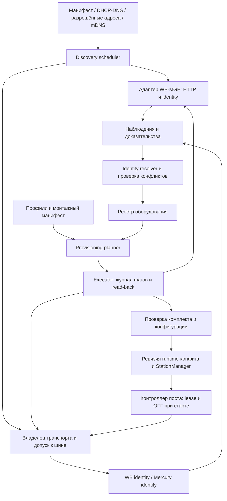
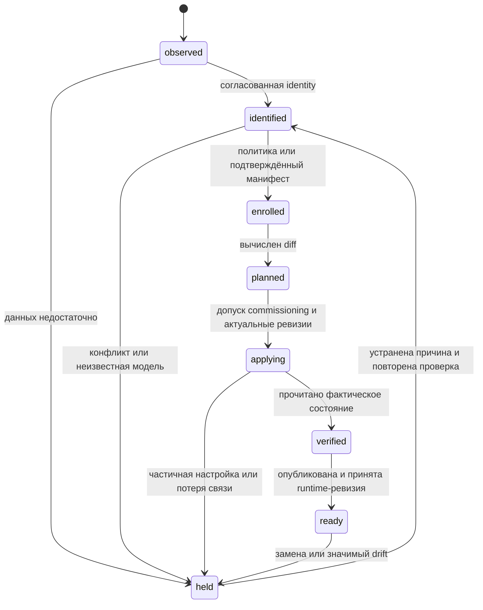

# Auto-Discovery и Auto-Provisioning оборудования EVcomm

Дата исследования: 25 сентября 2026 года. Статус: предлагаемая архитектура, до реализации и проверки на оборудовании.

## 1. Результат и рекомендуемое решение

**Автоматически обнаруживать и добавлять в реестр WB-MGE v.3, WB-MR6C и совместимые счётчики «Меркурий» возможно.** Степень автоматизации зависит от прошивки, доступности идентификаторов и заранее известной схемы поста. Предлагается модуль внутри Go-сервиса EVcomm: обнаружение → идентификация → регистрация → настройка по профилю → проверка → допуск к работе.

Нужно разделить три результата:

| Результат | Что автоматизируем | Условие |
|---|---|---|
| Инвентаризация | Найденное оборудование и неподтверждённые кандидаты появляются в реестре | Есть наблюдение, даже если модель или serial пока неизвестны |
| Регистрация экземпляра | Назначается постоянный `hardware_id`, сохраняются модель, serial, происхождение данных и расположение | Идентичность определена без конфликта; иначе только кандидат |
| Ввод поста в работу | Применяются настройки, создаётся конфигурация контроллера | Совпали комплект поставки, профиль, физическая привязка и проверки безопасности |

**Автоматическая регистрация не должна автоматически включать питание EVSE.** После успешного provisioning пост готов принимать команды, но остаётся OFF.

Для штатного комплекта рекомендуется заранее импортировать монтажный манифест: `post_id → gateway serial → relay serial → meter serial/model`, профиль портов и схему линий. Тогда подключение оборудования запускает полностью автоматическую проверку и настройку в разрешённом режиме commissioning. Без манифеста система собирает инвентаризацию, а привязка к физическому посту подтверждается отдельно.

Серийный номер идентифицирует экземпляр в пространстве производителя/семейства, но не является доказательством подлинности. IP, hostname и адрес RS-485 описывают место подключения, а не идентичность оборудования.

## 2. Что уже есть в проекте

Основание: [README](../README.md), [дорожная карта](roadmap_evse_line_control_go_2026-09-25.md), [исследование транспорта](research_wb_mqtt_serial_go_integration_2026-09-25.md), [архитектура счётчика](mercury230_native_go_reader_architecture_2026-09-25.md), [обзор счётчиков](rs485-phase-energy-meter-research.md) и текущий код.

| Компонент | Фактическое состояние | Следствие для нового модуля |
|---|---|---|
| `internal/registry` | YAML: `Post.Gateway`, `MR6CAddress`, опциональный `Meter.Serial`; идентичности шлюза и реле нет | Добавить отдельные сущности оборудования, портов и привязок |
| `internal/hardware/mr6c` | Modbus TCP, lease, сверка и применение эталона; чтение firmware | Переиспользовать safety; добавить identity и проверку ожидаемого serial |
| `internal/hardware/mercury230` | `ReadSerial`, `ReadIdentity`, capability probes; собственный протокол через TCP-мост | Переиспользовать кодек, но создать отдельную короткую операцию discovery |
| `internal/controller/station.go` | Сам создаёт соединения обоих адаптеров; счётчик может быть отключён при отсутствии пароля | Ввести владение портом; явно задать обязательность счётчика в профиле поста |
| `cmd/line-controller` | Загружает YAML один раз; динамического добавления нет | Нужен менеджер жизненного цикла постов либо контролируемый перезапуск |
| `internal/store`, `internal/api`, `internal/measurements/wbmqtt`, `cmd/gen-serial-config` | Заглушки | Хранилище и API discovery ещё предстоит реализовать |

В дорожной карте фигурирует **Меркурий 234 ART-01PR**, а работающий Go-драйвер называется **`mercury230`**. Имя драйвера нельзя превращать в автоматически определённую модель. Для 234 ART нужен отдельный проверенный профиль совместимости; исполнение 234 D/DLMS не следует считать совместимым только из-за номера 234.

Текущий `registry.Parse` использует нестрогий `yaml.Unmarshal`: неизвестные поля могут быть проигнорированы. Поэтому новую схему нельзя просто положить в действующий `configs/bench.yaml` и считать поддержку реализованной.

## 3. Исследование способов обнаружения и идентификации

### 3.1. WB-MGE v.3: адреса и собственная идентичность

Заводская сеть Ethernet использует DHCP. Есть имя вида `wb-mge-XXXXXX.local`; порты RS-485 обычно доступны через TCP 502/503. Начиная с firmware 1.3.0 шлюз имеет собственный Unit ID 255: в режиме Modbus TCP запрос к нему обрабатывается локально, без пересылки на RS-485. В прозрачном режиме такое поведение предполагать нельзя. [Руководство WB-MGE](https://wiki.wirenboard.com/wiki/WB-MGE_v.3_Modbus_Ethernet_Gateway).

Проверены исходники `wirenboard/wb-mge`, commit **`bf305f02f2688dccc2981832dc00e72b28149ee8`**. Это снимок upstream, не доказательство наличия всех возможностей в установленной прошивке.

| Интерфейс | Данные / назначение | Использование в EVcomm |
|---|---|---|
| `POST /auth` | `login`, `pass`, cookie сессии; результат `auth` | Учётные данные из secret reference |
| `GET /info` | `device_name`, `signature`, `firmware`, `git_info`, `serial_num`, MAC интерфейсов | Основная идентификация шлюза |
| `GET /settings` | Сохранённая конфигурация | Сравнение с желаемым профилем |
| `POST /settings` | Обновление настроек; поля результата и `warnings` | Изменение только перечисленных в плане полей |

Контракт проверен в [OpenAPI прошивки](https://github.com/wirenboard/wb-mge/blob/bf305f02f2688dccc2981832dc00e72b28149ee8/openapi.yaml). Версию API и обработку частичных изменений требуется сертифицировать для каждой поддерживаемой ветки firmware.

В указанном исходнике `serial_num` генерируется из **заводского MAC eFuse**, а не гарантированно из Ethernet MAC, показанного в сети. Хранить все эти значения раздельно; равенство с номером на наклейке подтвердить на стенде. [Генерация serial](https://github.com/wirenboard/wb-mge/blob/bf305f02f2688dccc2981832dc00e72b28149ee8/main/sys_info.c).

Альтернативное чтение через Unit ID 255, FC03/FC04, адреса в таблице — десятичные, zero-based:

| Регистры | Поле |
|---|---|
| 200–219 | Модель: символ в младшем байте каждого регистра |
| 250–265 | Строка firmware |
| 266–267 | Схема serial; для MAC-derived — 4 |
| 268–271 | Полный serial, u64, старшее слово первым |
| 290–301 | Сигнатура firmware |

Чтение только 270–271 потеряет старшие биты serial шлюза. Реализация и тесты локального Unit ID доступны в [тесте self-unit](https://github.com/wirenboard/wb-mge/blob/bf305f02f2688dccc2981832dc00e72b28149ee8/api_tests/43_test_device_self_unit_e2e.py). Этот путь включать лишь для известного профиля firmware/режима; для неизвестного сетевого сервиса не посылать пробные Modbus-кадры вслепую.

**mDNS — дополнительный источник, не единственный механизм поиска.** В проверенном `network.c` устанавливается hostname; регистрации сервиса через `mdns_service_add` в исходниках не найдено. Поэтому нельзя обещать поиск всех шлюзов через browse `_http._tcp.local` или выдуманный `_wb-mge._tcp`. Известное имя можно разрешить, объявления адресов — использовать как подсказку. [Код mDNS](https://github.com/wirenboard/wb-mge/blob/bf305f02f2688dccc2981832dc00e72b28149ee8/main/network/network.c). mDNS рассчитан на локальный сегмент; для маршрутизируемых VLAN нужны DHCP/DNS или явные адреса. [RFC 6762](https://www.rfc-editor.org/info/rfc6762/).

### 3.2. WB-MR6C: модель, serial и поиск адреса

Официальная карта содержит модель в Input 200–205, расширение до 219 у firmware с Fast Modbus, версию в 250–265, serial u32 в 270–271 и расширение serial в 266–269. Сигнатура прошивки — Holding 290–301. Фактические состояния реле 96–101 доступны с 1.24.0. [Карта регистров реле](https://wiki.wirenboard.com/wiki/Relay_Module_Modbus_Management).

Предлагаемый probe: FC04 модели → serial → firmware, затем FC03 сигнатуры. При `Illegal Data Address` на длинной модели пробовать старый диапазон из шести регистров; FC03 для информационных полей разрешать только в проверенном профиле. Сохранять сырой блок 266–271: раскладку MR6C нельзя автоматически приравнивать к раскладке MGE. Для MVP профиль legacy u32 допустим после сверки с наклейкой; будущая смена схемы serial оформляется явным alias, а не новым экземпляром.

Строка `WBMR6C` сама по себе не обязательно различает аппаратные ревизии. Хранить отдельно `model_family`, `model_exact`, `hardware_revision` и `firmware_signature`; `v.3` подтверждать манифестом/маркировкой или проверенным соответствием сигнатур.

Если адрес неизвестен, возможны два пути:

- **Обычный поиск:** последовательный перебор 1…247 на известной скорости с чтением модели. Поиск не доказывает отсутствие второго устройства с тем же адресом.
- **Fast Modbus:** устройства участвуют в арбитраже; можно получить разные serial даже при одинаковом адресе и адресовать команду конкретному serial. В эталонной утилите актуален FC `0x46`, legacy — `0x60`. [Эталон сканера](https://github.com/wirenboard/wb-modbus-ext-scanner/blob/de29548f0cdf3e2111d0e2a880879b129c4f112e/README.ru.md), [описание протокола](https://github.com/wirenboard/wb-modbus-ext-scanner/blob/de29548f0cdf3e2111d0e2a880879b129c4f112e/docs/protocol.ru.md).

MGE поддерживает Fast Modbus через оба режима транспорта, но для Go потребуется реализация расширения и тесты через реальный шлюз. Штатную C-утилиту с TTY-интерфейсом нельзя считать готовым Go API для Modbus TCP. MVP использует адрес из манифеста и обычный ограниченный поиск; Fast Modbus — следующий этап. [Руководство MGE](https://wiki.wirenboard.com/wiki/WB-MGE_v.3_Modbus_Ethernet_Gateway).

### 3.3. «Меркурий»: serial читается, точная модель требует отдельного доказательства

В протоколе «Меркурий» `08 00` возвращает четыре байта serial и три байта даты без открытия канала. `08 01 00` читает паспортные параметры; `08 12` — старую форму варианта исполнения. В общей документации встречаются ответы паспорта разных длин, поэтому жёсткие ожидания существующего кодека необходимо проверить по профилям. [Протокол производителя](https://doc.incotexcom.ru/protocol/mercury/).

Для discovery использовать `ReadSerial` непосредственно, без запуска постоянного meter-adapter: тот открывает канал и начинает измерения. Проверять адрес ответа, длину, CRC, допустимость байтов decimal-pair 0…99; сохранять ведущие нули в строке serial и исходные байты. Номер повторно читать перед регистрацией. Текущий `DecodeSerial` форматирует байты, но не проверяет диапазон каждого байта serial — это доработка перед автоматическим включением идентичности в реестр.

Успех `08 00` подтверждает протокольное семейство, **не различает автоматически 230 и 234 ART**. Точную модель брать из подтверждённого манифеста/наклейки либо будущего проверенного декодера. Совместимость профиля должна подтверждаться паспортом и пробами нужных функций. Возможности `phase_energy`, `total_energy`, `phase_power` хранить отдельно от модели; неизвестное значение не заменять на `false`.

Поиск: сначала последний адрес/манифест, затем 1…240 при известных UART-параметрах. Диапазон соответствует текущему драйверу EVcomm, это не универсальное утверждение о всех счётчиках. Адреса 0 и `0xFE` исключить. Не перебирать пароли: использовать credential из манифеста; без него serial можно зарегистрировать, а проверку измерений пометить `needs_credentials`. Автоматическая запись адреса, скорости, времени, тарифов и параметров учёта счётчика в MVP не входит.

### 3.4. Что автоматически определить нельзя

| Объект / условие | Результат |
|---|---|
| Произвольное RS-485-устройство без известного профиля | Нет универсального безопасного метода узнать модель/serial по любому ответу |
| Одинаковые адреса на обычной RS-485 | CRC-ошибки могут указывать на коллизию, но также на помехи; нужен Fast Modbus или физическое разделение |
| Неизвестные скорость и чётность | Ограниченный перебор профилей только при эксклюзивном commissioning; обычный таймаут не означает отсутствие устройства |
| Контактор, автомат, пассивная EVSE за силовым реле | MR6C сообщает состояние контактов, но не модель и serial подключённого оборудования |
| Номер парковочного места, K4, порядок фаз, соответствие счётчика линии | Монтажный манифест и проверка проводки; из сетевого ответа это не выводится |
| Пригодность счётчика для денежных расчётов | Отдельные требования проекта; наличие serial и показаний не является основанием для автоматического допуска |

### 3.5. Выбор реализации

| Подход | Оценка для EVcomm |
|---|---|
| Собственный Go-модуль + существующие драйверы | **Рекомендуется:** можно сохранить lease и одного владельца транспорта |
| `wb-device-manager` + `wb-mqtt-serial` | Готовые fast/slow scan, identity и RPC; полезный эталон или интеграция для порта, которым уже владеет wb-mqtt-serial |
| Отдельный независимый сетевой сканер с собственными соединениями к MR6C | Не подходит для рабочего контура: обходит lease |
| Обязательная кастомная прошивка MGE / агент на шлюзе | Для первого этапа не нужна; HTTP API достаточно, ограничения проверяются по firmware |

`wb-device-manager` публикует результаты с serial, сигнатурами, адресом и версией; данные можно использовать как источник наблюдений, но не как безусловное разрешение на ввод поста. [Контракт сервиса](https://github.com/wirenboard/wb-device-manager).

## 4. Компоненты и границы ответственности



Предлагаемая структура, **ещё не существующие пакеты**:

```text
internal/inventory          оборудование, identity aliases, наблюдения, привязки
internal/discovery          источники адресов, задания, ограничения, probe pipeline
internal/hardware/wbmge     versioned HTTP API и идентичность шлюза
internal/hardware/wbidentity модель, serial, сигнатуры WB; позднее Fast Modbus
internal/provisioning       план, политика, исполнение, восстановление шагов
internal/transportowner     эксклюзивное владение портом и gateway-wide maintenance
internal/profiles           встроенные проверенные профили оборудования/поста
internal/store             SQLite: реестр, задания, журнал, миграции
internal/api               API заданий, инвентаризации, планов и привязок
internal/controller        StationManager и смена конфигурации остановленного поста
cmd/evcomm-hw              клиент API: scan, inspect, plan, apply, bind
```

Модули discovery/provisioning исполняются в одном сервисе с владельцем транспорта. CLI обращается к его API и не открывает второй сокет к реле. На раннем стенде допустима отдельная offline-утилита при остановленном сервисе, эксклюзивной блокировке и разрешённом commissioning.

Профиль устройства задаёт точный transport/protocol, допустимые firmware, identity decoder, набор probes и разрешённых записей, порядок применения, проверку результата и восстановление. Профиль поста задаёт ожидаемый состав, UART, адреса при необходимости, safety, обязательность измерений и монтажную схему. Профили версионируются и проходят проверку; данные, полученные с устройства, не могут содержать исполняемый сценарий настройки.

## 5. Владение транспортом и сохранение watchdog

В MR6C таймер безопасного режима перезапускается принятым Modbus-пакетом. Поэтому даже чтение identity сторонним сканером способно отложить отключение при зависшем контроллере. [Описание безопасного режима](https://wiki.wirenboard.com/wiki/WB-MR6C_v.3_Modbus_Relay_Modules). Новый модуль обязан сохранить инвариант проекта: **истекла lease рабочего поста → прекратился весь исходящий трафик к его реле**.

Правила владения:

1. Ресурс блокировки — физический порт `(gateway_id, port_no)`, а не IP, TCP-сокет или Modbus unit. На нём только один владелец: `runtime`, `commissioning` или `wbmqtt`.
2. В `runtime` запрещены полный scan и перенастройка UART. Identity известного устройства обновляется существующим адаптером в его очереди и только при действующей lease; discovery получает копию результата.
3. Истечение lease не разрешает сканеру захватить порт. Владелец остаётся назначенным до явного безопасного перехода в обслуживание. Pending-запросы discovery отменяются; discovery не продлевает lease.
4. Для commissioning действующего поста: запрет новых сессий → завершение текущих → команда OFF → свежее подтверждение НЗ → остановка и закрытие адаптеров → передача порта. Если OFF не подтверждён, автоматический scan не начинается.
5. Для нового неизвестного реле безопасное состояние не выводится из молчания шины. Первичное commissioning разрешается на физически изолированном/обесточенном силовом тракте с зафиксированным условием допуска. Заводской safety нельзя считать уже настроенным.
6. В commissioning отдельный ограниченный по времени допуск выдаёт supervisor процесса ввода. Он не наследуется от рабочего lease и не разрешает ON. Потеря допуска останавливает все запросы; при неизвестной конфигурации безопасность обеспечивает условие первичного ввода из п. 5.
7. Любая перенастройка самого MGE блокирует **весь шлюз и оба порта**. HTTP settings могут перезапустить транспорт: обслуживание одного порта нельзя считать независимым от работающего второго.
8. Для порта `wbmqtt` использовать RPC владельца либо его подтверждённую остановку. Наличие MQTT retained-топика само по себе не доказывает доступность устройства.

Внутренний fencing token предотвращает работу старых Go-задач после передачи владения, но MGE этот token не проверяет. Поэтому дополнительно нужны закрытие старых соединений, один сетевой владелец, блокировка второго процесса на хосте и сетевой доступ к портам только от управляющего узла. HA с несколькими одновременно активными Pi в MVP не входит.

HTTP-чтение identity шлюза допустимо отдельно от шины. Локальный Unit ID 255 также можно использовать без трафика к реле **после проверки этого свойства для выбранной прошивки**; он не даёт права читать остальные адреса при истёкшей lease.

## 6. Реестр: постоянные идентификаторы и изменяемая топология

Рекомендуется SQLite на Raspberry Pi для транзакций, восстановления заданий и уникальных ограничений. Драйвер должен поддерживать текущую сборку linux/arm64 без cgo; конкретная зависимость выбирается при реализации. YAML остаётся форматом импорта манифеста и экспорта рабочей конфигурации, а не конкурентно редактируемой базой наблюдений.

| Сущность | Основные поля |
|---|---|
| `Hardware` | `hardware_id` UUID, kind, vendor, family, exact_model, hw_revision, firmware, lifecycle |
| `IdentityClaim` | hardware/candidate ID, namespace, serial_scheme, serial_text, raw, source, decoder_version, verified_at |
| `GatewayEndpoint` | gateway ID, interface, IP/hostname, management port, source, first/last_seen, verified identity |
| `Port` | gateway ID + номер, transport, UART, TCP endpoint, owner, generation |
| `Attachment` | hardware ID → port ID + bus address, valid_from/to, observed/approved |
| `PostBinding` | post ID, роль, hardware ID, wiring profile, binding revision |
| `Observation` | scan ID, время, endpoint, результат probe, evidence, error, expires_at |
| `ProvisioningJob` | plan hash, expected revisions, policy/actor, шаги, before/after, результат |
| `RuntimeRevision` | desired generation, validated content/hash, applied generation, activation status |

`Hardware` включает шлюзы; `GatewayEndpoint` и `Port` ссылаются на шлюз как на оборудование. Не создавать для одного MGE две независимые identity-записи «шлюз» и «устройство».

**Ключи и нормализация:**

- Постоянный первичный ключ — UUID; модель можно уточнить без потери истории.
- Кандидат на естественный ключ: `(vendor, identity_namespace, serial_scheme, serial_text)`. Namespace определяет профиль: например, `wb-mge-v3`, `wb-mr6c`, `mercury-230` после подтверждения модели. Серийные пространства разных семейств не считать заведомо общими.
- Поиск для оператора: производитель + модель + серийный номер. Сопоставление identity требует также совместимой модели и отсутствия конфликта; один serial без контекста недостаточен.
- Serial хранится строкой: u64 MGE не проходит через float64, «Меркурий» сохраняет ведущие нули. В Go для JSON использовать типизированное поле или `json.Number`.
- `serial=null` допустим только для неподтверждённого кандидата; IP или адрес шины не записываются вместо serial.
- `observed_model` и `declared_model` раздельны, с источником и временем. `identity_verified` означает проверку согласованности, а не криптографическую аттестацию.
- Уникальные ограничения применяются к **подтверждённым** identity/активным привязкам. Конфликтующие наблюдения сохраняются отдельно, а не отбрасываются ошибкой SQL.

Один активный `Attachment` на экземпляр; один владелец адреса на физическом порту; одна активная привязка устройства к роли поста. На разных шлюзах одинаковые адреса допустимы. Несколько IP интерфейсов одного MGE также допустимы.

Правила сопоставления:

| Событие | Действие |
|---|---|
| Повторный scan той же identity на том же порту | Обновить наблюдение; новых Hardware не создавать |
| Новый IP, тот же подтверждённый шлюз | Добавить/обновить endpoint; контроллер переподключает остановленный/восстановляемый пост после проверки identity |
| Старый IP, другой serial шлюза | Новый кандидат; старая конфигурация управления на него не переносится |
| Новый serial реле/счётчика на старом адресе | Кандидат замены; заблокировать новые сессии, сохранить старую историю и привязку до операции replacement |
| Тот же serial одновременно на двух физических портах | `identity_conflict`; не выполнять автоматическое объединение или перенос |
| Устройство пропало | Отметить health=offline; не удалять и не освобождать его привязку |
| Полная модель уточнена после чтения паспорта | Обновить атрибуты и aliases транзакционно, сохранить UUID и evidence |

Замена счётчика создаёт новый экземпляр и новую границу учёта. Накопленные показания разных serial не вычитаются друг из друга. Перенос исправного устройства между постами — отдельная операция закрытия старой и открытия новой привязки.

## 7. Алгоритмы discovery

### 7.1. Шлюзы в IP-сети

1. Собрать кандидатов из seed-адресов и манифеста, текущего реестра, интеграции с DHCP/DNS; добавить наблюдения mDNS. Доступ к DHCP-серверу не предполагается автоматически.
2. Для разрешённого CIDR допускается ограниченный поиск HTTP на известных management-портах. ICMP не обязателен; открытый порт и MAC OUI — только подсказки. Не искать произвольные порты всего предприятия.
3. Применить сетевой scope также к разрешённым DNS-адресам и redirect; не пересылать cookie/пароли на новый host. Сначала публичный fingerprint, если доступен, затем credential из политики этого сегмента/манифеста.
4. Прочитать identity через известный MGE API, классифицировать firmware. При отсутствии credentials использовать проверенный self-unit либо оставить кандидата `needs_credentials`; не считать HTTP 401 отсутствием шлюза.
5. Сопоставить identity; прочитать текущие настройки портов, если доступ разрешён. Для неизвестной firmware разрешена инвентаризация, но автоматические записи отключены.

Начальные проектные лимиты: 16 параллельных IP-проверок, не более двух запросов к одному management endpoint одновременно, connect timeout 1 с, общий deadline HTTP 3 с, один повтор. Это исходные настройки для локальной сети, не измеренные характеристики WB-MGE.

### 7.2. Устройства за шлюзом

План на каждый порт фиксирует gateway identity, owner generation, UART и ожидаемое семейство. Уже управляемый порт отдаёт текущие наблюдения runtime-адаптера. Полный active scan выполняется только при допуске commissioning из раздела 5.

Для MR6C: сначала адрес из манифеста/истории; при необходимости поиск 1…247. Для «Меркурия»: сначала `08 00` по ожидаемому адресу, затем ограниченный перебор. Разные семейства не пробовать вперемешку на работающем порту. На смешанной шине полный discovery и перенастройка допустимы только с отдельно проверенным профилем; в MVP такие шины требуют ручного описания.

При неизвестном UART использовать короткий упорядоченный список commissioning-профиля, например MR6C: текущие параметры → 9600 8N2 → 115200 8N2. Переключение параметров **шлюза** уже является provisioning-операцией с сохранением прежних значений, а не «чтением». Скорость самого неизвестного устройства при поиске не менять. Для счётчиков ниже диапазона скоростей MGE потребуется иной транспорт; бесконечный перебор проблему не решит.

Каждое подтверждение identity требует двух согласованных чтений, структурной проверки ответа и уникальности в реестре. Два одинаковых ответа не доказывают отсутствие коллизии одинаково настроенных приборов: для автоматической записи нужен ожидаемый состав шины либо проверенный Fast Modbus scan.

Ошибки различать: `timeout`, `transport_busy`, `needs_credentials`, `protocol_mismatch`, `unsupported_firmware`, `identity_incomplete`, `suspected_address_collision`, `identity_conflict`. Таймаут на одном UART-профиле не является окончательным `absent`.

### 7.3. Масштаб 100+ постов

Одна последовательная очередь на порт; до восьми одновременно сканируемых commissioning-портов на Pi как стартовое ограничение. Runtime имеет приоритет, а работающие посты не участвуют в массовом active scan. Повторные задания для одного порта объединяются.

Оценка стоимости полного пустого scan на одном UART-профиле:

`T ≈ число_адресов × deadline_транзакции × число_попыток + служебные_чтения`.

При deadline 300 мс и одной попытке: MR6C — около 74 с, «Меркурий» — 72 с; три UART-профиля утраивают оценку. Это нижняя инженерная оценка по заданным параметрам: внутренний timeout MGE, reconnect и задержки настройки могут её увеличить. Для 100 одинаковых портов с восемью очередями — порядка 16 минут плюс накладные расходы. Быстрый ввод следует строить на манифестах, известных адресах и позже Fast Modbus, а не на постоянном полном переборе.

У задания есть deadline и результат `partial`, курсор продолжения, jitter и backoff. После достижения ожидаемого состава прекращать быстрый поиск только при разрешении профиля; проверку лишних устройств выполнять отдельным commissioning-scan. Ночные массовые сканирования работающих реле не требуются.

Фоновая сверка использует события подключения, изменения DHCP и уже выполняемый runtime-опрос. Периодическую identity-проверку известного реле планирует его владелец без нарушения deadline управления; при нехватке бюджета она откладывается. Проверка доступности не обновляет `identity_verified_at`, если serial фактически не читался. Изменение настроек или identity создаёт drift-событие и новый план, а не немедленную перезапись работающего оборудования. Метрики: длительность и покрытие scan, конфликты identity, возраст доказательств, ожидание владельца порта, результат provisioning и расхождение desired/applied generation.

## 8. Auto-Provisioning: состояние, политика и применение

### 8.1. Состояния



`held` хранит причину и последний успешный этап. Доступность (`online/offline/stale`) независима от lifecycle: offline не означает удаление или повторный provisioning. Отказ одной периферии не стирает регистрацию шлюза.

### 8.2. Политика автоматизации

| Режим | Автоматические действия |
|---|---|
| `observe` | Сетевые наблюдения и данные владельца порта; никаких изменений оборудования |
| `enroll_known` | Регистрация точного совпадения с манифестом; добавление известных identity в реестр |
| `commission_known` | Выполнение утверждённого профиля для ожидаемого оборудования при действующем допуске commissioning |

Базовый режим — `observe`. Политика может заранее разрешить полностью автоматическую настройку известного комплекта; подтверждение каждого регистра не требуется. Для неизвестной модели или изменения физической привязки нужен новый конкретный план/манифест, а не общее разрешение «настроить всё найденное».

### 8.3. План и исполнение

План неизменяемый: `plan_id`, hash, profile version, hardware identities, expected inventory/binding/owner generations, срок действия, список полей и регистров before/after, секретные ссылки, предусловия, read-back каждого шага и способ восстановления.

Последовательность для известного комплекта:

1. Проверить политику, identities и актуальность плана. Получить допуск и владение; для HTTP-изменений — блокировку всего шлюза.
2. Снять snapshot настроек без открытых секретов в журнале. Убедиться в условии безопасного commissioning; реле и существующие линии перевести/удерживать OFF проверенным способом.
3. Настроить MGE по поддерживаемому контракту: RS485-1 → Modbus TCP, RS485-2 → прозрачный server для native Mercury; запрет лишних owners/overlays по профилю. На этапе поиска сохранить скорость, на которой найдено устройство.
4. Проверить exact profile MR6C, serial и firmware. Применить эталон из `mr6c.SafetyConfig.Expected()`; для новой реализации отдельно утвердить порядок записи, чтобы промежуточные состояния также сохраняли OFF. Перечитать все поля, выходы и НЗ. Provisioning не выполняет пробное ON.
5. Если профиль требует смены UART/адреса MR6C: сначала на старой связи изменить целевое устройство, затем соответствующий порт MGE, переподключиться и сверить тот же serial. На общей шине это отдельная согласованная миграция всех участников; для MVP автоматизируется только одноприборный порт. Потерянный ответ не означает, что запись не состоялась.
6. Для счётчика записать в EVcomm serial, driver profile, адрес, secret reference и монтажный `phase_map`; открыть канал известным credential, проверить требуемые измерения. Параметры учёта самого счётчика не менять.
7. Перечитать saved и effective настройки MGE, снова идентифицировать периферию, проверить отсутствие конфликта и готовность всего комплекта. Только после этого публиковать runtime-конфигурацию.
8. Запустить/пересоздать пост с новой ревизией, выполнить штатную стартовую сверку с OFF. `ready` присвоить после подтверждения принятой ревизии. ON возможен только отдельной обычной командой управления.

Конкретное представление режима в проверенном HTTP API — `port_mode: tcp_bridge`, `bridge.mode: server`, а Modbus TCP/прозрачный транспорт различаются `bridge.modbus: true/false`. Это mapping внутри versioned-адаптера, не публичная модель EVcomm. [Схема настроек MGE](https://github.com/wirenboard/wb-mge/blob/bf305f02f2688dccc2981832dc00e72b28149ee8/openapi.yaml).

`HTTP 200` недостаточно: проверить `success`, статусы полей, warnings, повторное чтение и фактическую работу порта. В исследованной firmware часть применения выполняется асинхронно. [Применение настроек](https://github.com/wirenboard/wb-mge/blob/bf305f02f2688dccc2981832dc00e72b28149ee8/main/settings_update.c). Не повторять POST вслепую после timeout; сначала выяснить фактическое состояние.

Смена IP, Wi-Fi, management-порта, credentials, Vout и firmware не входит в базовый профиль автоматического ввода. При необходимости для них создаётся отдельный план с путём повторного обнаружения и восстановления. DHCP reservation предпочтительна как административная настройка сети; её создание требует отдельной интеграции, которой сейчас нет.

### 8.4. Сбой посередине операции

Hardware, SQLite и конфигурационный файл не поддерживают общую транзакцию. Поэтому каждый шаг сохраняется до отправки как `started`, после read-back — `verified`; неизвестный результат — `outcome_unknown`.

После перезапуска сначала восстанавливаются jobs и блокировки допуска к управлению, затем запускаются посты. Для незавершённого job запрещены новые сессии: перечитать identity и фактические настройки, пересчитать оставшийся план. Повторение записи разрешено только после проверки её идемпотентности и актуальных предусловий.

Откат относится к конкретному полю: не восстанавливать небезопасный заводской watchdog или старое ON ради возврата к snapshot. После неудачной смены скорости проверяются только предусмотренные старые/новые UART-параметры; если связь не восстановлена — `held: recovery_required`. Рабочий registry до завершения проверки не подменяется частично.

## 9. Контракты модуля и пример данных

Предлагаемые интерфейсы, не готовый компилируемый код:

```go
type DiscoverySource interface {
    Candidates(ctx context.Context, scope Scope) ([]EndpointCandidate, error)
}
type DeviceProbe interface {
    // Доступ только через владельца транспорта, без внутреннего net.Dial.
    Identify(ctx context.Context, port OwnedPort, hint ProbeHint) (Observation, error)
}
type IdentityResolver interface {
    Reconcile(ctx context.Context, observation Observation) (IdentityDecision, error)
}
type Provisioner interface {
    Plan(ctx context.Context, desired DesiredPost) (Plan, error)
    // Повтор с тем же ключом возвращает/продолжает тот же job.
    Apply(ctx context.Context, planID, idempotencyKey string) (JobID, error)
}
```

Пример будущего монтажного манифеста. Значения условные; **текущий `registry.Load` этот формат не поддерживает**. `wiring_verified` устанавливается после проверки монтажа, а не самим discovery.

```yaml
schema_version: 2
site_id: parking-a
policy: commission_known
posts:
  - id: post017
    profile: evcomm-mge3-mr6c3-mercury230-v1
    wiring_profile: post017-wiring-rev1
    wiring_verified: true
    has_k4: true
    mode: 3x1
    phase_map: [L1, L2, L3]
    expected:
      gateway:
        vendor: wirenboard
        model: WB-MGE-v3
        serial_scheme: wb-mge-efuse-mac48
        serial: "18838586676582"
        seed_host: "192.0.2.17"
        credentials_ref: "secret://parking-a/post017/gateway"
      relay:
        vendor: wirenboard
        model: WB-MR6C-v3
        serial_scheme: wb-legacy-u32
        serial: "4267937719"
        port: 1
        address_hint: 17
      meter:
        vendor: incotex
        model: Mercury-230-ART-01-RN
        model_source: verified_label
        serial_scheme: mercury-decimal-pairs-v1
        serial: "32874766"
        port: 2
        address_hint: 145
        driver_profile: mercury230-native-v1
        credentials_ref: "env://MERCURY_PW_POST017"
    commissioning:
      permit_ref: "commissioning://parking-a/post017/job-001"
```

Профиль хранит UART и safety, а манифест — индивидуальные identities и проводку. Ссылка на commissioning permit разрешается в ограниченный по времени допуск с проверенными предусловиями, не просто в boolean из YAML.

Минимальный API:

| Метод | Назначение |
|---|---|
| `POST /v1/discovery/jobs` | Задать scope, gateways/ports, passive или commissioning scan; ответ 202 + job ID |
| `GET /v1/discovery/jobs/{id}` | Прогресс, найденное, непроверенные диапазоны, ошибки |
| `POST /v1/discovery/jobs/{id}/cancel` | Отменить будущие probes; сохранить уже полученные наблюдения |
| `GET /v1/hardware` | Фильтр по vendor/model/serial, post, lifecycle; exact и family раздельны |
| `GET /v1/hardware/{id}` | Identity evidence, topology, capabilities и история |
| `POST /v1/provisioning/plans` | Рассчитать diff и блокирующие причины |
| `POST /v1/provisioning/plans/{id}/apply` | Запустить job с `Idempotency-Key`; 409 для устаревшего/конфликтного плана |
| `POST /v1/posts/{id}/bindings` | Создать/заменить привязку с expected revision |

Для всех управляющих запросов — аутентификация и роли observer/commissioner/admin. Секреты не возвращаются в API, снимках и логах. Сетевой доступ к HTTP MGE ограничивается management-сегментом; в исследованном контракте указан HTTP, наличие TLS на произвольной firmware не предполагается.

## 10. Миграция без двух источников конфигурации

1. **Инвентаризация рядом с v1.** Импортировать текущий YAML: сохранить `post_id`, создать legacy bindings к endpoint/address, имеющийся meter serial считать объявленным. Их идентичность ещё не подтверждена. YAML пока единственный источник runtime-настроек; discovery пишет только inventory.
2. **Подтвердить identities.** Сверить шлюз и MR6C, обогатить legacy bindings. Без подтверждения не переподключать пост автоматически на новый IP и не применять профиль к замене.
3. **Переключить источник.** После реализации валидации registry v2 желаемая конфигурация хранится в БД. YAML v1 становится только производным экспортом; старый файл больше не редактируется параллельно. Импорт изменений — отдельная операция с revision check.
4. **Публикация экспорта.** Генерировать полный snapshot из уже готовых постов и прошедших hardware-проверки постов `verified`, допущенных к активации текущим job. Непроверенные кандидаты исключить; существующий работающий пост не удалять из snapshot из-за временного offline. Пропустить snapshot через существующий `registry.Parse/Validate` и дополнительные проверки identity/уникальности. Записать temp-файл в том же каталоге, `fsync`, атомарный rename и `fsync` каталога; хранить hash и generation в БД/сопроводительных метаданных. Статус нового поста остаётся `verified` до подтверждения активации.
5. **Активация.** Сейчас сервис не перечитывает файл. До `StationManager` использовать контролируемый перезапуск только в окне обслуживания всех затронутых постов. После его реализации — менять только остановленный пост. Атомарная запись YAML сама по себе не является активацией.
6. **Восстановление.** После crash сравнить desired, published и applied generations и hash файла. Не запускать пост с незавершённым provisioning. Не объявлять job завершённым до подтверждения runtime.

Перед автоматическим допуском дополнить текущие проверки: строгая версия/схема YAML, уникальность физических портов и адресов, обязательные ожидаемые identity шлюза/реле, запрет unknown capability вместо permissive default `real_state`, обязательность meter по профилю. При несовпадении identity новые ON запрещены; безопасное отключение выполняется штатным контроллером. Нельзя считать существующую отметку `meter.Mismatch` уже реализованной блокировкой поста.

## 11. План реализации и критерии приёмки

| Этап | Работа | Критерий завершения |
|---|---|---|
| 0. Стенд и профили | Зафиксировать firmware MGE/MR6C, маркировку и паспорта счётчиков, saved/effective API и serial encodings | Набор обезличенных ответов и таблица совместимости; проверка Unit 255 анализатором шины |
| 1. Identity и inventory | MGE adapter, WB identity, Mercury discovery probe, SQLite, импорт v1, seed/DHCP discovery | Повторный scan не создаёт дубликатов; неизвестная модель остаётся кандидатом |
| 2. Владение портами | Перевести dial в owner, lease gate для всех путей, commissioning supervisor | Scanner не создаёт трафик к MR6C после потери lease; второй процесс не получает порт |
| 3. Auto-enrollment | Манифесты, политики, конфликты, модель topology | Точный комплект регистрируется автоматически; неоднозначные identities не связываются |
| 4. Provisioning MVP | План/diff, MGE UART, safety MR6C, meter read probes, журнал и recovery | Повторный apply не меняет уже совпавшие настройки; прерывание шага не даёт ложного ready |
| 5. Runtime integration | Экспорт, StationManager, binding revisions и replacement | Добавляется новый пост без влияния на остальные; после старта все линии OFF |
| 6. Расширение | Fast Modbus, смена адресов по serial, дополнительные meter profiles, интеграция wbmqtt | Подтверждён поиск при совпадающих адресах; каждый транспорт имеет одного владельца |

Зависимости: этап 1 сначала получает identity периферии только offline либо из её текущего владельца. Активный поиск на управляемых шинах и этап 4 запрещены до этапа 2. Профиль 234 ART считается отдельной поставкой с собственными fixtures, даже если использует кодек `mercury230`.

Обязательные проверочные сценарии реализации:

| Сценарий | Ожидаемый результат |
|---|---|
| Два одинаковых scan и конкурентные задания | Один hardware ID, один job на порт, сохранены оба наблюдения |
| DHCP сменил IP; другой шлюз занял старый IP | Старый serial получает новый endpoint; новое оборудование не наследует команды |
| Шлюз виден по Ethernet и Wi-Fi | Один gateway, несколько endpoints |
| MGE со старой firmware, без self-unit или DNS-SD | Работает поддерживаемый fallback; отсутствующие возможности не выдумываются |
| Serial MGE больше u32; serial счётчика с ведущими нулями | Точное сохранение и одинаковое сопоставление после restart |
| Неизвестная/короткая модель, недоступный serial | Candidate с evidence, без автоматического driver selection |
| Два MR6C с одним адресом; шум/CRC | Обычный scan не объявляет шину однозначной; Fast Modbus проверяется отдельно |
| Mercury 230/234, паспорт 16/24 байта, masked phase energy | Выбран лишь подтверждённый профиль; unsupported и unknown различаются |
| Работающая зарядка и запрос полного scan | Задание откладывается; соединение и UART не меняются |
| Контроллер завис, scanner жив | Анализатор не видит обходящего lease трафика; watchdog укладывается в утверждённый бюджет |
| Потеря допуска commissioning | Все probes прекращаются; ON не отправляется |
| HTTP 200 с field failure/warning; связь оборвалась после записи | Read-back определяет результат, job не становится ready вслепую |
| Crash после любого provisioning step, DB commit или rename | Предсказуемое продолжение с чтением состояния; нет частично активного поста |
| Замена счётчика во время/между сессиями | Новая identity и явная граница учёта, без смешивания накоплений |
| 100–200 шлюзов, часть не отвечает | Ограничены очереди/соединения; управление существующими постами не деградирует |

Для симуляторов потребуется расширить `mr6c-sim` identity-регистрами, добавить MGE HTTP/self-unit simulator, сценарии перестановки IP и частичных записей. Mercury simulator уже даёт основу, но ответы разных реальных исполнений должны подтверждаться стендовыми fixtures. Производительность, watchdog и смену UART проверять на реальном WB-MGE, а не только на mock.

## 12. Что подтвердить перед реализацией на площадке

- Точные firmware WB-MGE и WB-MR6C; соответствие API исследованному commit.
- Совпадает ли MGE API serial с маркировкой и каким идентификатором снабжается монтажный манифест.
- Фактические модели счётчиков: 230, 234 ART или другие; доступность паспорта и credential.
- Наличие DHCP/DNS-интеграции, границы VLAN, доступность management HTTP и правила доступа к 502/503.
- Можно ли использовать одноприборный порт MR6C как стандарт и как обеспечивается безопасное первичное commissioning.
- Обязателен ли исправный счётчик для допуска поста и какие измерительные capabilities обязательны для его профиля.

Эти вопросы не мешают реализовать inventory и планирование. Они определяют, какие профили смогут выполнять полностью автоматический ввод. **Рекомендуемый первый результат разработки:** известный WB-MGE + один MR6C + один подтверждённый профиль Mercury автоматически появляются в реестре по identity, проходят проверку и получают готовую конфигурацию поста в OFF.

## 13. Воспроизводимость исследования

Локальный код EVcomm изучен без изменения поведения. Сетевые обращения к оборудованию площадки не выполнялись. Проверены документация производителей и открытые исходники; стендовые утверждения в этом документе сформулированы как критерии будущей проверки.

- WB-MGE: commit `bf305f02f2688dccc2981832dc00e72b28149ee8`, файлы `openapi.yaml`, `main/sys_info.c`, `main/network/network.c`, `main/settings_update.c`, тесты HTTP, Fast Modbus probe и self-unit.
- WB Modbus extension: commit `de29548f0cdf3e2111d0e2a880879b129c4f112e`, `README.ru.md`, `docs/protocol.ru.md`.
- Живые страницы wiki Wiren Board и документации Incotex проверены на дату исследования; их содержание может меняться. При реализации зафиксировать firmware и собственные тестовые ответы каждого профиля.
