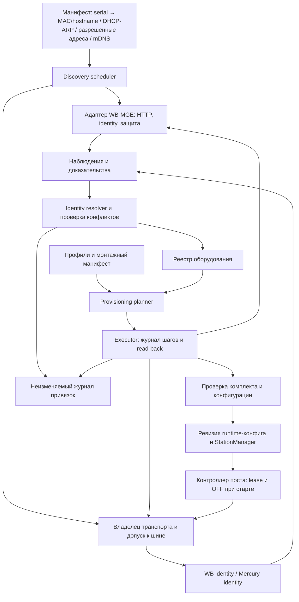
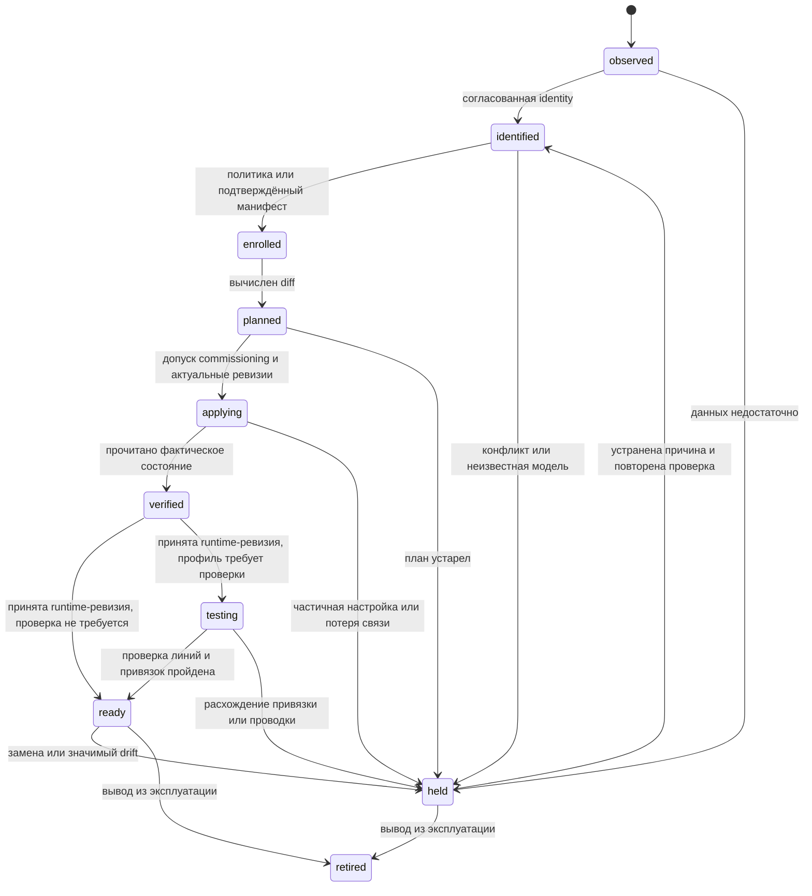

# Auto-Discovery и Auto-Provisioning оборудования EVcomm

Дата исследования: 25 сентября 2026 года. Статус: предлагаемая архитектура, до реализации и проверки на оборудовании.

Редакция 2 (25 сентября 2026 года):
- исправлены сведения о заводском состоянии WB-MGE и WB-MR6C, адресах «Меркурия», применении настроек шлюза и Fast Modbus;
- добавлены защита заводского шлюза, учётная схема R1, метрология, журнал привязок, монотонное время и несколько контроллеров;
- поиск построен на вычисляемых идентификаторах вместо перебора;
- план реализации переупорядочен: сначала identity в текущем контуре и offline-ввод.

Редакция 3 (25 сентября 2026 года), по разбору `wb-modbus-ext-scanner` и исходников WB-MGE:
- Fast Modbus scan перенесён в MVP как основной способ поиска MR6C (раздел 3.2.1);
- добавлены запись по serial, обнаружение перезагрузки и замены модуля, правила реализации скана;
- исправлены таймауты: у порта MGE в режиме Modbus TCP фиксированный внутренний таймаут, а при молчании устройства шлюз не отправляет исключение `0x0B` (раздел 3.1);
- запрещено смешивать протоколы на одном порту.

## 1. Результат и рекомендуемое решение

**Автоматически обнаруживать и добавлять в реестр WB-MGE v.3, WB-MR6C и совместимые счётчики «Меркурий» возможно.** Степень автоматизации зависит от прошивки, доступности идентификаторов и заранее известной схемы поста. Предлагается модуль внутри Go-сервиса EVcomm: обнаружение → идентификация → регистрация → настройка по профилю → проверка → допуск к работе.

Нужно разделить три результата:

| Результат | Что автоматизируем | Условие |
|---|---|---|
| Инвентаризация | Найденное оборудование и неподтверждённые кандидаты появляются в реестре | Есть наблюдение, даже если модель или serial пока неизвестны |
| Регистрация экземпляра | Назначается постоянный `hardware_id`, сохраняются модель, serial, происхождение данных и расположение | Идентичность определена без конфликта; иначе только кандидат |
| Ввод поста в работу | Применяются настройки, создаётся конфигурация контроллера | Совпали комплект поставки, профиль, физическая привязка и проверки безопасности |

**Автоматическая регистрация не должна автоматически включать питание EVSE.** После успешного provisioning пост готов принимать команды, но остаётся OFF.

**Заводской WB-MGE нельзя оставлять в работе.** С завода у него пароль `admin/admin`, HTTP без TLS, включены точка доступа Wi-Fi и Modbus TCP-сервер кэша на порту 504. Любой, кто подключился к шлюзу, может управлять MR6C напрямую в обход изоляции сети. Поэтому защита шлюза входит в базовый профиль ввода, а пост со шлюзом в заводском состоянии не получает `ready` (раздел 3.1.1).

Для штатного комплекта рекомендуется заранее импортировать монтажный манифест: `post_id → serial шлюза → serial и адрес реле с наклейки → serial и модель счётчиков`, профиль портов и схему линий. Из serial шлюза вычисляются его Ethernet MAC и hostname, из serial счётчика — заводской адрес, а MR6C при любом адресе находится Fast Modbus scan за доли секунды. Поэтому полный перебор не нужен: подключение оборудования запускает автоматическую проверку и настройку в разрешённом режиме commissioning. Без манифеста система собирает инвентаризацию, а привязка к физическому посту подтверждается отдельно.

Серийный номер идентифицирует экземпляр в пространстве производителя/семейства, но не является доказательством подлинности. IP, hostname и адрес RS-485 описывают место подключения, а не идентичность оборудования.

## 2. Что уже есть в проекте

Основание: [README](../README.md), [дорожная карта](roadmap_evse_line_control_go_2026-09-25.md), [исследование транспорта](research_wb_mqtt_serial_go_integration_2026-09-25.md), [архитектура счётчика](mercury230_native_go_reader_architecture_2026-09-25.md), [обзор счётчиков](rs485-phase-energy-meter-research.md) и текущий код.

| Компонент | Фактическое состояние | Следствие для нового модуля |
|---|---|---|
| `internal/registry` | YAML: `Post.Gateway`, `MR6CAddress`, опциональный `Meter.Serial`; идентичности шлюза и реле нет; нет фазы питания БП и привязки к вводу из раздела 4 дорожной карты | Добавить сущности оборудования, портов и привязок; ожидаемые serial шлюза и реле — уже в v1 (раздел 10, шаг 0) |
| `internal/hardware/mr6c` | Modbus TCP, lease, сверка и применение эталона (запись по возрастанию адреса); чтение firmware через FC03 250–265. Эталон сверяется только после переподключения TCP. `IsModuleSilent` ждёт исключения `0x0B`, которого MGE на 502/503 не отправляет (3.1); симулятор его отправляет | Переиспользовать safety; добавить identity, проверку ожидаемого serial, безопасный порядок записи (раздел 8.3, шаг 4) и обнаружение перезагрузки модуля (3.2.1); выровнять симулятор с реальным шлюзом |
| `internal/hardware/mercury230` | `ReadSerial`, `ReadIdentity`, capability probes; собственный протокол через TCP-мост | Переиспользовать кодек, но создать отдельную короткую операцию discovery |
| `internal/controller/station.go` | Сам создаёт соединения обоих адаптеров; счётчик может быть отключён при отсутствии пароля | Ввести владение портом; явно задать обязательность счётчика в профиле поста |
| `internal/supervision` | `Lease` хранит срок как `UnixNano()`, то есть по системным часам | Перевести аренду и все сроки на монотонное время (раздел 5, п. 10) |
| `cmd/line-controller` | Загружает YAML один раз; динамического добавления нет | Нужен менеджер жизненного цикла постов либо контролируемый перезапуск |
| `internal/store`, `internal/api`, `internal/measurements/wbmqtt`, `cmd/gen-serial-config` | Заглушки | Хранилище и API discovery ещё предстоит реализовать |

В дорожной карте фигурирует **Меркурий 234 ART-01PR**, а работающий Go-драйвер называется **`mercury230`**. Имя драйвера нельзя превращать в автоматически определённую модель. Для 234 ART нужен отдельный проверенный профиль совместимости. Исполнение 234 с «D» работает по СПОДЭС/DLMS и протоколом «Меркурий» не читается.

Дорожная карта рекомендует учётную схему R1: на RS485-2 кроме вводного счётчика стоят однофазные счётчики после K1–K3. Модель данных и манифест поэтому описывают `meters[]` с ролями, а не один счётчик (разделы 3.3, 8.1, 9).

Текущий `registry.Parse` использует `yaml.Unmarshal`: неизвестные поля молча игнорируются. Поэтому новую схему нельзя просто положить в действующий `configs/bench.yaml` и считать поддержку реализованной. Строгий разбор (`yaml.NewDecoder` с `KnownFields(true)`) и `schema_version` нужны до появления первых полей v2.

## 3. Исследование способов обнаружения и идентификации

### 3.1. WB-MGE v.3: заводское состояние, адреса и собственная идентичность

Проверены исходники `wirenboard/wb-mge`, commit **`bf305f02f2688dccc2981832dc00e72b28149ee8`**. Это снимок upstream, не доказательство наличия всех возможностей в установленной прошивке. [Руководство WB-MGE](https://wiki.wirenboard.com/wiki/WB-MGE_v.3_Modbus_Ethernet_Gateway).

Заводское состояние по [`main/config.h`](https://github.com/wirenboard/wb-mge/blob/bf305f02f2688dccc2981832dc00e72b28149ee8/main/config.h) и [`main/setting_items.c`](https://github.com/wirenboard/wb-mge/blob/bf305f02f2688dccc2981832dc00e72b28149ee8/main/setting_items.c):

| Параметр | С завода | Следствие |
|---|---|---|
| Ethernet | DHCP | IP — только подсказка |
| Hostname | `WB-MGE-XXXXXX`: три младших байта Ethernet MAC, верхний регистр; имя mDNS `….local` регистр не различает | Вычисляется из serial (ниже) |
| Порты RS485-1/2 | `tcp_bridge`, `server`, TCP 502/503, **`modbus=false` — прозрачный режим**, 9600 8N2 | Unit ID 255 на 502/503 недоступен; порту счётчика нужна 8N1 |
| Клиенты порта | Прозрачный режим — один: второе подключение принимается и сразу закрывается; Modbus TCP — до 8 | Подключение сканера к прозрачному порту занимает единственный слот мастера |
| Modbus TCP-сервер кэша | Включён на TCP 504; кэш портов выключен | Отвечает за Unit ID 255 при любом режиме портов; ещё один вход к шлюзу |
| Web | HTTP 80, логин `admin`, пароль `admin`; TLS и списка разрешённых клиентов нет | Смена пароля — часть ввода (3.1.1) |
| Wi-Fi | Точка доступа `WB-MGE-XXXXXX`; пароль из eFuse (на наклейке), при его отсутствии — из Ethernet MAC | Обходит изоляцию VLAN (3.1.1) |

HTTP API по [OpenAPI прошивки](https://github.com/wirenboard/wb-mge/blob/bf305f02f2688dccc2981832dc00e72b28149ee8/openapi.yaml). Без авторизации доступны только `/auth`, `/hostname` и статические файлы.

| Интерфейс | Данные / назначение | Использование в EVcomm |
|---|---|---|
| `POST /auth` | `login`, `pass`; ответ `{auth, error}`, cookie `session_id` (HttpOnly), не более 10 сессий | Учётные данные из secret reference |
| `GET /hostname` | Имя шлюза, без авторизации | Публичный fingerprint: сверка с ожидаемым hostname |
| `GET /info` | Требует сессии. `device_name`, `signature`, `firmware`, `git_info`, `serial_num` (int64), `ethernet.mac`, `wifi.sta_mac`, `wifi.ap_mac`, состояние портов | Основная идентификация шлюза |
| `GET /settings` | Сохранённая конфигурация | Сравнение с желаемым профилем |
| `POST /settings` | Обновление настроек; `success`, результат по полям, `warnings[]` (`port_collision`, `cache_apply_failed`) | Изменение только перечисленных в плане полей |

Версию API и обработку частичных изменений требуется сертифицировать для каждой поддерживаемой ветки firmware.

Поведение порта в режиме Modbus TCP ([`main/bridge/modbus_tcp.c`](https://github.com/wirenboard/wb-mge/blob/bf305f02f2688dccc2981832dc00e72b28149ee8/main/bridge/modbus_tcp.c), [`main/bridge/modbus_helpers.c`](https://github.com/wirenboard/wb-mge/blob/bf305f02f2688dccc2981832dc00e72b28149ee8/main/bridge/modbus_helpers.c)):

- Запросы к порту обрабатываются строго по одному.
- Внутренний таймаут ответа RS-485 фиксирован и зависит только от скорости: время приёма 266 байтов по 11 бит плюс 30 мс. Это ≈ 56 мс при 115 200 и ≈ 336 мс при 9600; настройки для него нет.
- Если устройство молчит, шлюз **не отправляет исключение `0x0B`**. Клиент получает только таймаут, а шлюз берёт следующий запрос после истечения своего таймаута. `0x0B` возвращает только сервер кэша на 504.
- Ведущие байты `0xFF` в ответе отрезаются (`fast_modbus_truncate_ff`), кадры на unit `0xFD` пересылаются на шину — так проходит Fast Modbus (3.2.1).

Следствия:
- каждый пустой адрес при переборе стоит не меньше внутреннего таймаута шлюза;
- deadline клиента должен быть больше этого таймаута плюс сетевая задержка, иначе поздний ответ придёт к следующему запросу;
- по коду исключения нельзя отличить «шлюз жив, модуль молчит» от других отказов.

В [`main/sys_info.c`](https://github.com/wirenboard/wb-mge/blob/bf305f02f2688dccc2981832dc00e72b28149ee8/main/sys_info.c) `serial_num` — это 48-битный заводской MAC из eFuse (`ESP_MAC_EFUSE_FACTORY`), байты по порядку от старшего; старшие 16 бит u64 нулевые. Ethernet MAC при стандартной схеме ESP-IDF — тот же базовый MAC с `+3` к младшему байту по модулю 256, без переноса ([`mac_addr.c`, ESP-IDF v5.4.4](https://github.com/espressif/esp-idf/blob/v5.4.4/components/esp_hw_support/mac_addr.c)); собственного MAC прошивка не задаёт. Значит, из serial на наклейке вычисляются ожидаемые Ethernet MAC и hostname, и манифесту достаточно serial. Соотношение подтвердить на стенде для каждой партии. Serial, MAC интерфейсов и hostname хранить раздельно; равенство serial с номером на наклейке тоже подтвердить.

Альтернативное чтение через Unit ID 255 ([`main/bridge/mb_device.c`](https://github.com/wirenboard/wb-mge/blob/bf305f02f2688dccc2981832dc00e72b28149ee8/main/bridge/mb_device.c); адрес фиксированный, не настраивается). FC03 и FC04 читают одну карту, адреса десятичные, zero-based:

| Регистры | Поле |
|---|---|
| 200–219 | Модель: символ в младшем байте каждого регистра |
| 250–265 | Строка firmware |
| 266–267 | Схема serial; для MAC-derived — 4 |
| 268–271 | Полный serial, u64, старшее слово первым; 268 = 0 |
| 290–301 | Сигнатура firmware |

Неопределённый регистр внутри запрошенного диапазона даёт исключение `0x02`, поэтому блоки читаются по отдельности, не больше 125 регистров. Чтение только 270–271 потеряет старшие биты serial шлюза: раскладка MGE отличается от общей карты WB.

Unit ID 255 обрабатывается локально только на порту в режиме Modbus TCP (`modbus=true`, `server`) и на сервере кэша 504. **В прозрачном режиме, а это заводское состояние, кадр для 255 уходит на RS-485.** Поэтому на заводском шлюзе self-unit читается только через 504, а на 502/503 — лишь после подтверждённого перевода порта в Modbus TCP. Для неизвестного сетевого сервиса пробные Modbus-кадры вслепую не посылать. Реализация и тесты: [тест self-unit](https://github.com/wirenboard/wb-mge/blob/bf305f02f2688dccc2981832dc00e72b28149ee8/api_tests/43_test_device_self_unit_e2e.py).

**mDNS — дополнительный источник, не единственный механизм поиска.** Hostname формируется в `main/setting_items.c`; [`main/network/network.c`](https://github.com/wirenboard/wb-mge/blob/bf305f02f2688dccc2981832dc00e72b28149ee8/main/network/network.c) вызывает только `mdns_init` и `mdns_hostname_set`. Регистрации сервиса через `mdns_service_add` в репозитории нет. Поэтому нельзя обещать поиск всех шлюзов через browse `_http._tcp.local` или выдуманный `_wb-mge._tcp`. Имя, вычисленное из serial, можно разрешить; объявления адресов — использовать как подсказку. mDNS рассчитан на локальный сегмент; для маршрутизируемых VLAN нужны DHCP/DNS или явные адреса. [RFC 6762](https://www.rfc-editor.org/info/rfc6762/).

#### 3.1.1. Заводской шлюз и изоляция сети

Дорожная карта исходит из того, что к порту 502 обращается только Go-хост. Заводской шлюз это условие нарушает:

- Точка доступа Wi-Fi позволяет подключиться к шлюзу в обход VLAN и сетевых правил. Если пароль не записан в eFuse, прошивка выводит его из Ethernet MAC, а тот при стандартной схеме ESP-IDF вычисляется из BSSID точки доступа.
- `admin/admin` по HTTP без TLS позволяет любому узлу сегмента изменить режим портов, скорость и пароль.
- Кроме 502/503 открыт Modbus TCP-сервер кэша на 504.

Через любой из этих входов можно писать в MR6C напрямую, включая ON, и сбрасывать его watchdog. Поэтому:

1. Базовый профиль ввода выключает точку доступа Wi-Fi, ставит уникальный пароль web из secret reference и выключает сервер кэша 504, если профиль его не использует (раздел 8.3, шаг 3). В `setting_items.c` есть режим Wi-Fi, флаг постоянного отключения Wi-Fi и флаг сервера кэша. Их обратимость и доступ после смены пароля проверить на стенде.
2. Пост не получает `ready`, пока шлюз в заводском состоянии: вход с `admin/admin` удался, точка доступа включена или 504 открыт без необходимости. Это состояние хранится как `security_state` шлюза и перепроверяется при drift.
3. Сетевые правила закрывают 80/502/503/504 для всех узлов, кроме управляющего. Это дополнение к пунктам 1–2, а не замена.

### 3.2. WB-MR6C: модель, serial и поиск адреса

Официальная карта содержит модель в Input 200–205, расширение до 219 у firmware с Fast Modbus, версию в 250–265, serial u32 в 270–271 и u64-расширение serial в 266–269. Сигнатура прошивки — Holding 290–301. Фактические состояния реле 96–101 доступны с 1.24.0. [Карта регистров реле](https://wiki.wirenboard.com/wiki/Relay_Module_Modbus_Management).

Заводское состояние MR6C v.3 ([карта регистров](https://wiki.wirenboard.com/wiki/Relay_Module_Modbus_Management), [адрес](https://wiki.wirenboard.com/wiki/Wiren_Board_Device_Modbus_Address), [настройки UART](https://wiki.wirenboard.com/wiki/UART_Communication_Settings)):

| Параметр | С завода | Следствие |
|---|---|---|
| UART | 9600 8N2 | Штатный пост работает на 115 200 |
| Адрес | Напечатан на наклейке; в одной партии адреса разные; из serial не выводится | Адрес с наклейки вносится в манифест |
| Режим входов 1–6 (рег. 9–14) | 1 — «переключатель с фиксацией»: вход переключает выход (до firmware 1.12.0 — 0) | При НЗ на входах 1–4 срабатывание контактора само переключает выход |
| Режим входа 0 (рег. 16) | 2 — «отключить все выходы» | — |
| Безопасный режим | По wiki выключен; рег. 8 = 10 с, рег. 19 = 0 | Watchdog не работает до записи эталона |

Смена адреса (рег. 128) и скорости (рег. 110) по wiki действует сразу: следующая команда идёт уже по новым параметрам. Ответ на саму запись может не прийти.

Предлагаемый probe при известном адресе: модель → serial → firmware → сигнатура. При `Illegal Data Address` на длинной модели пробовать старый диапазон из шести регистров. Эталонная утилита WB читает модель 200–219 через FC03, текущий `readFirmware` — 250–265 тоже через FC03; значит, FC03 для информационных регистров WB — штатный путь. Поддержку FC03 и FC04 конкретной прошивкой всё равно фиксировать в профиле. Сохранять сырой блок 266–271: раскладку MR6C нельзя автоматически приравнивать к раскладке MGE. Для MVP профиль legacy u32 допустим после сверки с наклейкой; будущая смена схемы serial оформляется явным alias, а не новым экземпляром.

Строка `WBMR6C` сама по себе не обязательно различает аппаратные ревизии. Хранить отдельно `model_family`, `model_exact`, `hardware_revision` и `firmware_signature`; `v.3` подтверждать манифестом/маркировкой или проверенным соответствием сигнатур.

Если адрес неизвестен, возможны два пути:

- **Fast Modbus scan (3.2.1):** устройства участвуют в арбитраже по serial; можно получить разные serial даже при одинаковом адресе и адресовать команду конкретному serial. Одиночный модуль находится за доли секунды при любом адресе. **Это основной способ в MVP.**
- **Обычный поиск:** последовательный перебор 1…247 на известной скорости с чтением модели — только для прошивок без расширения. Поиск не доказывает отсутствие второго устройства с тем же адресом.

Адрес с наклейки из манифеста служит сверкой результата скана, а не способом поиска. Штатную C-утилиту с TTY-интерфейсом нельзя считать готовым Go API: расширение реализуется в Go и проверяется через реальный шлюз.

#### 3.2.1. Расширение Fast Modbus

Разобраны [протокол](https://github.com/wirenboard/wb-modbus-ext-scanner/blob/de29548f0cdf3e2111d0e2a880879b129c4f112e/docs/protocol.ru.md), [README](https://github.com/wirenboard/wb-modbus-ext-scanner/blob/de29548f0cdf3e2111d0e2a880879b129c4f112e/README.ru.md), [исходник эталонной утилиты](https://github.com/wirenboard/wb-modbus-ext-scanner/blob/de29548f0cdf3e2111d0e2a880879b129c4f112e/scanner.c) и [статья](https://github.com/wirenboard/wb-modbus-ext-scanner/blob/de29548f0cdf3e2111d0e2a880879b129c4f112e/docs/article.en.md) из `wb-modbus-ext-scanner`, commit `de29548f0cdf3e2111d0e2a880879b129c4f112e` (он же текущий `main`). Расширенные кадры идут на зарезервированный адрес `0xFD`, команда `0x46`; устаревшая `0x60` нужна для старых прошивок.

| Субкоманда | Назначение |
|---|---|
| `01` | Начало скана: все устройства шины снова считают себя неотсканированными |
| `02` | Продолжение: отвечает следующее неотсканированное устройство |
| `03` (ответ) | `FD 46 03 SN[4] addr CRC`: serial (u32, big-endian) и Modbus-адрес |
| `04` (ответ) | Неотсканированных устройств не осталось — ждать таймаута не нужно |
| `08` / `09` | Стандартный PDU (FC 1–6, 15, 16), адресованный по serial, и ответ на него |
| `10` / `11` / `12` | Запрос событий, события, «событий нет» |
| `18` | Настройка событий по регистрам |

Перед ответом устройства проводят арбитраж: для скана — 32 окна по serial. Доминантный бит передаётся байтом `0xFF`, поэтому ответ приходит с префиксом до 32 байтов `0xFF`. Время ответа определяется скоростью: `max(3,5 символа, 12 бит + 800 мкс) + N × max(13 бит, 12 бит + 50 мкс)`, для скана N = 32. Эталонная утилита добавляет к этому время приёма 288 байтов и 50 мс запаса. Один шаг скана занимает ≈ 7,5 мс при 115 200 и ≈ 65 мс при 9600.

Что это даёт discovery:

- **Скан вместо перебора.** Одиночный MR6C находится за два шага (`01` → `03`, затем `02` → `04`): ≈ 0,15 с при 9600 против ≈ 83 с перебора через Modbus TCP (3.1). С завода и MGE, и MR6C работают на 9600 8N2, а порт шлюза — в прозрачном режиме, поэтому скан работает до любой настройки.
- **Подбор UART.** Нет ответа на `01` за расчётное время — значит, при этих скорости и чётности устройств с расширением нет. Одна проба на комбинацию вместо 247 адресов.
- **Полнота состава.** Ответ `04` доказывает, что других устройств с поддержкой `0x46` на шине нет. Устройства только с `0x60` и не-WB устройства так не видны.
- **Коллизии адресов** видны сразу: разные serial с одним адресом.
- **Адресация по serial.** Чтение модели, запись эталона и смена адреса (запись регистра 128) через `08` выполнит только устройство с указанным serial, даже при совпадающих адресах. Так между проверкой identity и записью не остаётся окна для подмены.
- **Перезагрузка и замена.** Событие включения (тип `0x0F`, id 0) после старта прошивки разрешено по умолчанию и доставляется с подтверждением. Кроме того, из описания протокола следует, что повторный `02` без `01` вызовет ответ только устройств, включённых после последнего скана. Оба способа дают serial нового модуля одной транзакцией; поведение подтвердить на стенде.

Правила реализации, взятые из эталона:

1. Устройство считает себя отсканированным сразу после отправки `03`. Потерянный или испорченный ответ — это потерянное устройство. Поэтому скан повторяется целиком с `01`, а незавершённый ответом `04` результат помечается `scan_incomplete`.
2. `01` сбрасывает флаг у всех устройств шины. Сканирует только владелец порта: параллельный скан wb-device-manager или wb-mqtt-serial ломает результат.
3. Кадр искать скользящим окном после префикса `0xFF`, по таблице длин субкоманд, с проверкой адреса и CRC. Адрес `0xFD` ожидается в ответах `03`, `04`, `09`, `12`, адрес устройства — в `11` и `18`. Без проверки адреса находится ложное начало кадра на байте `0x46` в чужих данных (исправлено в версии 1.5.1).
4. Между кадрами выдерживать паузу не меньше 3,5 символа; утилита выдерживает 5.
5. Если ожидаемое устройство не найдено — повторить скан с `0x60`. У неё устаревшие тайминги арбитража: 44 бита до начала, окно 20 бит.
6. На команды событий устройство без их поддержки отвечает `ILLEGAL FUNCTION`. Это признак прошивки, а не отказ.

Serial из скана — u32 в том же пространстве номеров, что регистры 270–271 (схема `wb-legacy-u32`). В README утилиты WBMR6C показан как `4267937719 = 0xFE638FB7`. Арбитраж идёт по младшим 28 битам: старшие 4 бита у серийных номеров WB всегда равны 1. Совпадение номера из скана с 270–271 подтвердить на стенде.

Через MGE расширение проходит в обоих режимах, хотя сам шлюз `0x46` не реализует:
- в прозрачном режиме кадры и префикс `0xFF` передаются как есть. Хватает существующего `internal/rtu` с новым режимом чтения: пропустить префикс и найти кадр переменной длины;
- в режиме Modbus TCP шлюз пересылает кадры на unit `0xFD` и отрезает префикс (3.1). Но `simonvetter/modbus` не отправляет нестандартный FC, поэтому понадобится собственный MBAP-кадр. Прохождение `0x60` в этом режиме не проверено.

Поэтому первичный скан удобнее выполнять на заводском прозрачном порту, до перевода RS485-1 в Modbus TCP. Собственная проба шлюза на поддержку расширения — FC `0x47` (`WB-FAST-MODBUS?`), только при `modbus=true` ([тест](https://github.com/wirenboard/wb-mge/blob/bf305f02f2688dccc2981832dc00e72b28149ee8/api_tests/26_test_fast_modbus_probe_e2e.py), [`fast_modbus.c`](https://github.com/wirenboard/wb-mge/blob/bf305f02f2688dccc2981832dc00e72b28149ee8/main/bridge/fast_modbus.c)). В wb-mqtt-serial Fast Modbus для TCP-портов с RTU включён всегда, для `modbus_tcp` — только с `connected_to_mge: true` ([`feature_port.cpp`](https://github.com/wirenboard/wb-mqtt-serial/blob/937284d82ccd5d616b5664b7febc566b3e7ca2de/src/port/feature_port.cpp)).

События изменения регистров (`18`, `10`–`12`) — отдельная возможность для runtime. Например, события по входам с НЗ-контактами сняли бы зависимость времени подтверждения от `poll_period`. В discovery они не нужны.

### 3.3. «Меркурий»: serial читается, точная модель требует отдельного доказательства

В протоколе «Меркурий» `08 00` возвращает четыре байта serial и три байта даты без открытия канала. Это указано в табл. 6.1 описания для 234/236; для 230 — только по неофициальному источнику производителя, поэтому подтвердить на стенде. Без канала также допустимы `00h` и `01h/02h`. Паспорт: `08 01` — 16 байт, `08 01 00` — 24 байта (добавлены CRC ПО и код варианта). Вариант исполнения: `08 12` — 6 байт (старая форма), `08 12 00` — 12 байт; `08 12` требует открытого канала. Существующий кодек ждёт 24 и 6 байт, остальные длины — отдельные профили. [Протокол производителя](https://doc.incotexcom.ru/protocol/mercury/).

Для discovery использовать `ReadSerial` непосредственно, без запуска постоянного meter-adapter: тот открывает канал и начинает измерения. Проверять адрес ответа, длину, CRC, допустимость байтов decimal-pair 0…99; сохранять ведущие нули в строке serial и исходные байты. Номер повторно читать перед регистрацией. Текущий `DecodeSerial` форматирует байты, но не проверяет диапазон каждого байта serial — это доработка перед автоматическим включением идентичности в реестр.

Успех `08 00` подтверждает протокольное семейство, **но не различает 230 и 234 ART**. Номера модели в байтах варианта исполнения нет: там класс точности, Uном/Iном, число фаз, постоянная и интерфейсы. У 2-байтного «кода варианта» нет опубликованного соответствия моделям. Точную модель брать только из подтверждённого манифеста или наклейки. Косвенные признаки годятся для проверки согласованности, но не как источник модели. Например, ответ на скорости выше 9600 исключает 230: у 230 RS-485 работает на 300–9600, у 234 — на 9600–115 200. Совместимость профиля должна подтверждаться паспортом и пробами нужных функций. Возможности `phase_energy`, `total_energy`, `phase_power` хранить отдельно от модели; неизвестное значение не заменять на `false`.

Адреса по протоколу:
- `00h` — универсальный: отвечает любой счётчик, запись по нему невозможна;
- `01h…F0h` — индивидуальные 1…240 (у нового 234 без «D» — 1…239);
- `FEh` — широковещательный, без ответа;
- `F1h…FFh` зарезервированы.

Заводской адрес — три последние цифры serial; две последние, если три дают больше 240 (у 234 — 239); `1`, если это `000`.

Поиск на порту, где профиль гарантирует один счётчик:

1. `00 08 00` → serial и дата за одну транзакцию.
2. Ожидаемый адрес — из манифеста или заводской по serial. Подтвердить `08 00` по индивидуальному адресу и сверить serial.
3. Если не ответил — ограниченный перебор 1…240 (1…239) при известных UART-параметрах.

На шине схемы R1 с несколькими счётчиками адрес `00h` запрещён: ответы столкнутся. Там поиск идёт по ожидаемым адресам, затем ограниченным перебором. Runtime-адаптер по-прежнему работает только по индивидуальному адресу; `FEh` не используется нигде.

Пароли не перебирать: использовать credential из манифеста. Заводские значения (уровень 1 — `111111`, уровень 2 — `222222`, в кодировках `01×6` и ASCII) — это известное значение, а не перебор. Пробовать их допустимо только в commissioning, если это разрешает профиль, с записью в журнал. Поведение счётчика после неверного пароля подтвердить на стенде. Без credential serial можно зарегистрировать, а проверку измерений пометить `needs_credentials`. Мгновенные значения у 230 по РЭ требуют уровня 2. Автоматическая запись адреса, скорости, времени, тарифов и параметров учёта счётчика в MVP не входит.

### 3.4. Что автоматически определить нельзя

| Объект / условие | Результат |
|---|---|
| Произвольное RS-485-устройство без известного профиля | Нет универсального безопасного метода узнать модель/serial по любому ответу |
| Одинаковые адреса на обычной RS-485 | CRC-ошибки могут указывать на коллизию, но также на помехи; нужен Fast Modbus или физическое разделение |
| Неизвестные скорость и чётность | Ограниченный перебор профилей только при эксклюзивном commissioning; обычный таймаут не означает отсутствие устройства |
| Модель «Меркурий» 230 или 234 | Только манифест или наклейка; протокол модель не сообщает |
| Контактор, автомат, пассивная EVSE за силовым реле | MR6C сообщает состояние контактов, но не модель и serial подключённого оборудования |
| Номер парковочного места, K4, порядок фаз, соответствие счётчика линии | Монтажный манифест; порядок фаз и привязку счётчика к линии подтверждает функциональная проверка с нагрузкой (8.1). Из сетевого ответа это не выводится |
| Счётчик учёта после контактора (R1), если он питается от линии | При OFF его нет на шине; identity и привязка подтверждаются только при функциональной проверке, `offline` при OFF — норма |
| Пригодность счётчика для денежных расчётов | Метрологические данные из манифеста (раздел 6); наличие serial и показаний не является основанием для автоматического допуска |

### 3.5. Выбор реализации

| Подход | Оценка для EVcomm |
|---|---|
| Собственный Go-модуль + существующие драйверы | **Рекомендуется:** можно сохранить lease и одного владельца транспорта |
| `wb-device-manager` + `wb-mqtt-serial` | Готовые fast/slow scan, identity и RPC; полезный эталон или интеграция для порта, которым уже владеет wb-mqtt-serial |
| Отдельный независимый сетевой сканер с собственными соединениями к MR6C | Не подходит для рабочего контура: обходит lease |
| Обязательная кастомная прошивка MGE / агент на шлюзе | Для первого этапа не нужна; HTTP API достаточно, ограничения проверяются по firmware |

`wb-device-manager` публикует результаты с serial, сигнатурами, адресом и версией. Шину он опрашивает через RPC wb-mqtt-serial (`port/Scan`), поэтому без wb-mqtt-serial на порту неприменим. Его данные можно использовать как источник наблюдений, но не как безусловное разрешение на ввод поста. [Контракт сервиса](https://github.com/wirenboard/wb-device-manager).

## 4. Компоненты и границы ответственности



Предлагаемая структура, **ещё не существующие пакеты**:

```text
internal/inventory          оборудование, identity aliases, наблюдения, привязки, метрология, controller_id
internal/discovery          источники адресов, задания, ограничения, probe pipeline
internal/hardware/wbmge     versioned HTTP API, идентичность и защита шлюза
internal/hardware/wbidentity модель, serial, сигнатуры WB; Fast Modbus scan и адресация по serial
internal/provisioning       план, политика, исполнение, восстановление шагов
internal/transportowner     эксклюзивное владение портом и gateway-wide maintenance
internal/profiles           встроенные проверенные профили оборудования/поста
internal/store             SQLite: реестр, задания, миграции; привязки — в неизменяемый журнал
internal/api               API заданий, инвентаризации, планов и привязок
internal/controller        StationManager и смена конфигурации остановленного поста
cmd/evcomm-hw              offline-ввод (MVP), затем клиент API: scan, inspect, plan, apply, bind
```

Модули discovery/provisioning исполняются в одном сервисе с владельцем транспорта. CLI обращается к его API и не открывает второй сокет к реле. До появления StationManager и владения портами (раздел 11, этапы 3–5) штатный путь ввода — offline-режим `evcomm-hw`. Он работает при остановленном сервисе или выведенных из работы постах, с эксклюзивной блокировкой и разрешённым commissioning.

Профиль устройства задаёт точный transport/protocol, допустимые firmware, identity decoder, набор probes и разрешённых записей, порядок применения, проверку результата и восстановление. Профиль поста задаёт ожидаемый состав, UART, адреса при необходимости, safety, обязательность измерений, роли счётчиков и монтажную схему. Профили версионируются и проходят проверку; данные, полученные с устройства, не могут содержать исполняемый сценарий настройки.

## 5. Владение транспортом и сохранение watchdog

В MR6C таймер безопасного режима отсчитывается заново после каждого успешно обработанного пакета Modbus. [Описание безопасного режима](https://wiki.wirenboard.com/wiki/WB-MR6C_v.3_Modbus_Relay_Modules). Значит, даже чтение identity этого реле сторонним сканером откладывает отключение при зависшем контроллере. Сбрасывают ли таймер кадры к другим адресам на той же шине, в документации не сказано — проверить анализатором. Новый модуль обязан сохранить инвариант проекта: **истекла lease рабочего поста → прекратился весь исходящий трафик к его реле**.

Правила владения:

1. Ресурс блокировки — физический порт `(gateway_id, port_no)`, а не IP, TCP-сокет или Modbus unit. На нём только один владелец: `runtime`, `commissioning` или `wbmqtt`.
2. В `runtime` запрещены полный scan и перенастройка UART. Identity известного устройства обновляется существующим адаптером в его очереди и только при действующей lease; discovery получает копию результата.
3. Истечение lease не разрешает сканеру захватить порт. Владелец остаётся назначенным до явного безопасного перехода в обслуживание. Pending-запросы discovery отменяются; discovery не продлевает lease.
4. Для commissioning действующего поста: запрет новых сессий → завершение текущих → команда OFF → свежее подтверждение НЗ → остановка и закрытие адаптеров → передача порта. Если OFF не подтверждён, автоматический scan не начинается.
5. Для нового неизвестного реле безопасное состояние не выводится из молчания шины. Заводской MR6C переключает выходы от входов, а его безопасный режим выключен (3.2). Поэтому первичное commissioning разрешается только при снятом питании катушек контакторов, а не одной лишь силовой нагрузки, с зафиксированным условием допуска. Питание катушек подаётся после записи и контрольного чтения эталона; порядок записи — 8.3, шаг 4.
6. В commissioning отдельный ограниченный по времени допуск выдаёт supervisor процесса ввода. Он не наследуется от рабочего lease и не разрешает ON. Потеря допуска останавливает все запросы; при неизвестной конфигурации безопасность обеспечивает условие первичного ввода из п. 5.
7. Перенастройка сети, защиты или firmware MGE блокирует **весь шлюз и оба порта**. Настройки порта в исследованной прошивке применяются только к этому порту: в [`settings_update.c`](https://github.com/wirenboard/wb-mge/blob/bf305f02f2688dccc2981832dc00e72b28149ee8/main/settings_update.c) флаги ведутся по подсистемам, а ETH, Wi-Fi и HTTP перезапускаются только при изменении своих настроек. Но `POST /settings` передаёт конфигурацию целиком, а поведение установленной прошивки не проверено. Поэтому в MVP блокируется весь шлюз. После стендовой проверки для настроек порта допустима блокировка только этого порта — тогда перенастройка RS485-2 не останавливает управление MR6C.
8. Для порта `wbmqtt` использовать RPC владельца либо его подтверждённую остановку. Наличие MQTT retained-топика само по себе не доказывает доступность устройства.
9. Прозрачный порт сам допускает одного клиента: второе подключение принимается и сразу закрывается, первое остаётся. Discovery не подключается к прозрачному порту, которым владеет runtime. Немедленное закрытие — это `transport_busy`, а не `absent`. После разрыва без FIN шлюз держит слот до ~20 с (keep-alive 5 с + 3 × 5 с), и передача порта это время ожидает.
10. Все сроки — lease, допуск commissioning, fencing, `expires_at` — считаются по монотонным часам процесса. Системные часы Pi 5 без батарейки RTC могут прыгнуть при синхронизации NTP. Текущая `supervision.Lease` хранит срок как `UnixNano()`: если часы переведены назад на Δ, аренда продлевается на Δ, и зависший цикл не останавливает трафик к MR6C. Исправить до этапа 3 (раздел 11).
11. Если постов обслуживает несколько Pi (открытый вопрос дорожной карты), у каждого шлюза один `controller_id`. Discovery чужого шлюза ограничивается `GET /hostname` и не подключается к 502–504: прозрачный слот на порту счётчика единственный.
12. Fast Modbus scan меняет состояние всех устройств шины (`01` сбрасывает флаг «отсканировано»), поэтому полный скан выполняет только владелец порта в commissioning. В runtime владелец при действующей аренде может запрашивать события и отправлять `02`, чтобы обнаружить перезагрузку (3.2.1). Кадры по serial (`08`) — такой же трафик к реле и подчиняются тем же правилам lease. Сбрасывают ли расширенные кадры watchdog так же, как обычные, проверить на стенде.
13. Протоколы на одном порту не смешиваются и в commissioning. Кадр «Меркурия» на `00h` для WB-устройств — это Modbus broadcast, а `08h` — функция Diagnostics. По описанию расширения некоторые WB-устройства (WB-MS) даже отвечают на broadcast с неизвестной командой. Поэтому `00h` посылается только на порт, где профиль гарантирует один счётчик и нет WB-устройств, а кадры `0xFD` — только на порт WB-устройств.

Внутренний fencing token предотвращает работу старых Go-задач после передачи владения, но MGE этот token не проверяет. Поэтому дополнительно нужны закрытие старых соединений, один сетевой владелец, блокировка второго процесса на хосте и сетевой доступ к портам только от управляющего узла. HA с несколькими одновременно активными Pi в MVP не входит.

HTTP-чтение identity шлюза допустимо отдельно от шины. Локальный Unit ID 255 также не создаёт трафика к реле — на порту в режиме Modbus TCP или на 504, **после проверки этого свойства для выбранной прошивки**. На заводском прозрачном порту кадр уйдёт на шину (3.1). Unit ID 255 не даёт права читать остальные адреса при истёкшей lease.

## 6. Реестр: постоянные идентификаторы и изменяемая топология

Рекомендуется SQLite на Raspberry Pi для транзакций, восстановления заданий и уникальных ограничений. Драйвер должен поддерживать текущую сборку linux/arm64 без cgo; конкретная зависимость выбирается при реализации. Для заданий и привязок нужны WAL, `synchronous=FULL` и резервная копия вне SD-карты. После переключения источника (раздел 10, шаг 3) база становится источником истины, а привязки и манифесты из оборудования не восстановить. YAML остаётся форматом импорта манифеста и экспорта рабочей конфигурации, а не конкурентно редактируемой базой наблюдений.

| Сущность | Основные поля |
|---|---|
| `Hardware` | `hardware_id` UUID, kind, vendor, family, exact_model, hw_revision, firmware, lifecycle; для шлюза — `controller_id`, `security_state` |
| `IdentityClaim` | hardware/candidate ID, namespace, serial_scheme, serial_text, raw, source, decoder_version, verified_at |
| `GatewayEndpoint` | gateway ID, interface, IP/hostname, MAC, management port, source, first/last_seen, verified identity |
| `Port` | gateway ID + номер, transport, UART, TCP endpoint, owner, generation |
| `Attachment` | hardware ID → port ID + bus address, valid_from/to, observed/approved |
| `PostBinding` | post ID, роль (реле, вводной счётчик, счётчик линии), линия, hardware ID, wiring profile, binding revision, ссылка на запись журнала |
| `MeterCertification` | hardware ID, тип СИ (номер в ФИФ ОЕИ), дата поверки, действительна до, свидетельство, пломбы, источник, кто и когда внёс |
| `Observation` | scan ID, время, endpoint, результат probe, evidence, error, expires_at |
| `ProvisioningJob` | plan hash, expected revisions, policy/actor, шаги, before/after, результат |
| `RuntimeRevision` | desired generation, validated content/hash, applied generation, activation status |

`Hardware` включает шлюзы; `GatewayEndpoint` и `Port` ссылаются на шлюз как на оборудование. Не создавать для одного MGE две независимые identity-записи «шлюз» и «устройство».

Изменения `PostBinding` и замены оборудования пишутся в неизменяемый журнал из дорожной карты (только добавление, цепочка хешей). По ним определяется, показания какого serial принадлежат линии в момент сессии. Счётчик учёта без действующей записи `MeterCertification` не получает `ready` в роли учёта.

**Ключи и нормализация:**

- Постоянный первичный ключ — UUID; модель можно уточнить без потери истории.
- Кандидат на естественный ключ: `(vendor, identity_namespace, serial_scheme, serial_text)`. Namespace определяет профиль: например, `wb-mge-v3`, `wb-mr6c`, `mercury-230` после подтверждения модели. Серийные пространства разных семейств не считать заведомо общими.
- Поиск для оператора: производитель + модель + серийный номер. Сопоставление identity требует также совместимой модели и отсутствия конфликта; один serial без контекста недостаточен.
- Serial из Fast Modbus scan — u32 в пространстве `wb-legacy-u32`, тот же, что в 270–271 (3.2.1). Связь с u64-расширением (266–269) оформляется явным alias.
- Serial хранится строкой: «Меркурий» сохраняет ведущие нули, а u64-расширение serial MR6C (266–269) может не пройти через float64. 48-битный serial MGE float64 хранит точно, но единый строковый тип проще. В Go для JSON использовать типизированное поле или `json.Number`.
- `serial=null` допустим только для неподтверждённого кандидата; IP или адрес шины не записываются вместо serial.
- `observed_model` и `declared_model` раздельны, с источником и временем. `identity_verified` означает проверку согласованности, а не криптографическую аттестацию.
- Уникальные ограничения применяются к **подтверждённым** identity/активным привязкам. Конфликтующие наблюдения сохраняются отдельно, а не отбрасываются ошибкой SQL.

Один активный `Attachment` на экземпляр; один владелец адреса на физическом порту; одна активная привязка устройства к роли поста. На разных шлюзах одинаковые адреса допустимы. Несколько IP интерфейсов одного MGE также допустимы.

Правила сопоставления:

| Событие | Действие |
|---|---|
| Повторный scan той же identity на том же порту | Обновить наблюдение; новых Hardware не создавать |
| Новый IP, тот же подтверждённый шлюз | Добавить/обновить endpoint; контроллер переподключает остановленный/восстанавливаемый пост после проверки identity |
| Старый IP, другой serial шлюза | Новый кандидат; старая конфигурация управления на него не переносится |
| Новый serial реле/счётчика на старом адресе | Кандидат замены; заблокировать новые сессии, сохранить старую историю и привязку до операции replacement |
| Тот же serial одновременно на двух физических портах | `identity_conflict`; не выполнять автоматическое объединение или перенос |
| Устройство пропало | Отметить health=offline; не удалять и не освобождать его привязку |
| Полная модель уточнена после чтения паспорта | Обновить атрибуты и aliases транзакционно, сохранить UUID и evidence |
| Шлюз с другим `controller_id` | Только наблюдение; привязки и команды не создаются |

Замена счётчика создаёт новый экземпляр и новую границу учёта. Накопленные показания разных serial не вычитаются друг из друга. Перенос исправного устройства между постами — отдельная операция закрытия старой и открытия новой привязки.

## 7. Алгоритмы discovery

### 7.1. Шлюзы в IP-сети

1. Собрать кандидатов. Из serial шлюза в манифесте вычислить ожидаемые Ethernet MAC и hostname (3.1). IP найти по DHCP lease или ARP-таблице управляющего узла либо разрешить имя через mDNS/DNS. Добавить seed-адреса, текущий реестр, интеграцию с DHCP/DNS и наблюдения mDNS. Доступ к DHCP-серверу не предполагается автоматически.
2. Только если кандидат не найден — ограниченный поиск HTTP в разрешённом CIDR на известных management-портах. ICMP не обязателен; открытый порт и MAC OUI — только подсказки. Не искать произвольные порты всего предприятия.
3. Применить сетевой scope также к разрешённым DNS-адресам и redirect; не пересылать cookie/пароли на новый host. Публичный fingerprint — только `GET /hostname`, его сверить с ожидаемым. Затем использовать credential из политики этого сегмента/манифеста.
4. Прочитать identity через `GET /info` (требует сессии) и классифицировать firmware. Успешный вход с `admin/admin` — не ошибка, а `security_state: factory_credentials`: шлюз регистрируется, но до защиты (3.1.1) не получает `ready`. Автоматическая смена пароля выполняется только в commissioning. Без credentials — self-unit через 504 или порт в Modbus TCP по проверенному профилю, либо кандидат `needs_credentials`. HTTP 401 не означает отсутствие шлюза.
5. Сопоставить identity; прочитать текущие настройки портов, если доступ разрешён. Для неизвестной firmware разрешена инвентаризация, но автоматические записи отключены. Шлюз с чужим `controller_id` — только наблюдение.

Начальные проектные лимиты: 16 параллельных IP-проверок, не более двух запросов к одному management endpoint одновременно, connect timeout 1 с, общий deadline HTTP 3 с, один повтор. Это исходные настройки для локальной сети, не измеренные характеристики WB-MGE.

### 7.2. Устройства за шлюзом

План на каждый порт фиксирует gateway identity, owner generation, UART и ожидаемое семейство. Уже управляемый порт отдаёт текущие наблюдения runtime-адаптера. Полный active scan выполняется только при допуске commissioning из раздела 5.

Для MR6C основной способ в commissioning — Fast Modbus scan (3.2.1): сначала `0x46`, при неполном составе — `0x60`. На заводском шлюзе скан выполняется в прозрачном режиме, до перевода порта в Modbus TCP. Адрес с наклейки из манифеста сверяется с результатом скана. Линейный перебор 1…247 — только для прошивок без расширения.

Для «Меркурия» на порту с одним счётчиком — `00 08 00` и заводской адрес по serial (3.3). На шине с несколькими счётчиками — `08 00` по ожидаемым адресам, затем ограниченный перебор. Разные протоколы на одном порту не пробовать ни в runtime, ни в commissioning (раздел 5, п. 13). На смешанной шине полный discovery и перенастройка допустимы только с отдельно проверенным профилем; в MVP такие шины требуют ручного описания.

При неизвестном UART:
- WB-устройства: одна проба `01` на комбинацию скорости и чётности (3.2.1). Сначала текущие параметры, 9600 8N2 и 115200 8N2, без ответа — остальные скорости MGE (1200–115 200) и чётности. Время определяет в основном перенастройка порта MGE;
- «Меркурий»: 9600 8N1 → параметры манифеста (230: 300–9600, 234: 9600–115 200).

Порт MGE с завода работает в 8N2, счётчику нужна 8N1 (3.1). Переключение параметров **шлюза** — уже provisioning-операция с сохранением прежних значений, а не «чтение». Скорость самого неизвестного устройства при поиске не менять. Для счётчиков ниже диапазона скоростей MGE (минимум 1200, а 230 бывает настроен на 300 или 600) потребуется иной транспорт; бесконечный перебор проблему не решит.

Таймауты:
- в прозрачном режиме таймаут задаёт клиент. Для перебора пустых адресов можно взять измеренный на стенде короткий таймаут пробы, а найденный адрес подтверждать с обычным;
- в режиме Modbus TCP нижнюю границу задаёт шлюз (3.1). Пустой адрес стоит не меньше ≈ 56 мс при 115 200 и ≈ 336 мс при 9600. Deadline клиента должен быть больше этого плюс сетевая задержка: 300 мс при 9600 недостаточно. Молчание устройства — это таймаут, а не исключение `0x0B`;
- для Fast Modbus таймаут рассчитывается по формуле из 3.2.1 плюс задержка шлюза и сети.

Каждое подтверждение identity требует двух согласованных чтений, структурной проверки ответа и уникальности в реестре. Два одинаковых ответа не доказывают отсутствие коллизии одинаково настроенных приборов. Для автоматической записи нужен ожидаемый состав шины либо Fast Modbus scan, завершённый ответом `04`.

Ошибки различать: `timeout`, `transport_busy`, `needs_credentials`, `protocol_mismatch`, `unsupported_firmware`, `identity_incomplete`, `scan_incomplete`, `suspected_address_collision`, `identity_conflict`. Таймаут на одном UART-профиле не является окончательным `absent`.

### 7.3. Масштаб 100+ постов

У каждого поста свой MGE, поэтому шины разных постов физически независимы. Одна последовательная очередь на порт и не больше одного commissioning-задания на шлюз. Общий лимит одновременно сканируемых шлюзов определяют только ресурсы Pi: стартовое значение 32, настраивается. Runtime имеет приоритет, а работающие посты не участвуют в массовом active scan. Повторные задания для одного порта объединяются.

Оценка стоимости полного пустого перебора на одном UART-профиле:

`T ≈ число_адресов × max(deadline_транзакции, внутренний_таймаут_шлюза) × число_попыток + служебные_чтения`.

При одной попытке:
- MR6C через MGE в режиме Modbus TCP — ≈ 14 с при 115 200 и ≈ 83 с при 9600 (заводская скорость): стоимость адреса не меньше внутреннего таймаута шлюза (3.1);
- «Меркурий» через прозрачный мост при deadline 300 мс — ≈ 72 с.

Каждый дополнительный UART-профиль добавляет столько же. Это нижняя инженерная оценка: reconnect и задержки настройки могут её увеличить. Для 100 заводских портов MR6C при лимите 32 — около 6 минут на один профиль.

Fast Modbus scan того же порта занимает ≈ 0,15 с при 9600, поэтому перебор остаётся запасным путём для прошивок без расширения. При манифесте шлюз находится по MAC или hostname, MR6C — сканом, одиночный счётчик — за 1–2 транзакции через `00h`: ввод поста занимает секунды.

У задания есть deadline и результат `partial`, курсор продолжения, jitter и backoff. После достижения ожидаемого состава прекращать быстрый поиск только при разрешении профиля; проверку лишних устройств выполнять отдельным commissioning-scan. Ночные массовые сканирования работающих реле не требуются.

Фоновая сверка использует события подключения, изменения DHCP и уже выполняемый runtime-опрос. Периодическую identity-проверку известного реле планирует его владелец без нарушения deadline управления; при нехватке бюджета она откладывается. Перезагрузку или замену MR6C владелец обнаруживает событием включения или повторным `02` (3.2.1): одной транзакцией в своей очереди, при действующей аренде. Такой сигнал сбрасывает сверку эталона и запускает проверку identity до следующего ON. Сейчас эталон перепроверяется только после переподключения TCP; молчание модуля обычно приводит к таймауту и переподключению, но короткую перезагрузку так можно пропустить. Проверка доступности не обновляет `identity_verified_at`, если serial фактически не читался. Изменение настроек, identity или `security_state` создаёт drift-событие и новый план, а не немедленную перезапись работающего оборудования. Метрики: длительность и покрытие scan, конфликты identity, возраст доказательств, ожидание владельца порта, результат provisioning и расхождение desired/applied generation.

## 8. Auto-Provisioning: состояние, политика и применение

### 8.1. Состояния



`held` хранит причину и последний успешный этап. Доступность (`online/offline/stale`) независима от lifecycle: offline не означает удаление или повторный provisioning. Отказ одной периферии не стирает регистрацию шлюза. `retired` — ручной вывод из эксплуатации: привязки закрываются, история и записи не удаляются.

**Функциональная проверка (`testing`)** нужна, если профиль требует подтвердить проводку: при схеме R1, первом вводе поста, замене счётчика учёта. Её выполняет оператор с тестовой нагрузкой, обычными командами ON/OFF роли commissioner, по одной линии. Проверяется:
- НЗ меняет состояние вслед за выходом; K4 и K1–K3 одновременно не включаются;
- мощность появляется на ожидаемой фазе вводного счётчика — это подтверждает `phase_map`;
- в схеме R1 нагрузку видит только счётчик этой линии — это подтверждает привязку счётчика к линии.

Результат с показаниями и serial пишется в журнал. `wiring_verified` выставляется по этой записи, а не вручную в YAML. Счётчику учёта дополнительно нужна действующая запись о поверке (раздел 6). Сам provisioning по-прежнему ON не выполняет.

### 8.2. Политика автоматизации

| Режим | Автоматические действия |
|---|---|
| `observe` | Сетевые наблюдения и данные владельца порта; никаких изменений оборудования |
| `enroll_known` | Регистрация точного совпадения с манифестом; добавление известных identity в реестр |
| `commission_known` | Выполнение утверждённого профиля, включая защиту шлюза, для ожидаемого оборудования при действующем допуске commissioning |

Базовый режим — `observe`. Политика может заранее разрешить полностью автоматическую настройку известного комплекта; подтверждение каждого регистра не требуется. Для неизвестной модели или изменения физической привязки нужен новый конкретный план/манифест, а не общее разрешение «настроить всё найденное».

### 8.3. План и исполнение

План неизменяемый: `plan_id`, hash, profile version, hardware identities, expected inventory/binding/owner generations, срок действия, список полей и регистров before/after, секретные ссылки, предусловия, read-back каждого шага и способ восстановления.

Последовательность для известного комплекта:

1. Проверить политику, identities и актуальность плана. Получить допуск и владение; для HTTP-изменений — блокировку шлюза (раздел 5, п. 7).
2. Снять snapshot настроек без открытых секретов в журнале. Убедиться в условии безопасного commissioning; реле и существующие линии перевести/удерживать OFF проверенным способом. Для нового MR6C питание катушек снято (раздел 5, п. 5).
3. Настроить MGE по поддерживаемому контракту:
   - защита: выключить точку доступа Wi-Fi, установить уникальный пароль из secret reference, выключить сервер кэша 504, если профиль его не использует;
   - RS485-1 → Modbus TCP;
   - RS485-2 → прозрачный server для native Mercury, 8N1 на скорости счётчика;
   - запрет лишних owners/overlays по профилю.

   Новый пароль сначала сохраняется в хранилище секретов как ожидающий, затем применяется и проверяется входом; при неудаче — `held: recovery_required`. На этапе поиска сохранить скорость, на которой найдено устройство.
4. Проверить exact profile MR6C, serial и firmware. Записать эталон `mr6c.SafetyConfig.Expected()` в таком порядке, чтобы ни одно промежуточное состояние не давало самопроизвольного переключения:
   - режимы входов 9–14 и 16;
   - безопасное состояние и действия выходов 930–951;
   - регистры 8 и 19;
   - регистры 6 и 5.

   Сейчас `applySafety` пишет по возрастанию адреса (5, 6, 8, 9…), поэтому для provisioning порядок задаёт профиль. Если прошивка поддерживает расширение, записи эталона и контрольные чтения адресуются по serial через `08` (3.2.1): их выполнит только устройство с ожидаемым serial. Перечитать все поля, выходы и НЗ. Provisioning не выполняет пробное ON.
5. Если профиль требует смены адреса MR6C — это одна запись регистра 128 по serial через `08`, в том числе при совпадающих адресах. Смена UART: сначала на старой связи изменить целевое устройство, затем соответствующий порт MGE, переподключиться и сверить тот же serial. По wiki новые адрес и скорость действуют сразу. На общей шине смена UART — отдельная согласованная миграция всех участников; для MVP автоматизируется только одноприборный порт. Потерянный ответ не означает, что запись не состоялась.
6. Для каждого счётчика профиля записать в EVcomm serial, driver profile, адрес, secret reference, роль (вводной / учёт линии), монтажный `phase_map` и метрологические данные. Открыть канал известным credential и проверить требуемые измерения. Параметры учёта самого счётчика не менять.
7. Перечитать saved и effective настройки MGE и `security_state`, снова идентифицировать периферию и повторным сканом с ответом `04` подтвердить итоговый состав шины. Проверить отсутствие конфликта и готовность всего комплекта. Только после этого публиковать runtime-конфигурацию.
8. Запустить/пересоздать пост с новой ревизией, выполнить штатную стартовую сверку с OFF. `ready` присвоить после подтверждения принятой ревизии и, если профиль требует, функциональной проверки (8.1). ON возможен только отдельной обычной командой управления.

Конкретное представление режима в проверенном HTTP API — `port_mode: tcp_bridge`, `bridge.mode: server`, а Modbus TCP/прозрачный транспорт различаются `bridge.modbus: true/false`. Это mapping внутри versioned-адаптера, не публичная модель EVcomm. [Схема настроек MGE](https://github.com/wirenboard/wb-mge/blob/bf305f02f2688dccc2981832dc00e72b28149ee8/openapi.yaml).

`HTTP 200` недостаточно: проверить `success`, статусы полей, `warnings` (`port_collision`, `cache_apply_failed`), повторное чтение и фактическую работу порта. В исследованной firmware применение асинхронное и затрагивает только изменённые подсистемы. [Применение настроек](https://github.com/wirenboard/wb-mge/blob/bf305f02f2688dccc2981832dc00e72b28149ee8/main/settings_update.c). Не повторять POST вслепую после timeout; сначала выяснить фактическое состояние.

Смена IP, management-порта, Vout и firmware не входит в базовый профиль автоматического ввода. При необходимости для них создаётся отдельный план с путём повторного обнаружения и восстановления. Защита шлюза (Wi-Fi, пароль, 504), наоборот, входит в базовый профиль: без неё не выполняется исходное условие изоляции сети (3.1.1). DHCP reservation предпочтительна как административная настройка сети; её создание требует отдельной интеграции, которой сейчас нет.

### 8.4. Сбой посередине операции

Hardware, SQLite и конфигурационный файл не поддерживают общую транзакцию. Поэтому каждый шаг сохраняется до отправки как `started`, после read-back — `verified`; неизвестный результат — `outcome_unknown`.

После перезапуска сначала восстанавливаются jobs и блокировки допуска к управлению, затем запускаются посты. Для незавершённого job запрещены новые сессии: перечитать identity и фактические настройки, пересчитать оставшийся план. Повторение записи разрешено только после проверки её идемпотентности и актуальных предусловий.

Откат относится к конкретному полю: не восстанавливать небезопасный заводской watchdog, заводской пароль, включённую точку доступа или старое ON ради возврата к snapshot. После неудачной смены скорости проверяются только предусмотренные старые/новые UART-параметры; если связь не восстановлена — `held: recovery_required`. Рабочий registry до завершения проверки не подменяется частично.

## 9. Контракты модуля и пример данных

Предлагаемые интерфейсы, не готовый компилируемый код:

```go
type DiscoverySource interface {
    Candidates(ctx context.Context, scope Scope) ([]EndpointCandidate, error)
}
type DeviceProbe interface {
    // Доступ только через владельца транспорта, без внутреннего net.Dial.
    Identify(ctx context.Context, port OwnedPort, hint ProbeHint) (Observation, error)
}
type WBBusScanner interface {
    // Скан расширения WB: 01, затем 02 до ответа 04. Потерянный ответ — повтор с 01,
    // иначе ScanResult.Incomplete. Только владелец порта в commissioning.
    Scan(ctx context.Context, port OwnedPort, uart UARTParams) (ScanResult, error)
    // Стандартный PDU по serial (08/09): выполнит только устройство с этим serial.
    BySerial(ctx context.Context, port OwnedPort, serial uint32, pdu []byte) ([]byte, error)
}
type IdentityResolver interface {
    Reconcile(ctx context.Context, observation Observation) (IdentityDecision, error)
}
type Provisioner interface {
    Plan(ctx context.Context, desired DesiredPost) (Plan, error)
    // Повтор с тем же ключом возвращает/продолжает тот же job.
    Apply(ctx context.Context, planID, idempotencyKey string) (JobID, error)
}
```

Пример будущего монтажного манифеста. Значения условные; **текущий `registry.Load` этот формат не поддерживает**.

```yaml
schema_version: 2
site_id: parking-a
controller_id: pi-a
policy: commission_known
posts:
  - id: post017
    profile: evcomm-mge3-mr6c3-mercury230-v1
    wiring_profile: post017-wiring-rev1
    has_k4: true
    mode: 3x1
    feeder: feeder-a          # ввод для агрегированного бюджета фаз
    aux_supply_phase: L1      # фаза питания БП поста
    expected:
      gateway:
        vendor: wirenboard
        model: WB-MGE-v3
        serial_scheme: wb-mge-efuse-mac48
        serial: "18838586676582"  # Ethernet MAC и hostname вычисляются из serial
        seed_host: "192.0.2.17"
        credentials_ref: "secret://parking-a/post017/gateway"
      relay:
        vendor: wirenboard
        model: WB-MR6C-v3
        serial_scheme: wb-legacy-u32
        serial: "4267937719"
        port: 1
        address_hint: 17          # с наклейки
      meters:
        - role: input             # в схеме R1 добавляются role: line с line: L1…L3
          vendor: incotex
          model: Mercury-230-ART-01-RN
          model_source: verified_label
          serial_scheme: mercury-decimal-pairs-v1
          serial: "32874766"
          port: 2
          address_hint: 145       # изменён при монтаже; заводской по serial — 66
          driver_profile: mercury230-native-v1
          phase_map: [L1, L2, L3]
          credentials_ref: "secret://parking-a/post017/meter-input"
          metrology:
            fif_number: "23345-07"
            verified_at: 2026-03-01
            valid_until: 2036-03-01
    commissioning:
      permit_ref: "commissioning://parking-a/post017/job-001"
```

Профиль хранит UART и safety, а манифест — индивидуальные identities, проводку, ввод и фазу питания БП. Поля `wiring_verified` в манифесте нет: его выставляет функциональная проверка (8.1). Ссылка на commissioning permit разрешается в ограниченный по времени допуск с проверенными предусловиями, не просто в boolean из YAML. Секреты `secret://` берутся из хранилища на хосте, например файла с правами только службы или systemd credentials. Переменная окружения на каждый счётчик (`password_env` в v1) не масштабируется на 100+ постов.

Минимальный API:

| Метод | Назначение |
|---|---|
| `POST /v1/discovery/jobs` | Задать scope, gateways/ports, passive или commissioning scan; ответ 202 + job ID |
| `GET /v1/discovery/jobs/{id}` | Прогресс, найденное, непроверенные диапазоны, ошибки |
| `POST /v1/discovery/jobs/{id}/cancel` | Отменить будущие probes; сохранить уже полученные наблюдения |
| `GET /v1/hardware` | Фильтр по vendor/model/serial, post, lifecycle, `security_state`; exact и family раздельны |
| `GET /v1/hardware/{id}` | Identity evidence, topology, capabilities, метрология и история |
| `POST /v1/provisioning/plans` | Рассчитать diff и блокирующие причины |
| `POST /v1/provisioning/plans/{id}/apply` | Запустить job с `Idempotency-Key`; 409 для устаревшего/конфликтного плана |
| `POST /v1/posts/{id}/bindings` | Создать/заменить привязку с expected revision; запись в журнал |
| `POST /v1/posts/{id}/tests` | Функциональная проверка линий при операторе; результат в журнал |

Для всех управляющих запросов — аутентификация и роли observer/commissioner/admin. Секреты не возвращаются в API, снимках и логах. Сетевой доступ к HTTP MGE ограничивается management-сегментом; в исследованном контракте HTTP без TLS, поэтому пароль шлюза передаётся открыто внутри этого сегмента.

## 10. Миграция без двух источников конфигурации

0. **Identity в v1.** Добавить в YAML v1 ожидаемые serial шлюза и MR6C и проверять их при подключении, как уже делается для счётчика (`ExpectedSerial`). При несовпадении включения запрещены. Одновременно перейти на строгий разбор YAML (`KnownFields(true)`, `schema_version`). Это защищает от подмены устройства на IP после DHCP ещё до inventory.
1. **Инвентаризация рядом с v1.** Импортировать текущий YAML: сохранить `post_id`, создать legacy bindings к endpoint/address, имеющийся meter serial считать объявленным. Их идентичность ещё не подтверждена. YAML пока единственный источник runtime-настроек; discovery пишет только inventory.
2. **Подтвердить identities.** Сверить шлюз и MR6C, обогатить legacy bindings. Без подтверждения не переподключать пост автоматически на новый IP и не применять профиль к замене.
3. **Переключить источник.** После реализации валидации registry v2 желаемая конфигурация хранится в БД. YAML v1 становится только производным экспортом; старый файл больше не редактируется параллельно. Импорт изменений — отдельная операция с revision check.
4. **Публикация экспорта.** Генерировать полный snapshot из уже готовых постов и прошедших hardware-проверки постов `verified`, допущенных к активации текущим job. Непроверенные кандидаты исключить; существующий работающий пост не удалять из snapshot из-за временного offline. Пропустить snapshot через существующий `registry.Parse/Validate` и дополнительные проверки identity/уникальности. Записать temp-файл в том же каталоге, `fsync`, атомарный rename и `fsync` каталога; хранить hash и generation в БД/сопроводительных метаданных. Статус нового поста остаётся `verified` до подтверждения активации.

   Если счётчики опрашивает wb-mqtt-serial, вместе с YAML генерируется `wb-mqtt-serial.conf` (`cmd/gen-serial-config`). Перезапуск драйвера прерывает измерения на всех постах, а без снимков энергии новые ON запрещены (дорожная карта, раздел 3). Поэтому такие изменения пакетируются и применяются в окне обслуживания; поддержку частичной перезагрузки конфигурации проверить отдельно.
5. **Активация.** Сейчас сервис не перечитывает файл. До `StationManager` использовать контролируемый перезапуск только в окне обслуживания всех затронутых постов. После его реализации — менять только остановленный пост. Атомарная запись YAML сама по себе не является активацией.
6. **Восстановление.** После crash сравнить desired, published и applied generations и hash файла. Не запускать пост с незавершённым provisioning. Не объявлять job завершённым до подтверждения runtime.

Перед автоматическим допуском дополнить текущие проверки:
- строгая версия и схема YAML;
- уникальность физических портов и адресов;
- обязательные ожидаемые identity шлюза и реле;
- запрет unknown capability вместо разрешительного значения `real_state` по умолчанию;
- обязательность счётчика по профилю;
- фаза питания БП и привязка к вводу, если их требует профиль.

При несовпадении identity новые ON запрещены; безопасное отключение выполняется штатным контроллером. Нельзя считать существующую отметку `meter.Mismatch` уже реализованной блокировкой поста.

## 11. План реализации и критерии приёмки

| Этап | Работа | Критерий завершения |
|---|---|---|
| 0. Стенд и профили | Зафиксировать:<br>• firmware MGE/MR6C, заводское состояние (режим портов, Wi-Fi, пароль, 504), маркировку и паспорта счётчиков, saved/effective API;<br>• поддержку прошивкой MR6C `0x46` или только `0x60`, событие включения, совпадение serial из скана с 270–271;<br>• внутренний таймаут MGE и отсутствие `0x0B` на 502/503;<br>• влияние расширенных кадров и кадров к чужим адресам на watchdog.<br>Подтвердить serial ↔ Ethernet MAC ↔ hostname и ответ «Меркурия» на `00h` | Набор обезличенных ответов и таблица совместимости; проверка Unit 255, 504 и скана анализатором шины |
| 1. Identity в текущем контуре | Ожидаемые serial шлюза и MR6C в YAML v1 с проверкой при подключении; строгий YAML; монотонная аренда | Подменённое на том же IP устройство не получает ON; скачок часов не продлевает аренду |
| 2. Offline-ввод | `evcomm-hw`: шлюз по MAC/hostname; MR6C — Fast Modbus scan на заводском прозрачном порту через `internal/rtu`, запись эталона и адреса по serial; счётчик через `00h`; защита MGE; эталон MR6C в безопасном порядке; генерация и проверка YAML. Сервис остановлен или посты выведены из работы | Известный комплект вводится без ручного редактирования YAML; одиночный MR6C находится при любом адресе, два модуля с одним адресом различаются по serial; потерянный ответ скана даёт повтор, а не пропуск устройства; у шлюза нет заводского пароля и точки доступа; все линии OFF |
| 3. Runtime и владение портами | StationManager, dial через владельца, lease gate для всех путей, commissioning supervisor; обработка молчания модуля без `0x0B`; обнаружение перезагрузки и замены MR6C | Пост добавляется без влияния на остальные; сканер не создаёт трафика к MR6C после потери lease; второй процесс не получает порт; перезагрузка модуля без разрыва TCP запускает сверку эталона и identity |
| 4. Inventory и enrollment | SQLite, импорт v1, наблюдения, манифесты, политики, конфликты, метрология, журнал привязок | Повторный scan не создаёт дубликатов; неоднозначные identities не связываются; привязки в журнале с цепочкой хешей |
| 5. Provisioning в сервисе | План/diff, jobs и recovery, API; MBAP-кадры Fast Modbus для порта в режиме Modbus TCP | Повторный apply не меняет совпавшие настройки; прерывание шага не даёт ложного ready |
| 6. Функциональная проверка и R1 | Этап `testing`, `meters[]` с ролями, привязка счётчиков к линиям | Привязка счётчика к линии подтверждена нагрузкой и записана в журнал |
| 7. Расширение | События Fast Modbus для НЗ-обратной связи, дополнительные meter profiles, интеграция wbmqtt | Каждый транспорт имеет одного владельца |

Зависимости: этапы 1–2 не требуют StationManager и SQLite и уже дают первый результат из раздела 12. Этап 1 получает identity периферии только от её текущего владельца, этап 2 — offline. Активный поиск на управляемых шинах и provisioning внутри сервиса (этап 5) запрещены до этапа 3. Профиль 234 ART считается отдельной поставкой с собственными fixtures, даже если использует кодек `mercury230`.

Обязательные проверочные сценарии реализации:

| Сценарий | Ожидаемый результат |
|---|---|
| Два одинаковых scan и конкурентные задания | Один hardware ID, один job на порт, сохранены оба наблюдения |
| DHCP сменил IP; другой шлюз занял старый IP | Старый serial получает новый endpoint; новое оборудование не наследует команды |
| Шлюз виден по Ethernet и Wi-Fi | Один gateway, несколько endpoints |
| Заводской MGE: прозрачный режим, `admin/admin`, точка доступа, 504 | Unit 255 не посылается на 502/503; `ready` запрещён до защиты; после ввода заводской пароль не принимается, точка доступа выключена |
| MGE со старой firmware, без self-unit или DNS-SD | Работает поддерживаемый fallback; отсутствующие возможности не выдумываются |
| Serial MGE больше u32; serial счётчика с ведущими нулями | Точное сохранение и одинаковое сопоставление после restart |
| Неизвестная/короткая модель, недоступный serial | Candidate с evidence, без автоматического driver selection |
| Заводской MR6C с НЗ на входах | Питание катушек снято; первыми записываются режимы входов; ни один выход не меняется сам |
| Два MR6C с одним адресом; шум/CRC | Обычный перебор не объявляет шину однозначной; Fast Modbus scan находит оба serial, адрес меняется записью по serial |
| Заводские MGE и MR6C (9600 8N2, прозрачный режим) | Скан находит модуль до любой настройки; адрес с наклейки совпадает, иначе фиксируется расхождение |
| Потерян или испорчен ответ `03` | Скан повторяется с `01`; без ответа `04` результат `scan_incomplete`, устройство не пропадает молча |
| Второй мастер пытается сканировать ту же шину | Порт ему не выдаётся; при обходе владельца результат помечается неполным |
| Прошивка MR6C только с `0x60` | Скан `0x46` пуст, повтор с `0x60` находит модуль |
| Запись по serial с чужим serial | Устройство её не выполняет; job не становится `verified` |
| Молчащий модуль за MGE в режиме Modbus TCP | Клиент получает таймаут, а не `0x0B`; это `timeout`, не `absent`; deadline больше внутреннего таймаута шлюза |
| Перезагрузка или замена MR6C без разрыва TCP | Событие включения или ответ на `02`; сверка эталона и identity до следующего ON |
| Кадр «Меркурия» на `00h` на порту с WB-устройствами; кадр `0xFD` на порту счётчика | Запрещены профилем и не отправляются |
| Mercury 230/234, паспорт 16/24 байта, masked phase energy | Выбран лишь подтверждённый профиль; unsupported и unknown различаются |
| Одиночный счётчик с заводским адресом; `00h` на шине с двумя счётчиками | Найден за 1–2 транзакции; на шине R1 `00h` запрещён профилем |
| Порт счётчика занят другим клиентом; слот после разрыва без FIN | `transport_busy`, ожидание освобождения; ложного `absent` нет |
| Работающая зарядка и запрос полного scan | Задание откладывается; соединение и UART не меняются |
| Контроллер завис, scanner жив | Анализатор не видит обходящего lease трафика; watchdog укладывается в утверждённый бюджет |
| Системные часы переведены назад или вперёд | Аренда и допуск commissioning не продлеваются и не обрываются |
| Потеря допуска commissioning | Все probes прекращаются; ON не отправляется |
| HTTP 200 с field failure/warning; связь оборвалась после записи | Read-back определяет результат, job не становится ready вслепую |
| Смена пароля шлюза прервана | Доступ восстанавливается по ожидающему секрету либо `held: recovery_required`; шлюз не теряется |
| Crash после любого provisioning step, DB commit или rename | Предсказуемое продолжение с чтением состояния; нет частично активного поста |
| Замена счётчика во время/между сессиями | Новая identity и явная граница учёта, без смешивания накоплений; запись в журнале |
| Счётчик линии R1 не виден при OFF | Не авария; привязка подтверждается только функциональной проверкой |
| Счётчик учёта без действующей поверки | Роль учёта не получает `ready` |
| 100–200 шлюзов, часть не отвечает | Ограничены очереди/соединения; управление существующими постами не деградирует |

Для симуляторов потребуется:
- расширить `mr6c-sim` identity-регистрами (сейчас FC04 не поддерживается), заводскими режимами входов, сменой адреса/скорости и расширением Fast Modbus: скан `01`–`04` с префиксом `0xFF`, `08`/`09`, событие включения;
- привести поведение симулятора при молчании модуля к реальному MGE: таймаут без исключения `0x0B` (сейчас симулятор отвечает `0x0B`);
- добавить MGE HTTP/self-unit simulator с заводским состоянием (прозрачный режим, `admin/admin`, 504);
- сценарии перестановки IP и частичных записей.

Mercury simulator уже даёт основу, но ответы разных реальных исполнений, включая адрес `00h`, должны подтверждаться стендовыми fixtures. Производительность, watchdog и смену UART проверять на реальном WB-MGE, а не только на mock.

## 12. Что подтвердить перед реализацией на площадке

- Точные firmware WB-MGE и WB-MR6C; соответствие API исследованному commit.
- Поддерживает ли прошивка поставленных MR6C расширение `0x46` (или только `0x60`) и событие включения.
- Совпадает ли MGE API serial с маркировкой; выполняется ли соотношение serial ↔ Ethernet MAC ↔ hostname у поставленной партии.
- Заводское состояние партии MGE: записан ли пароль Wi-Fi в eFuse; можно ли обратимо выключить Wi-Fi и сервер кэша 504.
- Фактические модели счётчиков: 230, 234 ART или другие; доступность паспорта и credential; ответ на адрес `00h`.
- Учётная схема R1 или R2; питаются ли счётчики учёта от линии после контактора; источник метрологических данных для манифеста.
- Один Pi на все посты или несколько контроллеров.
- Наличие DHCP/DNS-интеграции, границы VLAN, доступность management HTTP и правила доступа к 80/502/503/504.
- Можно ли использовать одноприборный порт MR6C как стандарт и как обеспечивается безопасное первичное commissioning при снятом питании катушек.
- Обязателен ли исправный счётчик для допуска поста и какие измерительные capabilities обязательны для его профиля.

Эти вопросы не мешают реализовать inventory и планирование. Они определяют, какие профили смогут выполнять полностью автоматический ввод. **Рекомендуемый первый результат разработки** — этапы 1–2 раздела 11. Известный WB-MGE, один MR6C и один подтверждённый профиль Mercury находятся по serial, проверяются по identity, шлюз защищается, и пост получает готовую конфигурацию в OFF.

## 13. Воспроизводимость исследования

Локальный код EVcomm изучен без изменения поведения. Сетевые обращения к оборудованию площадки не выполнялись. Проверены документация производителей и открытые исходники; стендовые утверждения в этом документе сформулированы как критерии будущей проверки.

- WB-MGE: commit `bf305f02f2688dccc2981832dc00e72b28149ee8`; файлы:
  - `openapi.yaml`, `main/config.h`, `main/setting_items.c`, `main/auth.c`, `main/sys_info.c`;
  - `main/network/network.c`, `main/settings_update.c`, `main/bridge/mb_device.c`, `main/bridge/tcp_server.c`;
  - `main/bridge/modbus_tcp.c`, `main/bridge/modbus_helpers.c`, `main/bridge/fast_modbus.c`, `main/bridge/cache_modbus_server.c` — таймаут порта, отсутствие `0x0B`, пересылка Fast Modbus;
  - тесты `api_tests/26_test_fast_modbus_probe_e2e.py`, `api_tests/43_test_device_self_unit_e2e.py`.
- ESP-IDF v5.4.4: `components/esp_hw_support/mac_addr.c` — вывод MAC интерфейсов из базового.
- WB Modbus extension (`wb-modbus-ext-scanner`): commit `de29548f0cdf3e2111d0e2a880879b129c4f112e` (текущий `main`), `README.ru.md`, `docs/protocol.ru.md`, `docs/article.en.md`, `scanner.c`, `debian/changelog` (версия 1.5.1: проверка адреса в ответе).
- wb-mqtt-serial: commit `937284d82ccd5d616b5664b7febc566b3e7ca2de`, `src/port/feature_port.cpp`.
- Живые страницы проверены на дату исследования; их содержание может меняться:
  - wiki Wiren Board: WB-MGE v.3, WB-MR6C v.3, Relay Module Modbus Management, Wiren Board Device Modbus Address, UART Communication Settings;
  - документация Incotex: протокол «Меркурий», РЭ 230 и 234.

  При реализации зафиксировать firmware и собственные тестовые ответы каждого профиля.
