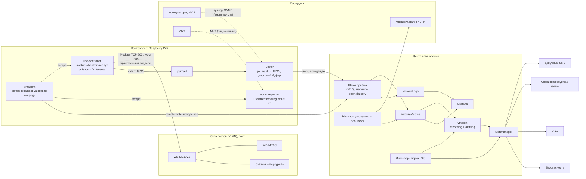

# Observability EVcomm: SRE, эксплуатация и мониторинг парка инсталляций

Версия 0.1 · 25 сентября 2026 года · Статус: предлагаемая архитектура, до реализации. Контекст: [дорожная карта](roadmap_evse_line_control_go_2026-09-25.md) (этап 4 «диагностика, метрики по 100+ постам», этап 5 «длительный прогон»), [исследование транспорта](research_wb_mqtt_serial_go_integration_2026-09-25.md), [архитектура счётчика](mercury230_native_go_reader_architecture_2026-09-25.md), [Auto-Discovery / Auto-Provisioning](hardware_discovery_provisioning_architecture_2026-09-25.md).

Числа в документе — начальные проектные значения и оценки. Пометка «проверить» означает, что значение подтверждается на стенде или по данным первых недель эксплуатации.

## 1. Главное

1. **Observability находится вне контура безопасности.** Отключение линий обеспечивают аренда, безопасный режим MR6C и аппаратная аварийная цепь. Потеря телеметрии, агента или центра наблюдения не меняет поведение управления. Мониторинг ничего не делает с оборудованием сам: он не посылает команд и не продлевает аренду.
2. **Весь трафик к оборудованию идёт только от владельца транспорта.** Любой сторонний Modbus-клиент на порту 502 сбрасывает таймер безопасного режима MR6C. Прозрачный мост на 503 допускает одного мастера. Поэтому внешних Modbus- или SNMP-экспортёров к WB-MGE, MR6C и счётчикам нет. Состояние постов публикует сам `line-controller` из данных, которые он уже читает.
3. **Телеметрия не блокирует цикл управления.** Сейчас `Post.Status()` выполняется через `p.do()` внутри goroutine цикла. Сбор метрик через этот путь добавил бы задержку в такт, а при зависшем цикле сам завис бы. Метрики читают неизменяемый снимок, который цикл публикует атомарно в конце каждого такта (раздел 6.2).
4. **Модель парка: площадка → контроллер → пост → линия.** Каждый контроллер (Raspberry Pi 5) сам собирает метрики и логи и отправляет их наружу **только исходящими** соединениями с mTLS и дисковым буфером. Центр принимает данные нескольких инсталляций, хранит их, строит дашборды и рассылает алерты.
5. **Рекомендуемый стек:** на Pi — `node_exporter`, `vmagent` и Vector; в центре — VictoriaMetrics, VictoriaLogs, vmalert, Alertmanager и Grafana. Контракт с сервисом не зависит от вендора: OpenMetrics на `/metrics` и JSON-логи slog. Если в организации уже есть Grafana-стек или Datadog, меняется только транспорт (раздел 5.3).
6. **Алерты адресуются разным аудиториям.** Дежурному SRE — отказ контроллера, массовая недоступность, сжигание бюджета ошибок. Сервисной службе — неисправности поста и линии: контактор, НЗ, счётчик, эталон MR6C. Учёту — полнота и сохранность данных сессий. Безопасности — заводской шлюз, чужой мастер на шине. Нарушения инвариантов безопасности вызывают дежурного всегда и сразу.
7. **Энергия для расчётов не проходит через систему наблюдения.** Оплачиваемые величины берутся только из неизменяемого журнала (`internal/store`). Мониторинг следит за его здоровьем: ошибки записи, цепочка хешей, отставание резервной копии. Показания в Grafana носят информационный характер.
8. **Перезапуск сервиса отключает все линии контроллера.** `ShutdownOff` по SIGTERM переводит всё в OFF. Поэтому все диагностические переключатели — уровень логов, трассировка кадров по посту — меняются во время работы. Выкатка идёт кольцами, в окно обслуживания или через режим «drain» (раздел 11.3).
9. **Инвентарь парка хранится как код.** Список площадок, контроллеров и постов с окнами обслуживания лежит в Git. Из него генерируются метки агентов, ожидаемый состав для алертов об отсутствии, маршруты Alertmanager и переменные дашбордов. Без ожидаемого состава нельзя заметить контроллер, который пропал целиком.
10. **Порядок работ.** Инструментирование сервиса и агент на Pi (этапы O1–O2, раздел 14) выполнить **до** длительного прогона этапа 5 дорожной карты. Его критерии «ресурсы Pi в норме» и «нет незапрошенных включений» проверяются именно этими метриками.

## 2. Исходные данные и допущения

### 2.1. Объект наблюдения

| Уровень | Что это | Масштаб (допущение) |
|---|---|---|
| Инсталляция / площадка (`site`) | Парковка или объект с изолированной сетью постов | Несколько: 3–20 на горизонте года |
| Контроллер (`controller`) | Raspberry Pi 5, процесс `line-controller`; `controller_id` из [discovery, раздел 5, п. 11](hardware_discovery_provisioning_architecture_2026-09-25.md) | 1–3 на площадку; «один Pi или несколько» — открытый вопрос дорожной карты |
| Пост (`post`) | WB-MGE v.3 + WB-MR6C (RS485-1, Modbus TCP 502) + счётчик «Меркурий» (RS485-2, прозрачный мост 503) | 100–200 на контроллер |
| Линия (`line`) | L1–L3 (K1–K3) и опционально 3P (K4) | 3–4 на пост |
| Окружение (`env`) | `prod`, `stage`, `lab` (стенд с `mr6c-sim` / `mercury230-sim`) | — |

Отсюда масштаб: до ≈ 4 000 постов и ≈ 16 000 линий на весь парк. Это немного для TSDB, но много для людей: без группировки и подавления один отказ коммутатора даёт 200 уведомлений.

### 2.2. Кому нужна система

| Аудитория | Главный вопрос | Что получает |
|---|---|---|
| SRE / платформа | Работает ли сервис на всех контроллерах, выполняются ли SLO, безопасна ли выкатка | Алерты по вызову, SLO-дашборды, дашборд выкаток |
| Эксплуатация / сервисная служба | Какие посты не могут начать зарядку и почему, куда ехать и что менять | Заявки по постам с кодом причины, дашборд неисправностей, прогноз износа контакторов, сроки поверки |
| Учёт / биллинг | Все ли сессии имеют два показания, сохранён ли журнал | Алерты полноты и сохранности, доля `metered` |
| Безопасность | Нет ли обхода изоляции сети постов | Состояние защиты шлюзов, попытки доступа к 80/502/503/504, чужой мастер на порту |
| Владелец площадки | Готовность постов, использование | Ограниченный дашборд своей площадки (tenant) |

### 2.3. Нефункциональные требования

| Требование | Значение (начальное) |
|---|---|
| Влияние на управление | Не должно быть измеримым: p99 интервала между тактами с агентами и без них одинаков в пределах погрешности (проверить в O1) |
| Задержка обнаружения отказа контроллера в центре | ≤ 3 мин |
| Задержка алерта о нарушении инварианта безопасности | ≤ 2 мин от события до уведомления |
| Автономность при потере WAN | Метрики и логи буферизуются не меньше 24 ч без потерь (буфер на диске, раздел 5.5) |
| Работа без центра | Локальная диагностика на площадке: API `/v1/posts`, `/v1/events`, journald |
| Ресурсы Pi под наблюдение | ≤ 10 % CPU одного ядра, ≤ 300 МБ RAM, ограниченная запись на носитель (раздел 5.5) |
| Хранение | Метрики с полным разрешением — 90 дней, агрегаты — 2 года, логи — 30 дней, события безопасности — 1 год |
| Каналы связи | Только исходящие соединения с площадки; WAN может быть LTE с лимитом трафика (проверить) |

## 3. Принципы

1. **Безопасность не зависит от наблюдения.** Метрики, логи и алерты не участвуют в допуске включения и не продлевают аренду. Условия допуска вычисляет контроллер, телеметрия лишь публикует их. Автоматические действия мониторинга над оборудованием запрещены. Автоматика допустима только над самим стеком наблюдения, например перезапуск агента.
2. **Один владелец транспорта.** Данные о шлюзе, MR6C и счётчике собирает тот же адаптер, который владеет портом (раздел 5 discovery). Внешние экспортёры не подключаются к 80/502/503/504 шлюзов. Даже чтение по Modbus сбрасывает watchdog MR6C, а второй клиент прозрачного моста выбивает сессию счётчика или получает `gateway_busy`.
3. **Цикл управления не ждёт телеметрию.** Метрики читают атомарные снимки. Логирование неблокирующее, с ограничением частоты. Экспорт идёт из отдельного процесса-агента с низким приоритетом CPU и I/O.
4. **Push с площадки, pull внутри Pi.** Агент опрашивает `localhost` и отправляет данные в центр исходящим соединением. Никаких входящих подключений к сети постов и к Pi из центра.
5. **Ограниченная кардинальность.** В метках допустимы только перечислимые значения: `site`, `controller`, `post`, `line`, `phase`, `state`, `reason_code`. Свободный текст причины, `command_id`, IP, текст ошибки в метки не попадают. Серийные номера и версии прошивок публикуются только в info-метриках, которые меняются редко.
6. **Коды причин вместо текста.** Каждое состояние, отказ и блокировка получает `reason_code` из закрытого списка (раздел 6.3). Текст с наблюдением `K1=… real=… NC=…` остаётся в логах.
7. **Учёт и наблюдение разделены.** Журнал — источник истины с гарантированной доставкой. Телеметрия допускает потери. Отчёт о переданной энергии строится только из журнала.
8. **Алерт должен требовать действия.** У каждого алерта есть владелец-аудитория, `runbook_url`, код причины и понятное действие. Всё, что не требует действия, остаётся на дашборде.
9. **Парк описан кодом.** Инвентарь, правила, дашборды, маршруты и runbook-и версионируются в репозитории вместе с кодом метрик. Переименование метрики и правка правила идут одним PR и проверяются одним CI.

## 4. Что уже есть в коде

| Место | Фактическое состояние | Что нужно для наблюдения |
|---|---|---|
| `cmd/line-controller/main.go` | `slog.NewJSONHandler(os.Stderr, nil)`: JSON в stderr, уровень INFO фиксирован, без базовых полей. HTTP-сервера нет | Базовые поля `service`, `version`, `controller`; `slog.LevelVar` и уровень по компоненту и посту во время работы; HTTP-сервер для `/metrics`, `/healthz`, `/readyz` (раздел 6.1) |
| `internal/controller/api.go` | `Status()` собирает `PostStatus` через `p.do()` — в goroutine цикла | Для метрик не использовать; публиковать снимок через `atomic.Pointer` (6.2) |
| `internal/controller/post.go` | Причины — свободный текст (`"feedback mismatch while ON: " + obs`); переход логируется `"line state"` с `from`/`to`/`reason`; простой цикла обнаруживается только **на следующем** такте (`gap > LeaseTTL`) | Коды причин (6.3); счётчики переходов и отказов; возраст последнего такта (`step_age`), видимый при зависании «прямо сейчас» |
| `internal/hardware/mr6c` | `Status`: `Connected`, `ModuleOK`, `Silenced`, `Reconnects`, `Safety`, `LastSuccessAt`. Счётчиков транзакций и задержек нет. Все транзакции идут через интерфейс `Bus` | Декоратор `Bus` со счётчиками и гистограммой по операции (6.2); `Reconnects` как counter |
| `internal/hardware/mercury230` | `Status`: `State`, `Transactions`, `Errors`, `LinkErrors`, `Reconnects`, `Alarms` (ключи `internal`, `phase_energy`, `power_access`, `serial`), `Capabilities`. Хук `Trace(Exchange)`; пароль в `Exchange.Req` уже маскируется `r.Mask(frame)` | Метрики из `MeterStatus()` и хука `Trace` (длительность и результат по типу запроса) |
| `internal/supervision` | `Lease` на монотонных часах; в описании пакета упомянуты метрики | Метрики вынести в отдельный `internal/telemetry`: пакет аренды должен остаться без внешних зависимостей |
| `internal/store`, `internal/api` | Заглушки | Метрики здоровья журнала (раздел 12) и HTTP API — вместе с их реализацией |
| `cmd/*-sim`, `cmd/*-bench` | Симуляторы с флагами отказов (`-stuck`, `-factory`, `-no-phase-energy`…), `DebugHang`, `kill -STOP` | Синтетическая площадка и game days для проверки алертов (раздел 13) |
| `.goreleaser.yaml` | tar.gz для linux amd64/arm64 | Поставка конфигов агентов и systemd-юнитов (deb через nfpm или отдельный артефакт) |

## 5. Архитектура

### 5.1. Уровни

| Уровень | Компоненты | Ответственность |
|---|---|---|
| L0. Пост | WB-MGE, MR6C, счётчики | Агентов нет. Наблюдается только через владельца транспорта |
| L1. Контроллер (Pi 5) | `line-controller` (метрики, health, события), `node_exporter` + textfile-коллекторы, `vmagent`, Vector, journald | Сбор, локальный буфер, отправка; локальная диагностика без центра |
| L2. Площадка | Маршрутизатор / VPN, коммутаторы, ИБП, межсетевой экран сети постов | Независимый признак доступности площадки; сетевые и силовые сигналы |
| L3. Центр | Шлюз приёма (mTLS), VictoriaMetrics, VictoriaLogs, vmalert, Alertmanager, Grafana, blackbox-проверки, инвентарь | Хранение, правила, алерты, дашборды; мультиинсталляционный вид |
| L4. Управление парком | Git (инвентарь, правила, дашборды, runbook-и), CI, выкатка релизов, CA для сертификатов | Конфигурация как код, выкатка кольцами, контроль дрейфа |

### 5.2. Схема



Потоки данных:

| Поток | Путь | Гарантия | Назначение |
|---|---|---|---|
| Метрики | `line-controller` / `node_exporter` → `vmagent` (15 с) → remote write → VictoriaMetrics | At-least-once, дисковая очередь; при переполнении теряются старые данные | Состояние, тренды, SLO, алерты |
| Логи и события | stderr → journald → Vector → VictoriaLogs | At-least-once, дисковый буфер; ограничение частоты на источнике | Разбор инцидентов, хронология поста |
| Доступность площадки | blackbox (центр) → ICMP/TCP к VPN-концу площадки | — | Отличить «площадка без связи» от «контроллер умер» |
| Инвентарь | Git → CI → серии `evcomm_inventory_*`, маршруты, silences | Детерминированно, по коммиту | Ожидаемый состав, окна обслуживания |
| Журнал учёта | `internal/store` → резервная копия вне Pi | Долговечно, цепочка хешей | **Не телеметрия**; мониторится только его здоровье |

### 5.3. Выбор стека

| Вариант | Плюсы | Минусы | Оценка |
|---|---|---|---|
| **A. VictoriaMetrics-стек:** vmagent + Vector на Pi; VictoriaMetrics, VictoriaLogs, vmalert, Alertmanager, Grafana в центре | Статические arm64-бинарники; дисковая очередь vmagent для нестабильного WAN; экономное хранение; PromQL-совместимые запросы; single-node долго достаточен | Два агента на Pi вместо одного; VictoriaLogs моложе Loki | **Рекомендуется** для небольшой команды |
| B. Grafana-стек: Alloy на Pi; Mimir/Prometheus, Loki, Grafana в центре | Один агент для метрик и логов; зрелая экосистема | Mimir избыточен при ≈ 10⁵ серий; Alloy на Pi тяжелее (проверить) | Если в организации уже есть Grafana-стек |
| C. Prometheus на каждом Pi + Thanos / federation | Локальные запросы и алерты на площадке | Лишняя TSDB и запись на носитель Pi; сложнее эксплуатировать | Только если площадки подолгу без WAN и нужны локальные алерты |
| D. Внешний SaaS (Datadog, Grafana Cloud) | Нет своей эксплуатации центра | Стоимость по сериям и хостам; вывоз данных за периметр; требования 152-ФЗ, если появятся персональные данные | Допустим; контракт сервиса тот же |
| E. Zabbix | Привычен для железа, SNMP | Плохо подходит для метрик по 16 000 линиям с метками и для SLO | Не рекомендуется как основной |

Решение фиксируется ADR на этапе O0. Независимо от выбора сервис отдаёт OpenMetrics на `/metrics` и пишет JSON-логи. Правила алертов пишутся на PromQL без расширений MetricsQL, чтобы их можно было проверять `promtool test rules` и перенести на другой стек.

Оценка объёма центра: ≈ 17 000 активных серий на контроллер (раздел 6.5). 20 контроллеров дают ≈ 350 000 серий и ≈ 23 000 точек/с. Это нагрузка одного узла VictoriaMetrics средних размеров. Кластер понадобится при росте на порядок (раздел 16).

### 5.4. Сеть и безопасность телеметрии

- `line-controller` слушает `/metrics`, `/healthz`, `/readyz` и `pprof` **только на `127.0.0.1`**. API управления — на интерфейсе управления с авторизацией (этап 4 дорожной карты). Из VLAN постов эти порты недоступны.
- Агент отправляет данные в центр по HTTPS с клиентским сертификатом: CN = `controller_id`, O = `site`. Сертификат выпускает внутренний CA, срок жизни короткий (например, 90 дней) с автоматическим продлением. Срок действия — метрика и алерт.
- **Метки `site` и `controller` проставляет шлюз приёма по сертификату**, а не агент. Скомпрометированный Pi не сможет писать данные от имени чужой площадки. У VictoriaMetrics для этого есть параметр `extra_label` на приёме (проверить на выбранной версии); для логов — эквивалент в прокси перед VictoriaLogs.
- Если площадки принадлежат разным владельцам — отдельный tenant на владельца (у VictoriaMetrics cluster это `accountID`), и доступ в Grafana по tenant-у.
- Секреты не попадают в телеметрию: пароль счётчика, учётные данные MGE, токены API. Пароль в кадре открытия канала уже маскируется в `Exchange.Req`. Нужен тест, который прогоняет симулятор с `-v`/DEBUG и проверяет, что в выводе нет пароля.
- Персональных данных в первом выпуске нет. Если появятся идентификаторы пользователей (RFID, OCPP idTag, номер договора), они не попадают ни в метки, ни в логи. Для корреляции используется `session_id`. Размещение центра — с учётом 152-ФЗ.
- Серийные номера, IP шлюзов и схемы постов — внутренние данные эксплуатации. Внешние роли, например владелец площадки, их не видят.

### 5.5. Бюджет ресурсов на Pi

Зависший или «голодающий» цикл управления — это истёкшая аренда и OFF поста. Поэтому стек наблюдения на Pi изолирован по ресурсам через systemd:

| Юнит | Настройки (начальные) | Смысл |
|---|---|---|
| `line-controller.service` | `CPUWeight=1000`, `IOWeight=1000`, `OOMScoreAdjust=-900`, `MemoryMin=` по замеру | Приоритет цикла управления над всем остальным |
| `observability.slice` (`vmagent`, Vector, `node_exporter`) | `CPUWeight=50`, `CPUQuota=25%`, `IOWeight=10`, `MemoryMax=300M`, `Nice=10` | Жёсткий потолок; целевое среднее — из 2.3. Агент не может отнять CPU и I/O у цикла; при нехватке памяти убивается он |
| Буферы | Очередь `vmagent` и буфер Vector ≤ 2 ГБ суммарно, на NVMe/SSD, не на SD | Переживают 24 ч без WAN; ограниченная запись на носитель |
| journald | `SystemMaxUse=1G`, `RateLimitIntervalSec` / `RateLimitBurst` по замеру | Локальная история на 7+ дней для разбора без центра |

Рекомендация к железу: NVMe через M.2 HAT или USB-SSD для журнала учёта, буферов и journald. Батарейка RTC Pi 5 нужна, чтобы время после перезагрузки без NTP не откатывалось: от времени зависят журнал учёта и порядок событий. Фактическое потребление агентов на Pi 5 измеряется в O2. Критерий: p99 интервала между тактами при работающем стеке не хуже, чем без него.

## 6. Инструментирование line-controller

### 6.1. Модель здоровья

Дорожная карта требует разделять доступность API и готовность оборудования к включению. Статусов три:

| Проверка | Смысл | Когда «плохо» | Потребитель |
|---|---|---|---|
| `GET /healthz` (liveness) | Процесс отвечает | Не отвечает HTTP-сервер или остановились **все** циклы постов | systemd watchdog, `vmagent` (`up`) |
| `GET /readyz` (readiness) | Сервис может принимать команды | Реестр не загружен или журнал недоступен для записи | Балансировщик и клиенты API, выкатка |
| Готовность поста `ready_to_enable` | Пост может начать сессию | Есть хотя бы одна блокирующая причина (ниже) | Оператор, сервисная служба, SLO доступности |

Блокирующие причины поста — закрытый список, публикуются в `GET /v1/posts` и метрикой `evcomm_post_blocked{post, reason_code}`:

| `reason_code` | Условие | Источник |
|---|---|---|
| `link_down` | Нет TCP со шлюзом или модуль не отвечает | `mr6c.Status` |
| `stale_data` | Снимок MR6C старше `stale_after` | Контроллер |
| `lease_invalid` | Аренда не действует | `supervision.Lease` |
| `safety_unverified` | Эталон не прочитан в текущей сессии | `mr6c.Status.Safety` |
| `safety_mismatch` | Эталон расходится | То же |
| `identity_mismatch` | Serial шлюза, MR6C или счётчика не совпал с реестром | discovery, этап 1 |
| `meter_unavailable` | Счётчик обязателен по профилю, но недоступен | Адаптер счётчика |
| `snapshot_pending` | Нет конечного снимка предыдущей сессии (правило дорожной карты, раздел 3) | Сессии (этап 2) |
| `gateway_insecure` | `security_state` шлюза не `secured` | discovery, раздел 3.1.1 |
| `all_lines_faulted` | Все линии поста в `FAULT` / `LOCKED` | Контроллер |
| `maintenance` | Пост выведен в обслуживание | Реестр / инвентарь |
| `provisioning_held` | Незавершённый provisioning | discovery, раздел 8.4 |

Рассинхронизация времени в `readyz` и в блокировки не входит. При долгом отказе WAN NTP недоступен, и такая проверка остановила бы зарядку на всей площадке. Время — это алерт (раздел 9) и признак качества времени в записях журнала. Блокировать ли новые сессии при рассинхронизации, решается в O0 вместе с учётом. Рекомендуется локальный источник NTP на площадке (маршрутизатор).

**systemd watchdog.** `WatchdogSec` пингуется из supervisor-goroutine, пока жив хотя бы один цикл постов (`step_age` < порога) и отвечает HTTP. Один зависший пост — не причина перезапуска: его линии уже отключены безопасным режимом MR6C, а перезапуск отключил бы все остальные. Об этом сообщает алерт. Если зависли все циклы, процесс бесполезен, и systemd его перезапускает. Аппаратный watchdog Pi (`RuntimeWatchdogSec`) покрывает зависание ядра. Оба механизма восстанавливают сервис, а не обеспечивают безопасность (раздел 5 дорожной карты).

### 6.2. Сбор без влияния на цикл

1. **Снимок статуса поста.** В конце `step()` цикл собирает компактную структуру `PostTelemetry`: состояния линий, коды причин, desired, режим, блокировки, время такта. Он кладёт её в `atomic.Pointer[PostTelemetry]`. Коллектор метрик и `GET /v1/posts` читают указатель без блокировок. Аллокация на такт — одна структура на пост. Если такты 100 мс и постов 200, это ≈ 2000 малых аллокаций в секунду; проверить профилем, при необходимости двойной буфер. `Status()` через `p.do()` остаётся для точных запросов API с таймаутом.
2. **Возраст такта.** `lastStep` публикуется атомарно, а коллектор отдаёт `evcomm_control_step_age_seconds{post} = now − lastStep`. Сейчас простой обнаруживается только на следующем такте. Метрика показывает цикл, который висит прямо сейчас и, возможно, уже не вернётся.
3. **Декоратор `mr6c.Bus`.** Обёртка над `Bus` считает транзакции по операции и результату и пишет длительность в гистограмму. Интерфейс вызывается только из goroutine адаптера, поэтому достаточно `time.Now()` и атомарных счётчиков.
4. **Счётчик «Меркурий».** Хук `Trace(Exchange)` адаптера отдаёт длительность и результат по имени запроса. `MeterStatus()` уже защищён мьютексом и дешёв; коллектор вызывает его раз в scrape.
5. **События.** Переходы, завершения команд и отказы увеличивают счётчики в момент события внутри цикла (атомарный инкремент). Лог пишется через обработчик с ограничением частоты (6.6).
6. **Ни одной сетевой операции при scrape.** Коллектор не обращается к оборудованию, шлюзу или журналу. Всё, что требует ввода-вывода (размер журнала, результат проверки цепочки), обновляется фоновыми задачами своих компонентов и только читается.

Пакет `internal/telemetry` содержит регистр метрик, коллекторы, обработчик slog и справочник кодов. От него зависят `controller`, `mr6c` и `mercury230` через узкие интерфейсы. `supervision` остаётся без зависимостей. Библиотека — `github.com/prometheus/client_golang`: native histograms, exemplars, стандартные Go-коллекторы с `runtime/metrics`, включая задержку планировщика. Лёгкая альтернатива — `github.com/VictoriaMetrics/metrics`. Решение — в O1, с учётом `govulncheck` в CI.

### 6.3. Коды причин

Сейчас `reason` — строка с наблюдением. Вводится тип `ReasonCode`. Строка остаётся для логов и API, код идёт в метки и алерты. Начальный справочник по текущему `post.go`:

| `reason_code` | Сейчас в коде | Класс |
|---|---|---|
| `startup`, `reconciled` | `"startup"`, `"reconciled: …"` | Норма |
| `released_after_loss` | `lost + "; outputs found released"` | Отказ связи, безопасный режим сработал |
| `watchdog_not_released` | `"watchdog did not release output: …"` | **Инвариант безопасности** |
| `unsolicited_energize` | `"unexpected change while OFF"`, если выход или фактическое состояние ON | **Инвариант безопасности** (раздел 9 дорожной карты: «нет незапрошенных включений») |
| `nc_changed_while_off` | `"unexpected change while OFF"`, если изменился только НЗ | Неисправность обратной связи |
| `nc_open_while_off` | `"NC feedback open while output is off"` | Обрыв цепи НЗ |
| `on_not_executed` | `"ON not executed by module"` | Модуль / запись |
| `contactor_no_operate` | `"contactor did not operate (NC still closed)"` | Контактор |
| `on_not_confirmed` | `"ON not confirmed"` (прочее) | Модуль / контактор |
| `feedback_mismatch_on` | `"feedback mismatch while ON"` | Контактор / НЗ |
| `contactor_no_release` | `"contactor did not release or NC circuit open"` | Контактор |
| `off_not_confirmed` | `"OFF not confirmed"` (прочее) | Модуль / контактор |
| `loop_stalled` | `"control loop stalled for …"` | Сервис |
| `stale_data` | `"no fresh data from MR6C"` | Связь |
| `operator_reset` | `"reset by operator"` | Норма |
| `command_expired`, `superseded`, `line_not_available`, `write_failed` | Отказы команд | Команда |
| `policy_group_lock`, `policy_phase_budget`, `policy_mode` | Ошибки `policy.CheckEnable` | Корректный отказ политики |
| `safety_unverified`, `safety_mismatch` | `"MR6C safety config not verified"` | Пост |
| `phase_current_while_off` | Диагностика по счётчику (этап 3) | **Инвариант безопасности** (сваренный контакт) |

Для кодов политики `policy.CheckEnable` должна возвращать типизированные ошибки (sentinel), а не только текст. Справочник версионируется. Удалять код нельзя, только объявлять устаревшим: на коды ссылаются правила и runbook-и.

### 6.4. Каталог метрик

Префикс `evcomm_`. Метки `site`, `controller`, `env` добавляются при приёме (5.4) и ниже не указаны. «Info» — gauge со значением 1, где полезная нагрузка в метках. «Enum» — gauge со значением 1 только для текущего значения перечисления: одна активная серия на объект, при смене значения старая уходит в stale.

**Сервис**

| Метрика | Тип | Метки | Смысл |
|---|---|---|---|
| `evcomm_build_info` | info | `version`, `commit`, `goversion` | Версия на контроллере |
| `evcomm_registry_info` | info | `generation`, `sha256` (12 символов) | Какая ревизия реестра загружена; сверка с инвентарём |
| `evcomm_posts_configured` | gauge | — | Постов в реестре |
| `go_*`, `process_*` | стандартные | — | В том числе `go_sched_latencies_seconds`: задержка планировщика объясняет простои цикла |

**Цикл управления и аренда**

| Метрика | Тип | Метки | Смысл |
|---|---|---|---|
| `evcomm_control_step_seconds` | histogram | — | Длительность такта (без метки поста) |
| `evcomm_control_tick_gap_seconds` | histogram | — | Интервал между тактами; хвост ≫ `tick_period` — ранний признак проблем |
| `evcomm_control_step_age_seconds` | gauge | `post` | Возраст последнего такта на момент scrape |
| `evcomm_control_stalls_total` | counter | `post` | Простой дольше `lease_ttl` |
| `evcomm_lease_valid` | gauge | `post` | Аренда действует |
| `evcomm_mr6c_silenced` | gauge | `post` | Адаптер прекратил трафик |

**Линии**

| Метрика | Тип | Метки | Смысл |
|---|---|---|---|
| `evcomm_line_state` | enum | `post`, `line`, `state` | `UNKNOWN`/`OFF`/`ENABLING`/`ON`/`DISABLING`/`FAULT`/`LOCKED` |
| `evcomm_line_desired_on` | gauge | `post`, `line` | Требуемое положение |
| `evcomm_line_state_since_timestamp_seconds` | gauge | `post`, `line` | С какого момента линия в текущем состоянии |
| `evcomm_line_transitions_total` | counter | `post`, `line`, `to` | Переходы |
| `evcomm_line_faults_total` | counter | `post`, `line`, `reason_code` | Переходы в `FAULT`/`LOCKED` по причине |
| `evcomm_line_switches_total` | counter | `post`, `line`, `direction` | Подтверждённые срабатывания контактора |
| `evcomm_line_switches_lifetime` | gauge | `post`, `line` | Срабатывания за жизнь аппарата, из журнала (после этапа 2); для износа |
| `evcomm_lines` | gauge | `state` | Агрегат по контроллеру: сколько линий в каждом состоянии |
| `evcomm_safety_violations_total` | counter | `post`, `kind` | `unsolicited_energize`, `watchdog_not_released`, `phase_current_while_off`; **предынициализирован нулём** для всех постов |

Состояния короче интервала scrape (`ENABLING` длится доли секунды) метрика состояния не показывает, счётчики переходов и события — показывают. Предынициализация `evcomm_safety_violations_total` нужна потому, что `increase()` по серии, которая появилась сразу со значением 1, в PromQL может вернуть 0, и первый же случай будет пропущен.

**Команды**

| Метрика | Тип | Метки | Смысл |
|---|---|---|---|
| `evcomm_commands_total` | counter | `post`, `action` (`on`/`off`), `status` (`confirmed`/`failed`/`unknown`), `reason_code` | Итог каждой команды, включая отказы политики |
| `evcomm_command_stage_seconds` | histogram | `action`, `stage` (`write_ack`/`real_state`/`feedback`) | `CommandTimings`; exemplar с `command_id` и `post` для перехода к логам |
| `evcomm_commands_inflight` | gauge | `post` | Незавершённые команды |

**Пост**

| Метрика | Тип | Метки | Смысл |
|---|---|---|---|
| `evcomm_post_ready` | gauge | `post` | 1 — готов к включению (нет блокирующих причин) |
| `evcomm_post_blocked` | gauge | `post`, `reason_code` | Только активные причины (разреженная) |
| `evcomm_post_mode` | enum | `post`, `mode` | `3x1` / `1x3` |
| `evcomm_post_maintenance` | gauge | `post` | Выведен в обслуживание |
| `evcomm_phase_reserved_amperes` | gauge | `post`, `phase` | Зарезервированный бюджет (раздел 3 дорожной карты) |
| `evcomm_phase_limit_amperes` | gauge | `post`, `phase` | Лимит фазы; позже агрегат по вводу `feeder` |

**MR6C и шлюз**

| Метрика | Тип | Метки | Смысл |
|---|---|---|---|
| `evcomm_mr6c_connected`, `evcomm_mr6c_module_ok` | gauge | `post` | TCP со шлюзом; успешен последний обмен |
| `evcomm_mr6c_connects_total` | counter | `post` | Успешные подключения (`Status.Reconnects`) |
| `evcomm_mr6c_requests_total` | counter | `post`, `op`, `result` (`ok`/`timeout`/`exception`/`transport`) | Декоратор `Bus` |
| `evcomm_mr6c_request_seconds` | histogram | `op` | Задержка транзакции по контроллеру; при 115 200 ожидается порядка 4–6 мс (оценка исследования, раздел 9.2) |
| `evcomm_mr6c_snapshot_age_seconds` | gauge | `post` | Возраст последнего снимка |
| `evcomm_mr6c_safety_ok` | gauge | `post` | Эталон сверен и совпал |
| `evcomm_mr6c_safety_mismatches` | gauge | `post` | Число расходящихся регистров |
| `evcomm_mr6c_info` | info | `post`, `firmware`, `serial` | Инвентарь прошивок |
| `evcomm_post_protection_ok` | gauge | `post`, `device` (`breaker`/`rcd`/`estop`) | Резервные входы 0, 5, 6 — после решения этапа 0 о подключении |
| `evcomm_gateway_security_state` | enum | `post`, `state` | `secured` / `factory_credentials` / `ap_enabled` / `cache_504_open` (discovery, 3.1.1) |
| `evcomm_mr6c_reboots_total` | counter | `post` | Обнаруженные перезагрузки модуля (Fast Modbus, discovery 3.2.1) |

**Счётчики** (`role`: `input` / `line`, для схемы R1)

| Метрика | Тип | Метки | Смысл |
|---|---|---|---|
| `evcomm_meter_state` | enum | `post`, `role`, `state` | `connecting`/`online`/`gateway_busy`/`no_response`/`config_error`/`stopped` |
| `evcomm_meter_up` | gauge | `post`, `role` | `MeterOK` |
| `evcomm_meter_requests_total` | counter | `post`, `role`, `result` | Транзакции и ошибки |
| `evcomm_meter_request_seconds` | histogram | `request` | По типу запроса (`energy_phase`, `power_group`…), без метки поста |
| `evcomm_meter_connects_total` | counter | `post`, `role` | Подключения |
| `evcomm_meter_last_success_timestamp_seconds` | gauge | `post`, `role` | Последний успешный обмен |
| `evcomm_meter_serial_mismatch` | gauge | `post`, `role` | Serial не совпал с реестром |
| `evcomm_meter_alarm` | gauge | `post`, `role`, `key` | Активные тревоги (`internal`, `phase_energy`, `power_access`, `serial`) |
| `evcomm_meter_capability` | gauge | `post`, `role`, `capability` | `phase_energy`, `group_power`, `power_allowed`: 1 / 0; неизвестное не публикуется |
| `evcomm_meter_power_watts` | gauge | `post`, `line` | Мгновенная мощность (информационно) |
| `evcomm_meter_energy_wh` | gauge | `post`, `role`, `register` | Показание A+ (**информационно, не для расчётов**) |
| `evcomm_meter_energy_snapshots_total` | counter | `post`, `role`, `quality` | `fresh` / `disputed` |
| `evcomm_meter_info` | info | `post`, `role`, `serial`, `firmware` | Инвентарь счётчиков |
| `evcomm_meter_clock_offset_seconds` | gauge | `post`, `role` | Расхождение часов счётчика и Pi (раздел 11.3 исследования) |

**Сессии и журнал** (после этапа 2 дорожной карты, имена резервируются сейчас)

| Метрика | Тип | Метки | Смысл |
|---|---|---|---|
| `evcomm_sessions_closed_total` | counter | `quality` (`metered`/`incomplete`/`disputed`) | Полнота учёта |
| `evcomm_sessions_active` | gauge | — | Идущие сессии; условие для выкатки |
| `evcomm_journal_appends_total` | counter | `result` | Запись в журнал |
| `evcomm_journal_last_append_timestamp_seconds` | gauge | — | Журнал жив |
| `evcomm_journal_verify_ok`, `evcomm_journal_verify_timestamp_seconds` | gauge | — | Результат и время проверки цепочки хешей |
| `evcomm_journal_unreplicated_records`, `evcomm_journal_replication_lag_seconds` | gauge | — | Сколько записей ещё не скопировано вне Pi и с какого момента |
| `evcomm_journal_bytes` | gauge | — | Рост журнала; прогноз заполнения носителя |

**Discovery и provisioning** — по [разделу 7.3 discovery](hardware_discovery_provisioning_architecture_2026-09-25.md): длительность и покрытие scan, конфликты identity, возраст доказательств, ожидание владельца порта, итог provisioning, расхождение desired/applied generation. Имена задаются при реализации модуля по тем же правилам.

### 6.5. Кардинальность и объём

| Группа | Серий на пост (оценка) |
|---|---:|
| Линии: состояние, desired, since, переходы и срабатывания (4 линии) | ≈ 28 |
| Команды (разреженные) | ≈ 6 |
| Пост: готовность, режим, бюджет | ≈ 9 |
| Цикл и аренда | ≈ 4 |
| MR6C и шлюз | ≈ 16 |
| Счётчик (один, роль `input`) | ≈ 20 |
| Инварианты безопасности | 3 |
| **Итого** | **≈ 85** |

На контроллер с 200 постами: ≈ 17 000 серий от сервиса, ≈ 300 серий гистограмм без метки поста, 1 000–1 500 серий `node_exporter` в зависимости от коллекторов. Итого ≈ 18 000–19 000 серий и ≈ 1 250 точек/с при интервале 15 с. Схема R1 добавляет ≈ 60 серий на пост за три счётчика линий.

Трафик до центра — порядка десятков–сотен мегабайт в сутки на контроллер с учётом сжатия протокола; измерить в O2. Если WAN лимитирован (LTE), интервал для групп «по посту» увеличивается до 30–60 с, агрегаты остаются на 15 с. Метрики, которые не используются ни в правилах, ни на дашбордах, отбрасываются на агенте (`metric_relabel_configs`). Гистограммы — native, если выбранная связка это поддерживает (проверить), иначе не больше 10–12 бакетов.

Правило в CI: golden-файл со списком метрик, типов и имён меток. Тест регистрирует все коллекторы на реестре с 200 постами и сверяет. Появление новой метки или взрыв числа серий виден в PR.

### 6.6. Логи

Формат остаётся прежним — JSON slog в stderr, дальше journald. Обязательные поля:

| Поле | Пример | Кто добавляет |
|---|---|---|
| `time` | RFC 3339, UTC, наносекунды | slog |
| `level`, `msg` | `ERROR`, `line state` | slog |
| `service`, `version`, `controller` | `line-controller`, `v0.4.1`, `pi-a` | Базовый обработчик в `main` |
| `component` | `controller` / `mr6c` / `mercury230` / `api` / `store` / `discovery` | Уже есть в адаптерах |
| `post`, `line` | `post017`, `L2` | Уже есть |
| `event` | `line.state_changed` | Новое: стабильное имя события (6.7) |
| `reason_code` | `contactor_no_operate` | Новое |
| `command_id`, `session_id` | — | Где применимо |
| `err`, `err_class` | текст; `timeout`/`transport`/`exception`/`access_denied` | `err_class` — для фильтров |
| `site`, `env`, `host` | — | Vector при отправке |

Уровни:
- `ERROR` — нужно действие человека: `FAULT`, расхождение эталона, отказ аутентификации счётчика, смена serial;
- `WARN` — деградация с самовосстановлением: разрыв связи, `gateway_busy`, спорный снимок;
- `INFO` — жизненный цикл и переходы состояний;
- `DEBUG` — каждая транзакция; по умолчанию выключен.

**Ограничение частоты на источнике.** Сейчас в `FAULT` при включённом выходе `writeOff` повторяется каждые 500 мс, и каждая неудачная запись даёт `WARN "write OFF failed"`. Сообщение `"disconnected"` повторяется с каждым backoff. 200 недоступных постов с `reconnect_max` 10 с дают ≈ 20 строк в секунду, ≈ 1,7 млн строк в сутки. Обычная работа — порядка сотни строк на пост в сутки. Обработчик-обёртка пропускает первое сообщение с ключом `(post, event, reason_code)`, затем раз в 60 с пишет сводку с `suppressed: N`. Для `ERROR` с новым `reason_code` ограничения нет.

**Диагностика без перезапуска.** Перезапуск — это OFF всех линий, поэтому:
- уровень логов меняется во время работы: `slog.LevelVar` по компоненту и отдельно по посту;
- трассировка кадров конкретного поста (`Exchange`, кадры Modbus) включается через admin-API с обязательным сроком, например 15 минут, и выключается сама;
- `pprof` доступен на `127.0.0.1` роли admin.

Логи — не журнал. Сырые кадры, которые служат доказательством для учёта, пишутся в `internal/store`, а не в логи.

### 6.7. Каталог событий

Событие — лог-запись с полем `event` из закрытого списка и стабильным набором полей. Для каждого события одновременно увеличивается соответствующий счётчик: алерты строятся по метрикам, события нужны для хронологии и разбора. Кольцевой буфер последних событий по каждому посту (например, 200 записей) отдаётся через `GET /v1/events?post=…&since=…`. Это локальная диагностика на площадке без центра.

| `event` | Уровень | Аудитория | Ключевые поля | Сейчас в коде |
|---|---|---|---|---|
| `service.started` / `service.stopping` | INFO / WARN | SRE | `posts`, `registry_generation` | `"started"`, `"shutting down…"` |
| `service.shutdown_off` | INFO / ERROR | SRE | `post`, `result` | `"OFF not confirmed on shutdown…"` |
| `control.loop_stalled` | ERROR | SRE | `post`, `gap`, `watchdog_expected` | `"control loop stalled, lease expired"` |
| `lease.suspended` / `lease.resumed` | WARN / INFO | SRE | `post` | `"lease expired, traffic suspended…"` |
| `line.state_changed` | INFO / ERROR | Сервис | `post`, `line`, `from`, `to`, `reason_code`, `observation` | `"line state"` |
| `command.finished` | INFO | SRE, сервис | `command_id`, `action`, `status`, `reason_code`, тайминги | `"command finished"` |
| `safety.violation` | ERROR | SRE, безопасность | `post`, `line`, `kind`, `observation` | Новое |
| `mr6c.connected` / `mr6c.disconnected` | INFO / WARN | SRE | `post`, `err_class` | `"connected"`, `"disconnected"` |
| `mr6c.safety_verified` / `mr6c.safety_mismatch` | INFO / ERROR | Сервис | `post`, `firmware`, `registers` | `"safety config …"` |
| `meter.state_changed` | INFO / WARN | Сервис | `post`, `role`, `state` | Косвенно |
| `meter.identified` | INFO | Сервис | `serial`, `firmware`, `capabilities` | `"meter identified"`, `"capabilities"` |
| `meter.serial_changed` | ERROR | Сервис, учёт | `was`, `now` | `"meter serial changed"` |
| `meter.alarm_raised` / `meter.alarm_cleared` | WARN / INFO | Сервис | `key` | `"alarm"`, `"alarm cleared"` |
| `energy.snapshot_disputed` | WARN | Учёт | `issues` | `"energy snapshot disputed"` |
| `post.ready_changed` | INFO | Сервис | `ready`, `blocked_by` | Новое |
| `session.closed` | INFO | Учёт | `session_id`, `quality` (без энергии) | Этап 2 |
| `journal.verify_failed` | ERROR | Учёт, безопасность | `first_bad_record` | Этап 2 |
| `gateway.security_changed`, `discovery.identity_conflict`, `provisioning.*` | WARN / ERROR | Безопасность, сервис | по discovery | Этап discovery |

### 6.8. Трассировка и профилирование

- **Распределённая трассировка в MVP не нужна.** Путь команды проходит внутри одного процесса, его стадии уже измеряются в `CommandTimings`. Сквозной ключ — `command_id`: exemplar на гистограмме, поле в логах, поле в журнале.
- **OpenTelemetry** добавляется вместе с внешним бэкендом, который выдаёт команды: бронирование, биллинг, OCPP. Тогда API принимает `traceparent`, а команда становится спаном со стадиями-событиями. Экспорт идёт через тот же агент.
- **Профилирование** — `pprof` по запросу. Непрерывное профилирование (Pyroscope и аналоги) — только если простои цикла не объясняются метриками планировщика и GC.

## 7. Хост, сеть и окружение площадки

| Сигнал | Источник | Почему важно для EVcomm |
|---|---|---|
| CPU, память, load, PSI | `node_exporter` (`pressure`) | Голодание CPU → простой цикла → OFF поста |
| Температура, троттлинг, пониженное питание | `node_thermal_zone_temp`; textfile-скрипт по `vcgencmd get_throttled` (флаги «сейчас» и «было») | Pi 5 в шкафу поста: перегрев и просадка питания — частая причина сбоев и порчи носителя |
| Время | `node_timex_sync_status`, `node_timex_offset_seconds` (коллектор `timex`), состояние chrony | Метки времени журнала учёта; сверка с часами счётчика. Аренда от часов не зависит (монотонное время) |
| Носитель | `node_filesystem_avail_bytes`, `node_filesystem_readonly`; износ NVMe через smartctl-экспортёр (`percentage_used`) | Журнал учёта; переход ФС в read-only после сбоя SD |
| Сеть Pi | `node_network_*` по интерфейсам управления и постов: ошибки, `carrier_changes` | Отличить отказ порта Pi от отказа коммутатора |
| systemd | `node_systemd_unit_state`, счётчик перезапусков `line-controller` | Каждый перезапуск — OFF всех линий |
| Сертификаты | textfile-скрипт: срок действия клиентского сертификата агента | Истёкший сертификат — площадка «пропала» из центра |
| Межсетевой экран | счётчики nftables по отброшенным подключениям к 80/502/503/504 шлюзов от посторонних хостов | Попытка обойти изоляцию сети постов (раздел 5 дорожной карты, раздел 3.1.1 discovery) |
| Коммутаторы | syslog или SNMP от коммутаторов площадки, если они управляемые (опционально) | Массовый отказ постов из-за порта или коммутатора; события port-security |
| ИБП | NUT-экспортёр, если Pi и коммутаторы на ИБП | Работа от батареи; прогноз отключения |
| Доступность площадки | blackbox в центре: ICMP/TCP до VPN-конца площадки | Независимый от Pi признак: «площадка без связи» или «контроллер не работает» |
| Сам агент | собственные метрики `vmagent` (очередь, отброшенные данные) и Vector (`internal_metrics`) | Наблюдаемость самой наблюдаемости |

`node_exporter` работает с ограниченным набором коллекторов: лишние отключены флагами, чтобы не раздувать число серий.

## 8. SLI и SLO

Начальные цели ниже утверждаются после 30 дней наблюдения на первой площадке. Окно — 30 дней, SLO считается по площадке, если не сказано иное. Посты в обслуживании (`evcomm_post_maintenance == 1`) и окна обслуживания из инвентаря исключаются.

| SLI | Определение | Цель |
|---|---|---|
| **Успешность включения** | `confirmed` / все ON, кроме корректных отказов: коды `policy_*`, `command_expired`, `superseded` | 99,5 % |
| **Время подтверждения** | Доля `confirmed` ON с `feedback` ≤ T. T утверждается на этапе 0 по времени срабатывания контактора и `poll_period`; начально 1 с | 99 % |
| **Готовность поста** | Среднее `evcomm_post_ready` по времени | 99,5 % на пост |
| **Готовность площадки** | Доля времени, когда готовы ≥ 95 % постов площадки | 99,9 % |
| **Полнота учёта** | `metered` / все закрытые сессии | 99,9 % |
| **Сохранность журнала** | Доля времени, когда нет неотреплицированных записей старше RPO (начально 5 мин) | 99,9 % |
| **Свежесть телеметрии** | Доля минут, когда данные контроллера в центре не старше 2 мин, при доступной площадке | 99 % (SLO самой платформы наблюдения) |

**Инварианты безопасности — не SLO.** Бюджета ошибок у них нет: каждое нарушение — инцидент P1 с разбором.

| Инвариант | Как наблюдается |
|---|---|
| Нет незапрошенных включений | `evcomm_safety_violations_total{kind="unsolicited_energize"}` |
| Безопасный режим отпускает выходы после потери аренды | `kind="watchdog_not_released"`; сверка после восстановления (`released_after_loss` — норма) |
| Нет тока на фазе при подтверждённом OFF линии | `kind="phase_current_while_off"` (этап 3) |
| Нет сессии `metered` без двух показаний одного регистра | Проверка журнала (этап 2) |
| Шлюз в работе не в заводском состоянии | `evcomm_gateway_security_state{state!="secured"}` у поста в эксплуатации |

**Политика бюджета ошибок.** Быстрое сжигание вызывает дежурного. Исчерпанный месячный бюджет замораживает выкатку новых версий на площадку, кроме исправлений, до восстановления. Причина исчерпания разбирается и попадает в план работ. Порог «≥ 95 % постов» и цели пересматриваются раз в квартал.

Пример recording-правил для успешности включения (PromQL):

```yaml
- record: evcomm:commands_on_good:rate5m
  expr: sum by (site, controller) (rate(evcomm_commands_total{action="on", status="confirmed"}[5m]))
- record: evcomm:commands_on_valid:rate5m
  expr: |
    sum by (site, controller) (rate(evcomm_commands_total{action="on",
      reason_code!~"policy_.*|command_expired|superseded"}[5m]))
```

## 9. Алерты

### 9.1. Модель

| Severity | Реакция | Канал |
|---|---|---|
| `page` | Немедленно, 24/7 | Дежурный SRE (PagerDuty / Opsgenie / Telegram-бот — выбрать в O0) |
| `ticket` | Рабочее время, в пределах SLA сервиса | Заявка в системе сервисной службы + канал площадки |
| `info` | Без уведомления | Дашборд |

У каждого алерта обязательные метки `severity`, `audience` (`sre` / `field` / `billing` / `security`), `site`, `controller`, при необходимости `post` и `line`, `reason_code`. Аннотации: `summary`, `description` с наблюдением, `runbook_url`, `dashboard_url`.

### 9.2. Каталог

**Безопасность** (`page`, кроме отмеченных; `audience=sre` + копия `security`/`field`)

| Алерт | Условие | `for` |
|---|---|---|
| `EvcommSafetyViolation` | `increase(evcomm_safety_violations_total[5m]) > 0` | 0 |
| `EvcommGatewayInsecureInProduction` | `evcomm_gateway_security_state{state!="secured"} == 1` у поста в эксплуатации | 5m |
| `EvcommForeignMasterOnMeterPort` | `evcomm_meter_state{state="gateway_busy"} == 1` | 2m; `ticket` + `security` |
| `EvcommForeignAccessToGateway` | рост счётчиков nftables по чужим подключениям к 80/502/503/504 | 0; `ticket` + `security` |

**Доступность** (`page`, `audience=sre`)

| Алерт | Условие | `for` |
|---|---|---|
| `EvcommControllerDown` | `up{job="line-controller"} == 0` при `up{job="node"} == 1`: процесс остановлен или завис, хост жив | 1m |
| `EvcommControllerMissing` | Контроллер из инвентаря не присылает данных, а площадка доступна по blackbox | 3m |
| `EvcommSiteUnreachable` | Нет данных и blackbox до площадки неуспешен | 5m; `ticket`, эскалация в `page` через 30 мин |
| `EvcommAllLoopsStalled` / `EvcommControlLoopHung` | `evcomm_control_step_age_seconds > 2` у всех / у отдельных постов | 1m; для отдельных постов — `ticket` |
| `EvcommMassPostOutage` | Доля неготовых постов контроллера (без обслуживания) > 20 % | 5m |
| `EvcommCommandSLOBurnFast` | Сжигание бюджета успешности ON: 1 ч и 5 мин > 14,4, или 6 ч и 30 мин > 6 | — |
| `EvcommJournalAppendFailing` | `increase(evcomm_journal_appends_total{result!="ok"}[5m]) > 0` | 0; также `billing` |
| `EvcommStorageCritical` | Свободно < 10 % или ФС read-only на разделе журнала | 5m |

**Деградация сервиса и хоста** (`ticket`, `audience=sre`)

| Алерт | Условие | `for` |
|---|---|---|
| `EvcommControlStalls` | `increase(evcomm_control_stalls_total[15m]) > 0` | 0 |
| `EvcommSchedulerLatencyHigh` | p99 `go_sched_latencies_seconds` > 50 мс | 15m |
| `EvcommModbusLatencyHigh` | p99 `evcomm_mr6c_request_seconds` > 50 мс по контроллеру | 15m |
| `EvcommLinkFlapping` | `increase(evcomm_mr6c_connects_total[30m]) > 6` по посту: связь рвётся повторно. Одна волна подключений после восстановления сети алерт не вызывает | 0; `ticket` + `field` |
| `EvcommClockUnsynced` | `node_timex_sync_status == 0` или `abs(node_timex_offset_seconds) > 0.5` | 10m; при > 30 мин — `page` + `billing` |
| `EvcommPiThrottled` | Флаги пониженного питания или троттлинга «сейчас» | 5m |
| `EvcommStorageWear` | Износ носителя > 80 % или прогноз заполнения < 14 дней | 1h |
| `EvcommCommandSLOBurnSlow` | Сжигание за 3 дня и 6 ч > 1 | — |
| `EvcommTelemetryBacklog` | Очередь `vmagent` растёт 30 мин или есть отброшенные данные | 30m |
| `EvcommCertExpiringSoon` | До окончания сертификата агента < 14 дней | 1h |
| `EvcommVersionSkew` | Версия вне списка поддерживаемых в инвентаре | 1h |
| `EvcommRegistryDrift` | `evcomm_registry_info` ≠ ожидаемой ревизии из инвентаря | 30m |
| `EvcommControllerRestarted` | Перезапуск `line-controller` вне окна обслуживания | 0 |

**Пост и линия** (`ticket`, `audience=field`)

| Алерт | Условие | `for` |
|---|---|---|
| `EvcommLineFault` | `evcomm_line_state{state=~"FAULT\|LOCKED"} == 1`; в описании — `reason_code` последнего отказа | 5m |
| `EvcommPostSafetyMismatch` | `evcomm_post_blocked{reason_code=~"safety_mismatch\|identity_mismatch"} == 1` | 5m |
| `EvcommPostLinkDown` | `evcomm_post_blocked{reason_code="link_down"} == 1` | 10m |
| `EvcommMeterOffline` | `evcomm_meter_up == 0` | 10m; + `billing`, если есть `snapshot_pending` |
| `EvcommMeterSerialMismatch` | `evcomm_meter_serial_mismatch == 1` | 0; + `billing` |
| `EvcommMeterAuthError` | `evcomm_meter_state{state="config_error"} == 1` | 5m |
| `EvcommPostProtectionTripped` | `evcomm_post_protection_ok == 0` | 1m |
| `EvcommContactorWear` | `evcomm_line_switches_lifetime` > 80 % механического ресурса из профиля аппарата | 1d |
| `EvcommMeterCertificationExpiring` | До окончания поверки < 60 дней (из инвентаря / `MeterCertification`) | 1d; + `billing` |
| `EvcommFirmwareNotApproved` | `evcomm_mr6c_info` / `evcomm_meter_info` вне матрицы совместимости | 1d |

**Учёт** (`ticket`, `audience=billing`)

| Алерт | Условие | `for` |
|---|---|---|
| `EvcommSessionsIncompleteHigh` | Доля `incomplete`/`disputed` за 24 ч > 0,1 % | 1h |
| `EvcommDisputedSnapshots` | Рост `evcomm_meter_energy_snapshots_total{quality="disputed"}` по посту | 1h |
| `EvcommJournalReplicationLag` | `evcomm_journal_replication_lag_seconds > 300` | 5m; при > 1 ч — `page` |
| `EvcommJournalVerifyFailed` | `evcomm_journal_verify_ok == 0` | 0; `page` + `security` |

**Самоконтроль центра**

| Алерт | Условие |
|---|---|
| `Watchdog` | Всегда активен; Alertmanager отправляет его во внешний heartbeat-сервис. Если heartbeat пропал, сломана сама система алертов |
| `EvcommIngestErrors` | Ошибки приёма, отказы по сертификату, ошибки записи в VictoriaMetrics / VictoriaLogs |
| `EvcommRuleEvaluationFailing` | Ошибки вычисления правил vmalert |

### 9.3. Ожидаемый состав и отсутствие данных

Алерт на отсутствие данных невозможен, если не известно, что должно быть. CI из инвентаря (раздел 11.1) публикует серии:

```text
evcomm_inventory_controller{site, controller, env, ring, lifecycle} 1
evcomm_inventory_post{site, controller, post, lifecycle} 1   # lifecycle: production | maintenance | commissioning | retired
```

Пример выражения `EvcommControllerMissing`:

```promql
group by (site, controller) (evcomm_inventory_controller{lifecycle="production"})
unless on (site, controller)
group by (site, controller) (up{job="node"} == 1)
```

То же для постов: пост из инвентаря, которого нет в `evcomm_post_ready`, означает расхождение реестра и инвентаря.

### 9.4. Группировка и подавление

- Группировка в Alertmanager: `group_by: [site, controller, alertname]`. Для `field` — ещё по `post`, чтобы одна заявка соответствовала одному посту.
- Правила подавления:
  - `EvcommSiteUnreachable` подавляет `EvcommControllerMissing` той же площадки;
  - `EvcommControllerDown` / `Missing` подавляет все алерты того же контроллера;
  - `EvcommMassPostOutage` подавляет `EvcommPostLinkDown` и `EvcommMeterOffline` того же контроллера;
  - `EvcommPostLinkDown` подавляет `EvcommMeterOffline` того же поста: общий шлюз;
  - алерты безопасности не подавляются никогда.
- Окна обслуживания из инвентаря CI превращает в silences через API Alertmanager. Посты в `maintenance` исключены прямо в выражениях.

### 9.5. Runbook-и

Для каждого алерта — `deploy/observability/runbooks/<Alert>.md`:
- что означает алерт и чем грозит;
- что проверить: дашборд, `GET /v1/posts/<id>`, события поста;
- безопасные действия;
- эскалация.

Runbook-и повторяют правила управления:
- **никогда** не форсировать ON;
- `reset` линии — только после устранения причины и подтверждённого OFF (`Controller.Reset` сам это проверяет);
- перезапуск сервиса — это OFF всех линий контроллера.

## 10. Дашборды

Иерархия с переходами «вниз» по ссылкам и переменным `site` → `controller` → `post`. Дашборды хранятся как код и генерируются (Grafonnet / JSON из шаблона).

| Дашборд | Для кого | Содержание |
|---|---|---|
| Парк | SRE, руководство | Площадки и контроллеры: версия, доступность, готовые посты, активные линии, открытые алерты, статус SLO и остаток бюджета |
| Площадка / контроллер | SRE | Хост (CPU, температура, троттлинг, носитель, время); цикл (`tick_gap`, stalls, sched latency); сетка постов с цветом готовности и причиной блокировки; задержки Modbus; переподключения; счётчики; журнал |
| Пост | Сервис, SRE | Хронология состояний линий (state timeline); команды и тайминги; эталон MR6C; вход НЗ; мощность по фазам; события поста из логов; переход к логам по `command_id` |
| Неисправности | Сервис | Открытые `FAULT`/`LOCKED` с `reason_code` и давностью; посты без готовности по причинам; рейтинг износа контакторов; сроки поверки; прошивки вне матрицы; состояние защиты шлюзов |
| SLO | SRE | SLI, бюджеты, сжигание по площадкам |
| Учёт | Учёт | Доля `metered`, спорные снимки, отставание журнала, проверка цепочки. Энергия — только из журнала или с пометкой «не для расчётов» |
| Выкатки | SRE | Версии по кольцам, аннотации выкаток, сравнение SLI до и после |
| Платформа наблюдения | SRE | Очереди агентов, свежесть данных по контроллерам, ошибки приёма, ресурсы центра |

Время хранится в UTC, дашборды площадки показывают местное время по часовому поясу из инвентаря.

## 11. Администрирование парка

### 11.1. Инвентарь как код

`deploy/observability/inventory/sites.yaml` — единственный источник ожидаемого состава парка:

```yaml
sites:
  - site: parking-a
    env: prod
    tenant: owner-1
    timezone: Europe/Moscow
    wan: fiber            # fiber | lte-metered
    contacts: {field_queue: "FIELD-PARKING-A", escalation: "sre-oncall"}
    maintenance:
      - rrule: "FREQ=WEEKLY;BYDAY=TU;BYHOUR=3;DURATION=PT2H"
    controllers:
      - controller: pi-a
        ring: canary       # lab | canary | early | stable
        lifecycle: production
        expected_posts: 120
        supported_versions: [">=0.4.0 <0.6.0"]
        registry_generation: "3f9c2a7d10be"
```

Из инвентаря CI генерирует:
- серии `evcomm_inventory_*` для правил отсутствия и дрейфа;
- маршруты Alertmanager по `tenant` и `contacts`;
- silences на окна обслуживания;
- выпуск и отзыв клиентских сертификатов;
- конфигурацию агентов: интервалы по типу WAN, relabel;
- переменные дашбордов.

Пост-уровень инвентаря берётся из реестра, а после discovery — из БД реестра. Инвентарь парка хранит только ожидаемое число постов и ревизию реестра, чтобы не дублировать источник конфигурации (раздел 10 discovery).

### 11.2. Размещение в репозитории

```text
deploy/observability/
  edge/         vmagent.yaml, vector.toml, node_exporter textfile-скрипты, systemd-юниты и slice
  central/      развёртывание центра (compose / Helm values)
  rules/        recording.yml, alerts.yml, tests/*.yml (promtool test rules)
  dashboards/   исходники и сгенерированные JSON
  inventory/    sites.yaml, генераторы
  runbooks/     <Alert>.md
```

Метрики, правила и дашборды меняются в одном PR. CI проверяет:
- golden-файл метрик (6.5);
- `promtool check rules` и unit-тесты правил;
- корректность инвентаря;
- что у каждого алерта есть runbook.

### 11.3. Выкатка

Перезапуск `line-controller` выполняет `ShutdownOff`: все линии контроллера отключаются, идущие зарядки прерываются. Отсюда правила:

1. **Кольца:** `lab` (стенд с 100–200 симуляторами) → `canary` (один контроллер с наименьшей нагрузкой) → `early` (≈ 25 %) → `stable`. Переход к следующему кольцу — после выдержки, например 24 ч, и автоматической проверки:
   - нет новых `reason_code` в отказах;
   - `EvcommControlStalls` = 0;
   - SLI успешности включения не хуже базовой линии;
   - нет алертов безопасности.
2. **Когда перезапускать:** в окне обслуживания площадки или через **drain** — новый режим сервиса. Новые ON отклоняются с кодом `maintenance`, текущие сессии завершаются естественно или по сроку. Перезапуск выполняется при `evcomm_sessions_active == 0` (до этапа 2 — `evcomm_lines{state="ON"} == 0`) или по крайнему сроку окна. Состояние drain видно метрикой и блокирующей причиной `maintenance`.
3. **Аннотации:** каждая выкатка пишет аннотацию в Grafana с версией и кольцом.
4. **Откат:** предыдущий бинарник хранится на Pi; откат — та же процедура с drain.
5. **Обновления ОС и агентов** идут в окнах обслуживания. Сами агенты `line-controller` не перезапускают, но `apt upgrade` нагружает CPU и носитель; изоляция из 5.5 это смягчает, но не отменяет.
6. **Позже, со `StationManager`** (discovery, этап 3), изменение реестра применяется к остановленному посту без перезапуска процесса. Перезапуск нужен только для новой версии бинарника.

### 11.4. Контроль дрейфа

| Что | Как |
|---|---|
| Версия сервиса | `evcomm_build_info` против `supported_versions` |
| Ревизия реестра | `evcomm_registry_info{sha256}` против `registry_generation` в инвентаре |
| Конфигурация агентов | Хеш конфигурации — в метке `evcomm_agent_config_info` (textfile) |
| ОС и ядро | `node_uname_info`, версия образа — textfile |
| Прошивки оборудования | `evcomm_mr6c_info`, `evcomm_meter_info` против матрицы совместимости профилей (discovery, раздел 4) |
| Защита шлюзов | `evcomm_gateway_security_state` |

### 11.5. Удалённый доступ

- Входящих подключений к площадке нет. Для сопровождения — исходящий туннель (например, WireGuard) до бастиона центра, вход по персональным учётным записям, журнал сессий.
- По умолчанию доступ только для чтения: API `/v1/posts`, `/v1/events`, `journalctl`. Действия над постами — только через API сервиса с ролями `observer` / `commissioner` / `admin` (discovery, раздел 9) и записью в журнал. Прямой доступ к портам шлюзов из туннеля закрыт: он нарушил бы принцип одного владельца транспорта.

### 11.6. Роли и доступ к данным

| Роль | Метрики | Логи | Алерты |
|---|---|---|---|
| SRE | Весь парк | Весь парк | Все |
| Сервисная служба | Свои площадки | Свои площадки, без DEBUG | `field` своих площадок |
| Учёт | Сессии и журнал | События учёта | `billing` |
| Безопасность | Защита шлюзов, МСЭ | События безопасности | `security` |
| Владелец площадки (tenant) | Готовность и использование своей площадки | Нет | По договору |

## 12. Граница с учётом энергии

| | Телеметрия | Журнал учёта (`internal/store`) |
|---|---|---|
| Назначение | Эксплуатация, диагностика, SLO | Доказательство для расчётов с пользователями |
| Гарантия | At-least-once с буфером; при длительном отказе возможны потери | Долговечная запись, только добавление, цепочка хешей, копия вне Pi |
| Содержимое | Агрегаты, состояния, информационные показания | Снимки регистра с serial, временем Pi и счётчика, сырые кадры, события линий и команд |
| Хранение | 90 дней / 2 года агрегатов | По требованиям расчётов и закона |
| Отчёты об энергии | Запрещены как источник | Единственный источник |

Мониторинг журнала — метрики здоровья из 6.4 и алерты учёта из 9.2. Для аналитики сессий (использование постов, энергия по периодам) позже подключается отдельное хранилище, которое наполняется из журнала, а не из метрик (раздел 16).

## 13. Проверка системы наблюдения

1. **Unit-тесты правил** (`promtool test rules`): для каждого алерта — ряды, при которых он срабатывает, и ряды, при которых молчит. Отдельно проверяются подавления и предынициализированные счётчики безопасности.
2. **Контракт метрик:** golden-тест (6.5) и тест, который выполняет `Status()` / scrape при заблокированном `DebugHang` цикле и убеждается, что scrape не завис.
3. **Влияние на управление:** стенд из 200 симуляторов MR6C и счётчиков, сравнение p99 `evcomm_control_tick_gap_seconds` и `go_sched_latencies_seconds` с агентами и без них, в том числе при нагрузке агента (отключённый WAN, растущая очередь).
4. **Синтетическая площадка `lab`:** постоянно работающий стенд с `env=lab`, подключённый к центру как обычная площадка. На нём проверяются дашборды, маршруты и выкатка кольца `lab`.
5. **Game days** — сценарии раздела 9 дорожной карты с ожидаемыми сигналами:

| Сценарий | Как воспроизвести | Ожидаемые сигналы | Алерт |
|---|---|---|---|
| Процесс остановлен | `kill -STOP <pid>` на 5 с, затем `kill -CONT` | `up{job="line-controller"}=0` при живом `node`; после CONT — `FAULT` с `released_after_loss` | `EvcommControllerDown`; нет `EvcommSafetyViolation` |
| Зависание цикла при живом адаптере | `hang 5s` в `mr6c-bench` / `DebugHang` | `step_age` растёт, `lease_valid=0`, `silenced=1`, `stalls_total` +1 | `EvcommControlLoopHung`, `EvcommControlStalls` |
| Контактор не срабатывает | `mr6c-sim -stuck 1`, команда ON L1 | `commands_total{status="failed", reason_code="contactor_no_operate"}`, `FAULT` | `EvcommLineFault` |
| Эталон не совпадает | `mr6c-sim -factory` | `safety_ok=0`, `post_blocked{reason_code="safety_mismatch"}` | `EvcommPostSafetyMismatch` |
| Счётчик недоступен | Остановить `mercury230-sim` | `meter_up=0`, `meter_state{state="no_response"}` | `EvcommMeterOffline` |
| Второй мастер на порту счётчика | `mercury230-bench slot` | `meter_state{state="gateway_busy"}` | `EvcommForeignMasterOnMeterPort` |
| Исполнение без пофазной энергии | `mercury230-sim -no-phase-energy` | `meter_capability{capability="phase_energy"}=0`, alarm `phase_energy` | Нет алерта, если профиль допускает; иначе блокировка поста |
| Отказ сети одного шлюза | Правило nftables на IP одного симулятора | `link_down` только у этого поста | `EvcommPostLinkDown`; остальные посты без изменений |
| Отказ коммутатора | Заблокировать всю подсеть симуляторов | Массовая неготовность | Одно уведомление `EvcommMassPostOutage`, поштучные подавлены |
| Потеря WAN на 2 ч | Разорвать туннель до центра | Очередь агента растёт; после восстановления нет дыр в данных | `EvcommSiteUnreachable`, затем разрешение |
| Скачок часов | `date -s` на ±1 ч при выключенном NTP | Смещение времени; аренда не меняется | `EvcommClockUnsynced`; нет `EvcommControlStalls` |
| Заполнение носителя | Заполнить раздел журнала | `readyz` → 503, блокировка новых сессий (после этапа 2) | `EvcommStorageCritical`, `EvcommJournalAppendFailing` |
| Шторм переподключений | Перезапуск всех симуляторов | Одна волна `connects_total`, растянутая джиттером | `EvcommLinkFlapping` не срабатывает; повторные разрывы одного симулятора — срабатывает |
| Сам мониторинг сломан | Остановить Alertmanager | Внешний heartbeat пропал | Уведомление от heartbeat-сервиса |

Game day проводится перед каждым переходом кольца `stable` на новую основную версию и раз в квартал.

## 14. План внедрения

Оценка предварительная, в рабочих днях одного инженера. Этапы O1–O2 опираются на этап 4 дорожной карты («диагностика, метрики по 100+ постам») и должны завершиться до длительного прогона этапа 5.

| Этап | Работа | Срок | Критерий завершения |
|---|---|---:|---|
| O0. Решения | ADR по стеку и размещению центра; канал дежурства; WAN площадок; сроки хранения; начальные SLO; система заявок сервисной службы | 0,5–1 | ADR принят, владельцы аудиторий назначены |
| O1. Инструментирование сервиса | `ReasonCode` и типизированные ошибки политики; атомарный снимок поста и `step_age`; `internal/telemetry`; декоратор `Bus`; хук счётчика; `/metrics`, `/healthz`, `/readyz`; базовые поля логов, `LevelVar`, ограничение частоты; имена событий; `/v1/events`; golden-тест | 4–6 | 200 симуляторов: scrape не зависит от состояния циклов, p99 `tick_gap` без изменений, число серий в пределах оценки 6.5 |
| O2. Площадка | `node_exporter` с textfile-коллекторами (троттлинг, сертификат, nftables); `vmagent` и Vector с дисковыми буферами; systemd slice; mTLS; поставка вместе с релизом | 2–3 | Разрыв WAN на 2 ч без потерь; ресурсы агентов в бюджете 2.3; трафик измерен |
| O3. Центр | Развёртывание стека; шлюз приёма с метками по сертификату; инвентарь и генераторы; recording- и alerting-правила с тестами; маршруты, подавления, silences; дашборды | 3–4 | Лабораторная площадка видна в центре, все алерты 9.2 покрыты тестами |
| O4. SLO и эксплуатация | Burn-rate алерты; runbook-и; game days по таблице 13 | 2–3 | Все сценарии дали ожидаемые сигналы, runbook-и проверены на стенде |
| O5. Управление парком | Кольца выкатки и проверка между кольцами; режим drain; контроль дрейфа; ротация сертификатов; роли в Grafana | 2–4 | Выкатка на `canary` проходит без ручных шагов и без прерывания сессий вне окна |
| Далее | Метрики журнала и сессий (с этапом 2 дорожной карты), диагностика по счётчику (этап 3), discovery (свой план), OpenTelemetry (с внешним бэкендом) | — | — |

Итого 13,5–21 рабочий день. Это инженерная оценка, не смета. O1 можно начинать сразу: он не зависит от выбора стека центра.

## 15. Решения, необходимые до реализации

- Стек и размещение центра: своя инфраструктура или облако; юрисдикция данных. Есть ли в организации действующий мониторинг, с которым надо интегрироваться.
- Тип WAN площадок и лимиты трафика — от этого зависят интервалы опроса.
- Кто дежурит 24/7 и каким каналом; SLA сервисной службы; система заявок.
- Число площадок и контроллеров на горизонте года; один или несколько владельцев площадок (tenant-ы).
- Начальные значения SLO и порог T времени подтверждения — вместе с численными критериями этапа 0 дорожной карты.
- Носитель на Pi (NVMe / SSD / SD) и батарейка RTC.
- Управляемые ли коммутаторы на площадках (syslog / SNMP), есть ли ИБП.
- Подключение резервных входов MR6C 0, 5, 6 (автомат, УЗО, аварийная цепь) — от этого зависит `evcomm_post_protection_ok`.
- Механический ресурс выбранных контакторов — для `EvcommContactorWear`.
- RPO журнала учёта и способ его резервного копирования вне Pi.

## 16. Что пересмотреть при росте

- **> 50 контроллеров или > 1 млн серий:** VictoriaMetrics cluster или Mimir, шардирование приёма, streaming aggregation на агентах.
- **Частые и долгие отключения WAN при необходимости реакции на месте:** локальный vmalert на площадке с уведомлением по резервному каналу (LTE/SMS).
- **Внешний бэкенд (бронирование, биллинг, OCPP):** OpenTelemetry-трассировка сквозь API, SLO пользовательских сценариев («начать зарядку»).
- **Несколько Pi на площадке с HA:** метрики владения постами (`controller_id` у шлюза), алерты на двойное или пустое владение.
- **Аналитика сессий и энергии:** колоночное хранилище (например, ClickHouse), наполняемое из журнала учёта; метрики для этого не используются.
- **События Fast Modbus для НЗ-входов** (discovery, этап 7): время подтверждения перестанет быть кратным `poll_period` — пересмотреть порог T и бакеты гистограмм.
