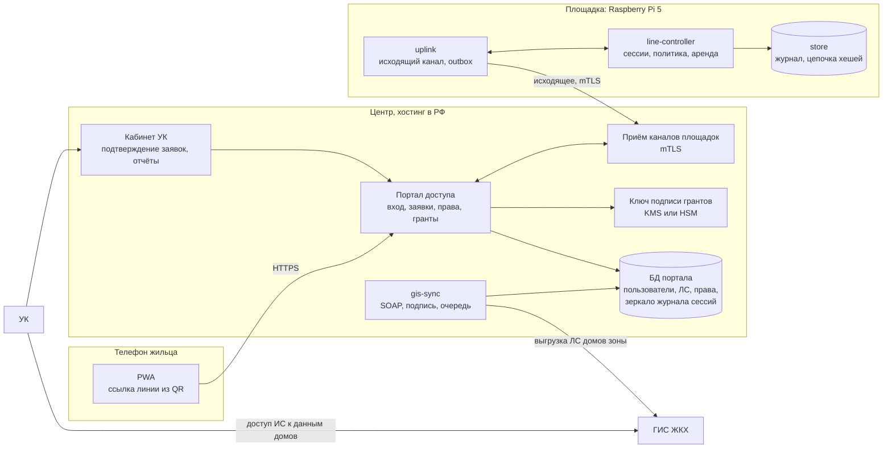
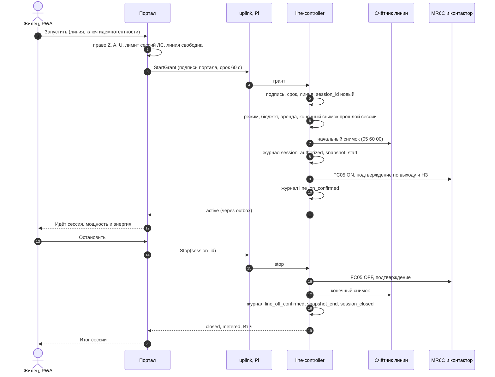

# Дорожная карта ПО управления питанием EVSE

Версия 0.4 · 25 сентября 2026 года · учтены отказ от wb-mqtt-serial и доступ жильцов через PWA с правами от УК по данным [ГИС ЖКХ](gis-zhkh-api-integration.md).

Изменения относительно 0.3:
- **wb-mqtt-serial исключён полностью.** Счётчики опрашиваются из Go напрямую через прозрачный мост WB-MGE по [архитектуре модуля «Меркурий 230»](mercury230_native_go_reader_architecture_2026-09-25.md), модуль реализован. Из плана удалены MQTT-брокер, генератор `wb-mqtt-serial.conf`, адаптер `wbmqtt` и резервный путь MR6C через драйвер (разделы 2, 4, 8–10).
- Однофазный счётчик схемы R1 выбирается с условием, что его протокол реализуется в Go (раздел 1).
- **Добавлен доступ жильцов** (раздел 6). Жилец открывает PWA по ссылке с конкретной линии поста и входит. Право заряжаться в зоне и лицевой счёт дают данные УК из ГИС ЖКХ. Сессия запускается и останавливается кнопкой и пишется в журнал. План работ — дорожка A (раздел 7).
- Уточнены граница выпуска (раздел 1), приёмочные сценарии (раздел 10) и список решений (раздел 11).

История: 0.3 — 100+ постов со своим шлюзом, watchdog на аренде и безопасном режиме MR6C, закрыта ветка cgo; 0.3.1–0.3.2 — энергия сессии по учётному регистру для расчётов с пользователями (раздел 3).

## 1. Цель и исходные допущения

Разработать приложение на Go для Raspberry Pi 5, которое разрешает и отключает питание отдельных линий EVSE на 100+ постах. ПО должно проверять результат переключения, исключать несовместимые режимы и предсказуемо обрабатывать отказы.

Линию включает сам жилец. Он сканирует ссылку на посту, входит в PWA и запускает сессию, если УК разрешила ему заряжаться в этой зоне. Энергия сессии относится на его лицевой счёт (ЛС).

Целевая ОС пока не выбрана. Для планирования принять 64-разрядный Linux (Raspberry Pi OS bookworm, arm64) и проверить на этапе 1.

**Состав поста** (подтверждён):
- **WB-MGE v.3** — шлюз Ethernet ↔ 2×RS-485, режим задаётся отдельно для каждого порта:
  - **RS485-1** → **WB-MR6C v.3** (один на пост), режим Modbus TCP, порт 502;
  - **RS485-2** → трёхфазный счётчик **Меркурий 234 ART-01PR** (5–60 А, 230/400 В) на вводе поста, в схеме R1 — ещё и однофазные счётчики линий. Режим «прозрачный мост», порт 503, опрос из Go.
- Три однофазных контактора: K1→L1, K2→L2, K3→L3. Каждый питает свою однофазную EVSE на 32 А.
- Опционально трёхфазный контактор K4 для трёхфазной EVSE на 32 А.
- Номинал EVSE — 32 А. Оба режима дают до 32 А на фазу, около 22 кВт на пост.
- Режимы поста: `3x1` (K1–K3) или `1x3` (K4). Одновременная работа даёт до 64 А на фазу, это выше 60 А счётчика, поэтому **запрещена**.
- Прочая нагрузка ввода незначительна: встроенные блоки питания модулей поста. Их питать до контакторов **и до учётных счётчиков**, чтобы пользователь не оплачивал это потребление.
- **Учёт для расчётов.** Рекомендуемая схема R1: отдельный однофазный поверенный счётчик после каждого из K1–K3 на RS485-2. Протокол счётчика должен быть реализуем в Go. Кодек протокола «Меркурий» для 230 уже есть, тот же протокол описан для 234/236. У однофазного «Меркурий 200» протокол другой (в wb-mqtt-serial это отдельный `mercury200`), для него нужен свой кодек. Modbus RTU обойдётся дёшево, СПОДЭС/DLMS — дорого. Трёхфазная сессия учитывается вводным Меркурий 234 или отдельным счётчиком после K4. Альтернатива R2 — один трёхфазный счётчик с пофазным учётом, если пофазные регистры входят в метрологические характеристики его типа. Решение принимается на этапе 0 вместе с метрологом и юристом.

Обратная связь — через НЗ-контакты контакторов. Пример исполнения для однофазных линий — ARMAT KMR 63 А 2НО+2НЗ. Точные артикулы, напряжение катушек, номинал вводного автомата, независимую аварийную цепь и защитные аппараты согласовать со специалистом по силовой части до испытаний под нагрузкой.

**Граница выпуска.** ПО управляет питанием линии, а не внутренним состоянием EVSE. Включённое питание не означает, что автомобиль заряжается; отсутствие потребления не доказывает отключение линии.

Входит:
- энергия каждой сессии, пригодная для расчётов с пользователями: разность показаний учётного регистра поверенного счётчика, принадлежащего линии, с неизменяемым журналом-доказательством;
- доступ жильцов (раздел 6): PWA по ссылке линии, вход, право от УК, привязка к ЛС, запуск и остановка сессии.

Не входит: изменение зарядного тока, CP/PP, OCPP, онлайн-оплата и тарифы (начисление делает УК по ЛС). Передача месячных итогов в УК — следующий шаг A6 (раздел 7).

Центральная часть — портал и интеграция с ГИС ЖКХ — нужна только для доступа жильцов. Контур безопасности на площадке от неё не зависит.

## 2. Архитектурное решение

```text
Центр (хостинг в РФ)
  PWA (статика) ─► портал доступа: вход жильца, заявки, права, гранты, зеркало сессий, кабинет УК
  gis-sync ◄─► ГИС ЖКХ (SOAP): лицевые счета домов зоны по доступу, выданному УК
  приём каналов площадок (mTLS)
        ▲
        │ исходящее соединение площадки: гранты и остановки ⇄ события сессий
        │
Raspberry Pi 5 / Linux (площадка)
  line-controller (Go)
    uplink → проверка гранта → сессии ─┐
    API оператора ─────────────────────┴─► правила допуска и бюджет фаз → автоматы постов (аренда на каждый пост)
       ├─ hardware/mr6c: goroutine и TCP на пост ─► WB-MGE[i]:502 (Modbus TCP) ─► RS485-1 ─► WB-MR6C
       └─ hardware/mercury230: goroutine и TCP на пост ─► WB-MGE[i]:503 (прозрачный мост, 9600 8N1) ─► RS485-2 ─► счётчики
    store: журнал (только добавление, цепочка хешей) и outbox событий в центр

Пост i: WB-MR6C K1..K4 → катушки контакторов → линии EVSE; НЗ → входы MR6C
        аппаратная блокировка групп (при согласовании) + независимая аварийная цепь поста
Изолированная сеть/VLAN постов; к портам 502 и 503 шлюзов имеет доступ только Go-хост
```

| Путь | Решение | Обоснование |
|---|---|---|
| Go → Modbus TCP → WB-MGE → MR6C | **Принят для управления** | На шине один модуль, опрос дешёвый. Отказ изолирован по постам. Безопасный режим MR6C работает как watchdog Go-цикла (раздел 5) |
| Go → RTU-over-TCP → прозрачный мост WB-MGE (503) → счётчики | **Принят для измерений и учёта** | Реализован в `internal/hardware/mercury230` и `internal/rtu`. Снимок энергии — синхронный вызов в goroutine поста. В журнал идут сырые кадры с CRC. Кодек умеет только читать. C++20, libwbmqtt и брокер не нужны |
| Портал в центре ↔ контроллер по исходящему каналу | **Принят для доступа жильцов** | Площадка не принимает входящих подключений ([observability](observability_sre_architecture_2026-09-25.md), раздел 11.5). Контроллер исполняет только подписанный порталом грант и сам проверяет все правила допуска (раздел 6.7) |
| wb-mqtt-serial (MQTT/RPC) для счётчиков или MR6C | **Отклонён** 25.09.2026 | Раздел 8 |
| Go → cgo → внутренности wb-mqtt-serial | **Отклонён** | Раздел 8 |

Для Modbus TCP к MR6C в прототипе используется `simonvetter/modbus` (MIT). Для счётчиков готовые клиенты Modbus не подходят: в ответе «Меркурия» нет кода функции. Поэтому транспорт свой — `internal/rtu`: CRC16/Modbus и транзакция «запрос-ответ» с концом кадра по ожидаемой длине.

## 3. Модель управления

Для каждой линии разделить четыре сущности:

- `desired_state` — требуемое положение линии;
- `relay_state` — последнее достоверное чтение выхода MR6C (coil 0…3) и фактического состояния (discrete 96…99);
- `contactor_feedback` — НЗ-контакт контактора;
- `measurement` — ток по фазе, мощность и энергия от счётчиков поста.

Для каждой величины хранить источник, время наблюдения и качество: `fresh`, `stale`, `unknown`, `error`. Контактная обратная связь не является самостоятельным доказательством отсутствия напряжения.

Состояния линии: `UNKNOWN`, `OFF`, `ENABLING`, `ON`, `DISABLING`, `FAULT`, `LOCKED`. `ON` означает подтверждённое разрешение питания, а не «идёт зарядка». Состояние команды хранить отдельно: `accepted`, `in_progress`, `confirmed`, `failed`, `unknown`. Состояние поста: режим (`3x1` / `1x3`), качество связи со шлюзом и модулем, соответствие настроек эталону, аренда.

Правила:

1. Использовать идемпотентное «установить ON/OFF» (FC05 на coil K), а не `toggle`. Повторный запрос с тем же `command_id` не создаёт нового переключения.
2. Каждым постом владеет один исполнитель, операции внутри поста сериализованы. Посты независимы друг от друга. Повторная ON-команда не переигрывает более новую OFF.
3. Ответ Modbus на запись не означает исполнения. После записи нужны свежее чтение выхода и фактического состояния и затем, после переходного процесса, НЗ-вход.
4. При таймауте результат может быть неизвестен. Сначала сверить фактическое состояние, затем решать о повторе.
5. При потере достоверности поста запретить на нём новые включения, запросить отключение доступным путём, дать сработать безопасному режиму (раздел 5). Не показывать OFF без подтверждения.
6. После запуска и восстановления связи выполнить сверку по каждому посту. Автоматическое восстановление ON из базы в первом выпуске запрещено.
7. Ограничить частоту коммутации и выдерживать минимальное время между переключениями. Встроенные задержки MR6C (регистры 1728+) используются как дополнительный предел.

**Переключение режимов поста** `3x1 ↔ 1x3`:
1. отключить текущую группу;
2. подтвердить OFF всех контакторов группы по выходу, фактическому состоянию и НЗ;
3. выдержать паузу;
4. проверить блокировки;
5. включить новую группу.

Ошибка на любом шаге запрещает дальнейшее включение. Несколько Modbus-записей не считать атомарной операцией.

**Бюджет.** Резервировать максимальный согласованный ток разрешённой линии (32 А) по её фазе; для `1x3` — по всем трём. Освободившийся бюджет не выдавать только потому, что автомобиль временно снизил потребление. Лимит фазы поста — меньшее из 60 А счётчика и номинала вводного автомата (уточнить). Если посты сгруппированы на общих вводах, агрегировать бюджет и по вводам — это требуется подтвердить (раздел 11).

**Диагностика по счётчику** (K1→L1, K2→L2, K3→L3):
- В режиме `3x1`: Kn подтверждён OFF по выходу и НЗ, но на Ln стабильно ток выше порога → авария линии, пост `LOCKED`. Возможные причины: сваренный контакт, ошибка монтажа, посторонняя нагрузка. Порог выбирается выше собственного потребления БП поста; фаза питания БП указывается в реестре.
- В режиме `1x3` то же правило действует для всех трёх фаз и K4.
- Ток фазы у лимита → событие оператору, запрет новых включений на посту.
- Обратный вывод запрещён: отсутствие тока не доказывает отключения.

**Энергия сессии (для расчётов).** Оплачиваемая величина — только разность двух показаний учётного регистра, принадлежащего линии (R1: однофазный счётчик линии; R2: пофазный регистр). Начальный снимок — при подтверждённом OFF перед ON, конечный — после подтверждённого OFF. Если регистр линии при OFF не меняется, допустимо позднее чтение. **Новое ON линии запрещено, пока не получены конечный снимок предыдущей и начальный снимок новой сессии.** Качество сессии: `metered` (оплачивается), `incomplete`, `disputed`. Контрольный расчёт ниже хранится как `estimated` и никогда не подменяет показание.

**Владелец сессии.** Сессия открывается только по гранту портала для жильца (раздел 6.7) или по команде оператора. Основание включения пишется в журнал. На линии одновременно открыта не более одной сессии.

Контрольный расчёт. Снимки энергии делаются до подтверждённого ON и после подтверждённого OFF, плюс на каждом событии ON/OFF поста (внеочередное чтение счётчика).
- Если счётчик отдаёт пофазную энергию (AP1–AP3): однофазная сессия — ΔAPn, трёхфазная — ΔTotal A+.
- Если только общий счётчик: трёхфазная и одиночная однофазная сессия — ΔTotal A+. При пересечении однофазных сессий ΔTotal за каждый интервал распределяется пропорционально интегралу пофазной активной мощности P1–P3.

Расчётное распределение не является показанием поверенного средства измерения и в расчёты с пользователями не идёт. Собственное потребление БП поста учитывается как базовая линия.

### Обратная связь и блокировка через НЗ

| Контактор | НЗ №1 | НЗ №2 |
|---|---|---|
| K1–K3 (однофазные, 2НО+2НЗ) | вход MR6C 1–3 (обратная связь) | цепь катушки K4 (аппаратная блокировка) |
| K4 (трёхфазный, 3–4 НО + доп. блок ≥ 2НЗ) | вход MR6C 4 | общее питание катушек K1–K3 |

Входы 5, 6, 0 зарезервированы под состояние вводного автомата или УЗО и аварийной цепи поста. Так можно отличить «отключено защитой» от неисправности. Семи штатных входов хватает, расширение не требуется. Ограничение: ПО не видит контакты, участвующие в блокировке; их проверка вносится в регламент обслуживания. Если силовая часть не согласует аппаратную блокировку, её функцию выполняют программная блокировка и watchdog, а итоговую защиту от перегрузки — вводной автомат. Решение фиксируется на этапе 0.

Интерпретация НЗ после окончания переходного процесса:

| Требуемое положение | НЗ-цепь | Интерпретация ПО |
|---|---|---|
| OFF | Замкнута | Соответствует отпущенному механизму; не доказывает отсутствие напряжения |
| OFF | Разомкнута | Отключение не подтверждено: обрыв цепи или неисправность механизма |
| ON | Разомкнута | Ожидаемо, но возможен и обрыв провода; не единственное доказательство замыкания НО |
| ON | Замкнута | Несоответствие: контактор не сработал или неисправна цепь обратной связи |

Если НЗ разомкнут ещё до ON, включение не разрешать без диагностики. Наличие двух НЗ само по себе не подтверждает свойств зеркального контакта; до получения документации обнаружение сваривания по НЗ не заявлять — для этого служит диагностика по счётчику.

Входы MR6C — «сухой контакт» около 2 мА. [Характеристики](https://wiki.wirenboard.com/wiki/WB-MR6C_v.3_Modbus_Relay_Modules#Технические_характеристики). Проверить пригодность контактов для малого тока и изоляцию между цепью катушек и цепью входов. Подача сетевого напряжения на входы WB исключена. Входы отвязать от управления выходами (матрица действий 384+ и режимы входов).

## 4. Транспорт и восстановление связи

**MR6C (Modbus TCP, порт 502 шлюза).**
- Одна goroutine и одно TCP-соединение на пост.
- Опрос с периодом около 100 мс: FC02 входы 0…7, FC02 фактическое состояние 96…101, FC01 выходы 0…5 (сплошное чтение WB — по результатам этапа 1). Скорость RS485-1 — 115 200 бит/с.
- Переподключение с экспоненциальной задержкой и джиттером, чтобы 100+ постов после восстановления сети не подключались одновременно.
- После переподключения — полная сверка поста, включая эталон настроек (раздел 5).
- К порту 502 имеет доступ только Go-хост: любой другой клиент сбрасывает таймер безопасного режима. Кэширующий мультимастер и сниффер на RS485-1 выключены.

**Счётчики (RTU-over-TCP, прозрачный мост, порт 503).** Подробно — в [архитектуре модуля](mercury230_native_go_reader_architecture_2026-09-25.md), разделы 5–7.
- Порт RS485-2 WB-MGE: прозрачный мост, роль «Сервер», 9600 **8N1** (по умолчанию стоит 8N2).
- Одно TCP-соединение на порт, им владеет одна goroutine. Шлюз допускает одного мастера: второй клиент получает немедленное закрытие, статус `gateway_busy`. После аварийного перезапуска Go слот может оставаться занятым до ~20 с. Снимки по OFF в этот период берутся поздним чтением (раздел 3).
- Конец кадра определяется по ожидаемой длине: шлюз отдаёт ответ частями. Переподключение с экспоненциальной задержкой и джиттером, как для MR6C.
- Опрос: мощность P — раз в 1 с (`08 16`, запасной путь 3 × `08 11`), энергия AP1–AP3 и Total — раз в 15 с. Внеочередной снимок по ON/OFF идёт через ту же очередь запросов с приоритетом. В снимке — серийный номер и сырые кадры.
- В R1 на одной шине 4–5 счётчиков. Их опрашивает одна goroutine по очереди. При 9600 бит/с транзакция занимает 30–170 мс, поэтому бюджет шины проверяется на этапе 1. Если его не хватает, мощность однофазных счётчиков опрашивается реже, а для лимитов берётся вводной счётчик.
- Кодек формирует только команды чтения (`00h`, `01h`, `02h`, `05h`, `08h`). Пароль счётчика хранится вне git и маскируется в логах.
- Качество определяется по времени последнего успешного ответа. Нарушение монотонности, неправдоподобный прирост или расхождение ΣΔAP с ΔTotal дают `disputed`.
- Совместимость Меркурий 234 ART-01PR с кодеком «Меркурий 230» проверить на этапе 1: скорость, адрес, пароль, `05 60 00`.

**Реестр постов** площадки — единственный источник конфигурации оборудования: IP шлюза, адрес MR6C, наличие K4, фаза питания БП, привязка к вводу, эталон настроек MR6C. Для каждого счётчика: порт моста, адрес, серийный номер, дата поверки, уровень доступа, переменная с паролем, `phase_map`. Одинаковые Modbus-адреса на разных шлюзах допустимы. Зоны, дома и коды ссылок линий хранит реестр центра, он ссылается на посты и линии реестра площадки (раздел 6.5).

## 5. Отказы и watchdog

У WB-MR6C есть безопасный режим по таймауту опроса. Таймер перезапускается каждым принятым Modbus-пакетом. [Документация WB-MR6C](https://wiki.wirenboard.com/wiki/WB-MR6C_v.3_Modbus_Relay_Modules). Так как в шину RS485-1 пишет только Go, этот режим используется как **watchdog цикла управления поста**:

- Цикл управления на каждом такте продлевает аренду поста (`lease[p] = now + leaseTTL`).
- Адаптер поста обменивается с MR6C только при действующей аренде. Когда аренда истекла, он не выполняет ни чтений, ни записей.
- Зависание цикла, зависание адаптера, падение процесса, отказ Pi или сети — во всех случаях трафик прекращается, и через `poll_timeout_s` MR6C переводит K1–K4 в OFF.
- Одновременное отключение всех постов при отказе Pi или сети **принято заказчиком** как допустимое.
- Исходное предложение: `leaseTTL` 1 с, `poll_timeout_s` 3 с, итого около 4–5 с до отпускания контакторов. Окончательные значения утвердить на этапе 0.
- Heartbeat из отдельной goroutine, не связанной с циклом управления, требованиям не соответствует.
- Канал к центру (раздел 6.7) не участвует в аренде. Его обрыв или зависание не влияет на цикл управления и не продлевает аренду.

**Эталон настроек MR6C** (Go читает при каждом подключении; при расхождении пост не включается):

| Настройка | Регистр | Значение |
|---|---|---|
| Источник безопасного режима | 19 | таймаут опроса (2) или таймаут/питание шины (0) — выбрать на этапе 0 |
| Таймаут опроса | 8 | утверждённый `poll_timeout_s` |
| Безопасное состояние K1–K6 | 930…935 | Off |
| Действие в безопасном режиме | 938…943 | перевести в безопасное состояние |
| Управление входами в безопасном режиме | 946…951 | запретить |
| Состояние при подаче питания | по шаблону WB | безопасное состояние |
| Связь входов с выходами | матрица 384+, режимы входов | отключена |

Проверить на стенде:
- модуль не восстанавливает ON сам после выхода из безопасного режима;
- шлюз сам не генерирует Modbus-трафик к модулю (проверить анализатором шины).

Встроенный безопасный режим — прошивка того же модуля, что управляет катушками. Он не заменяет независимую аварийную цепь поста и не покрывает отказы самого реле. Восстановление после аварии — только после сверки и новой разрешённой команды. systemd и supervisor используются для восстановления сервиса, но не заменяют аварийную цепь.

## 6. Доступ жильцов: PWA, права от УК, запуск и остановка сессии

### 6.1. Сценарий и принципы

1. На каждой линии поста наклеен QR-код со ссылкой и надписью «Пост 017 · Линия 2». Жилец сканирует его телефоном, открывается PWA.
2. Жилец входит по номеру телефона. При первом входе подаёт заявку: адрес, помещение, номер ЛС.
3. Портал сверяет ЛС с данными ГИС ЖКХ, к которым УК открыла доступ нашей ИС. УК подтверждает заявку. Появляется право: «ЛС № … может заряжаться в зоне …».
4. Жилец нажимает «Запустить». Портал проверяет право и отправляет контроллеру площадки подписанный грант. Контроллер берёт начальный снимок счётчика, включает линию и подтверждает ON. Сессия записывается в журнал.
5. Жилец нажимает «Остановить», либо сессия завершается автоматически. Контроллер отключает линию, подтверждает OFF и берёт конечный снимок. Энергия сессии `metered` относится на ЛС.

Пилот — УК «Академический», Екатеринбург (документ по ГИС ЖКХ).

Принципы:
- **Контур безопасности не зависит от центра.** Портал только разрешает. Режимы, бюджет фаз, блокировки, аренду и снимки проверяет контроллер, как для команды оператора. Никакой отказ центра не может включить линию.
- **ГИС ЖКХ не участвует в синхронном пути старта.** Её данные загружаются заранее. Кнопка работает и при недоступной ГИС ЖКХ, пока данные не устарели.
- **Персональные данные не попадают на площадку.** Контроллер видит только псевдоним ЛС. Телефон и номер ЛС хранятся в центре.
- **Грант — узкое разрешение:** одна линия, одна сессия, короткий срок. Остановка разрешена всегда.

### 6.2. Компоненты



| Компонент | Где | Отвечает за | Не делает |
|---|---|---|---|
| PWA | Телефон | Экран линии, вход, заявка, старт и стоп, статус, история | Не хранит ЛС; токены — только в HttpOnly-cookie; старт офлайн невозможен |
| Портал доступа | Центр | Идентификация, заявки, права, выдача грантов, зеркало сессий, API для PWA | Не управляет реле, не принимает решений о безопасности |
| Кабинет УК | Центр, роль в портале | Подтверждение и отзыв заявок, список ЛС с правом, отчёт по энергии за месяц | Не видит технических данных постов |
| gis-sync | Центр | Обмен с ГИС ЖКХ по актуальному WSDL/XSD, очередь асинхронных запросов, снимки ЛС по домам зоны | Не вызывается из пути старта |
| uplink | Pi | Исходящий канал к центру: приём грантов и остановок, отправка событий из outbox | Не открывает входящих портов |
| line-controller | Pi | Проверка гранта, сессия, снимки, ON/OFF, автостоп | Не знает телефон и номер ЛС |

### 6.3. Ссылка линии

- Формат: `https://<домен>/l/<code>`. `code` — случайный идентификатор не короче 64 бит (13 символов base32), не номер поста. Соответствие `code → площадка, пост, линия` хранится только в портале. Код можно перевыпустить при замене наклейки, после этого старый перестаёт работать.
- На наклейке — QR, короткий домен и крупная надпись «Пост 017 · Линия 2». PWA показывает ту же надпись. Перед стартом она просит подтвердить: «Кабель подключён к посту 017, линия 2?». Это защищает от ошибки в выборе линии. Против подменённой наклейки (фишинговый QR) помогает сверка домена в адресной строке с напечатанным.
- Ссылка не даёт права, это только указатель на линию. Без входа PWA показывает статус линии и предлагает войти.
- Статус линии в PWA: «свободна», «занята», «неисправна», «недоступна в текущем режиме поста». В режиме `1x3` доступна линия `3P`, в `3x1` — L1–L3.
- PWA запоминает линию в «Моих линиях», и следующий запуск возможен без сканирования. Физическое присутствие у поста не проверяется: у поста нет дисплея, а CP/PP вне выпуска. От сессии на чужом автомобиле защищают подтверждение линии и автостоп без потребления (6.6).

### 6.4. Вход жильца

| Способ | Плюсы | Минусы | Решение |
|---|---|---|---|
| Телефон и одноразовый код (SMS или звонок) | Привычно, без сторонних учётных записей | Стоимость SMS, перевыпуск SIM, перебор кодов | **Первый вход** |
| Passkey (WebAuthn) после первого входа | Без SMS, устойчив к фишингу, биометрия телефона | Нужен современный браузер; при смене телефона — снова код | **Повторный вход**, рекомендуется |
| ЕСИА (Госуслуги) | Подтверждённая личность, СНИЛС | Подключение к ЕСИА, сроки; СНИЛС плательщика в данных ЛС не гарантирован | На будущее |

- Код: 6 цифр, срок 5 минут, не более 5 попыток. Частота запросов ограничена по номеру и по IP.
- Сессия портала: короткий access-токен и refresh-токен в cookie `HttpOnly; Secure; SameSite=Strict`. Устройства видны жильцу и УК, их можно отозвать.
- Web Push о конце сессии и об аварии — опционально. На iOS он работает только у PWA, установленной на домашний экран (iOS 16.4+).

### 6.5. Права: зона, лицевой счёт и подтверждение УК

**Зона** — группа линий, которой пользуются жильцы определённых домов, например парковка ЖК. Реестр центра: `зона → УК, дома (идентификаторы ГИС ЖКХ), посты и линии`. Жилец может заряжаться в зоне, если его ЛС относится к помещению в доме этой зоны и УК это подтвердила.

Право складывается из трёх частей:

| Часть | Источник | Что проверяется | Хранение |
|---|---|---|---|
| Z. Доступ к зоне | УК в ГИС ЖКХ предоставила нашей ИС доступ к данным домов зоны ([инструкция для УК](https://cdn.dom.gosuslugi.ru/webhelp/new/topics/administration/grant_access/grant_is_operator-uo.html)) | Доступ действует, срок не истёк, дом входит в зону | `zone_grant`: дом, срок, виды информации, время проверки |
| A. Лицевой счёт | `exportAccountData` по дому (имя из регламента v5; сверить с актуальным WSDL) | ЛС существует, не закрыт, относится к помещению в доме зоны; помещение совпадает с заявкой | `account_snapshot`: номер ЛС, идентификатор в ГИС ЖКХ, помещение, статус, версия выгрузки |
| U. Подтверждение УК | Кабинет УК в портале | Заявитель проживает в помещении или владеет им и может заряжаться за счёт этого ЛС | `enrollment`: пользователь, ЛС, зона, кто и когда подтвердил, срок |

В просмотренной документации ГИС ЖКХ нет признака «разрешена зарядка» у ЛС. Поэтому ЛС и доступ к дому (части A и Z) берутся из ГИС ЖКХ, а решение УК по конкретному жильцу (часть U) фиксируется в портале. Если в актуальном комплекте найдётся способ отразить допуск в ГИС ЖКХ, часть U тоже можно брать оттуда. Кандидат — справочник дополнительных услуг организации, но это нужно проверить (раздел 11).

Пока доступ в ГИС ЖКХ не получен, УК может загрузить реестр ЛС файлом в кабинете. Он ложится в ту же модель `account_snapshot`, помечается источником `uk_upload` и заменяется выгрузкой ГИС ЖКХ, когда она появится. Основание для передачи таких данных — договор с УК (6.10).

Привязка жильца к ЛС:

| Способ | Как работает | Оценка |
|---|---|---|
| **Заявка и подтверждение УК** | Жилец вводит адрес, помещение и номер ЛС. Портал сверяет их с `account_snapshot`, УК подтверждает в кабинете | **Для пилота.** Простая техника, но нагрузка на УК |
| Код приглашения от УК | УК выдаёт одноразовый код, привязанный к ЛС (в квитанции или по запросу). Жилец вводит код, и привязка происходит без ручной проверки | При росте числа жильцов |
| ЕСИА и сверка СНИЛС плательщика | Автоматическая проверка личности | Если СНИЛС есть в данных ЛС и подключена ЕСИА |

Правила:
- К одному ЛС можно привязать нескольких пользователей, например членов семьи. УК подтверждает каждого отдельно.
- Число одновременных сессий на ЛС ограничено политикой зоны (по умолчанию 1).
- Право отзывается, если УК отозвала подтверждение, ЛС закрыт в выгрузке или истёк доступ Z. Новые старты запрещаются сразу. Активная сессия завершается штатно, немедленную остановку УК выбирает явно.
- Срок годности данных. `account_snapshot` обновляется ежедневно. Если выгрузка старше `gis_max_age` (предложение — 7 суток), новые привязки запрещены. Старты по уже подтверждённым правам — по политике УК (раздел 11).
- Решение о старте фиксирует версии данных: `enrollment_id`, версию `account_snapshot`, `zone_grant`. Спор по начислению разбирается по этим записям.

### 6.6. Запуск и остановка сессии



Состояния сессии. Источник истины — контроллер, портал хранит зеркало.

`authorized → starting → active → stopping → closing → closed` с качеством `metered`, `incomplete` или `disputed`. Отказы: `rejected` — у портала нет права; `start_failed` — контроллер отклонил по политике, снимку или неподтверждённому ON.

- `starting`: грант принят, берётся начальный снимок, линия включается. Если ON не подтверждён, линия переводится в OFF, сессия получает `start_failed`, энергии нет.
- `closing`: линия подтверждённо OFF, ожидается конечный снимок (позднее чтение, раздел 3). До `closed` новая сессия на линии запрещена.

Сессия останавливается по первой из причин. Причина пишется в журнал как `stop_reason`.

| Причина | Кто решает | Работает без центра |
|---|---|---|
| Кнопка «Остановить» в PWA | Владелец сессии | Нет |
| Нет потребления `idle_start_timeout` после старта (предложение — 15 мин): вероятно, не та линия или автомобиль не заряжается | Контроллер | Да |
| Потребление прекратилось и не возобновилось `idle_end_timeout` (предложение — 30 мин): зарядка закончена | Контроллер | Да |
| Предельная длительность `max_duration` из гранта (предложение — 14 ч) | Контроллер | Да |
| Отзыв права УК с немедленной остановкой | Портал | Нет |
| Авария линии, `FAULT` / `LOCKED`, потеря достоверности поста | Контроллер | Да |
| Команда оператора | API оператора | Да |

- «Нет потребления» — мощность линии со счётчика ниже порога (порог выше шума) и нет прироста энергии. Таймеры простоя идут только по свежим данным. Пока счётчик `stale`, по простою сессию не останавливаем, действует `max_duration`.
- **Остановка под нагрузкой.** Кнопка во время зарядки снимает питание при идущем токе. Это разрешено только после проверки документации EVSE и согласования силовой коммутации (раздел 10, последний абзац). Пока проверки нет, PWA сначала просит завершить зарядку в автомобиле. Контроллер снимает питание, когда ток упал ниже порога, но не позже `stop_grace` (предложение — 2 мин).
- Идемпотентность. PWA генерирует ключ идемпотентности на каждое нажатие. Повторное нажатие или повтор запроса после обрыва сети возвращает ту же сессию. `session_id` (ULID) выдаёт портал. Из него строятся `command_id` линии: `<session_id>/on` и `<session_id>/off`. Повтор гранта с тем же `session_id` не создаёт второго включения (правило 1 раздела 3).
- Одна открытая сессия на линию. Портал проверяет это при выдаче гранта, контроллер — повторно, как источник истины.
- Время отклика. Канал центр–площадка — меньше 1 с, снимок — около 0,2 с, ON с подтверждением по НЗ — около 0,5 с. Цель — статус `active` в PWA не позже чем через 5 с (p95); утвердить до стенда.

Известное ограничение. Жилец может уйти, не остановив сессию, а другой автомобиль — подключиться к линии до автостопа. Тогда энергия уйдёт на ЛС первого жильца. Без CP/PP или авторизации в самой EVSE это не исключается полностью. Смягчение — короткий `idle_end_timeout` и push «зарядка не идёт — остановить?». Надёжное решение — OCPP или RFID в EVSE (R4, будущее расширение).

### 6.7. Грант и канал площадка–центр

Грант — подписанное порталом разрешение на одну сессию:

```text
StartGrant {
  session_id           ULID, уникален
  site, post, line
  account_ref          псевдоним ЛС: HMAC от идентификатора ЛС, ключ только в центре
  user_ref             псевдоним пользователя
  enrollment_id        основание права
  issued_at, not_after срок действия гранта ≤ 60 с
  max_duration, idle_start_timeout, idle_end_timeout, stop_grace
  key_id, signature    Ed25519
}
```

- Открытые ключи портала хранятся в конфигурации контроллера, ротация — по `key_id`. Контроллер проверяет подпись, срок по своим часам (NTP и RTC, допуск ±30 с), совпадение площадки и линии и уникальность `session_id` по журналу. Хеш гранта пишется в журнал как доказательство основания включения.
- Ключ подписи хранится отдельно от TLS-ключей портала (KMS или HSM). Даже скомпрометированный канал или шлюз приёма не может включить линию.
- `Stop{session_id}` исполняется по любому аутентифицированному сообщению канала: отключение — безопасное направление. Что останавливает владелец сессии, УК или оператор, проверяет портал.
- Канал — исходящее соединение контроллера к центру, mTLS с сертификатом площадки. CA тот же, что для телеметрии ([observability](observability_sre_architecture_2026-09-25.md), раздел 5.4). Двунаправленный поток gRPC или WebSocket и формат гранта (JWS EdDSA или своя структура) выбираются ADR на этапе A0. Heartbeat, переподключение с джиттером.
- События сессий и статусы линий уходят через outbox: запись в журнал → отправка → подтверждение центром по порядковому номеру. Доставка at-least-once, центр дедуплицирует по `(site, seq)`, хранит зеркало журнала сессий и проверяет цепочку хешей.

### 6.8. Журнал и данные сессии

Журнал площадки (`internal/store`) — источник для расчётов. Для сессии жильца в него добавляются записи:

| Запись | Содержимое |
|---|---|
| `session_authorized` | `session_id`, линия, `account_ref`, `user_ref`, `enrollment_id`, хеш гранта, `key_id`, время |
| `snapshot_start` | Показание регистра, серийный номер, сырые кадры, качество (раздел 3) |
| `line_on_confirmed` / `start_failed` | `command_id`, тайминги, причина |
| `stop_requested` | `stop_reason`, инициатор: `user_ref`, УК, оператор или контроллер |
| `line_off_confirmed`, `snapshot_end` | Как в разделе 3 |
| `session_closed` | Вт·ч, качество `metered` / `incomplete` / `disputed`, контрольное `estimated` |

В БД портала в центре:
- соответствие `account_ref → ЛС, дом, помещение` и `user_ref → телефон`;
- заявки, подтверждения УК, версии выгрузок ГИС ЖКХ;
- зеркало журнала сессий с проверкой цепочки хешей.

Отчёт УК за месяц собирается только из `metered`-сессий журнала: период, ЛС, кВт·ч, ссылки на сессии, версия расчёта. Эта модель предложена в [разделе 5 документа по ГИС ЖКХ](gis-zhkh-api-integration.md#5-применение-к-общей-зарядной-станции). Жилец видит в PWA историю своих сессий с энергией и причиной остановки.

### 6.9. Отказы

| Отказ | Поведение |
|---|---|
| ГИС ЖКХ недоступна или отвечает ошибкой | Старты по действующим правам идут. Новые привязки ждут. После `gis_max_age` — по политике УК |
| Центр недоступен или нет канала площадки | Новые старты невозможны, PWA показывает «площадка не на связи». Активные сессии продолжаются и завершаются автостопом или `max_duration` на контроллере. События копятся в outbox и уходят после восстановления |
| Канал оборвался сразу после отправки гранта | Портал показывает «исход неизвестен» и после восстановления сверяет сессию. Повтор с тем же `session_id` не даёт второго включения |
| Грант пришёл после `not_after` | `start_failed: grant expired`, линия не включается |
| Счётчик линии недоступен при старте | Нет начального снимка — нет ON (раздел 3), `start_failed` |
| Счётчик недоступен при остановке | Линия OFF, сессия в `closing` до позднего чтения, новая сессия на линии запрещена |
| Перезапуск контроллера во время сессии | Линии OFF (аренда и сверка, разделы 3 и 5). При старте открытые сессии журнала переходят в `closing` с причиной `controller_restart`. Автоматического возобновления нет, жилец запускает новую сессию |

### 6.10. Безопасность и персональные данные

- Телефон, номер ЛС и адрес помещения — персональные данные. Они хранятся только в центре, хостинг в РФ (локализация по 152-ФЗ). Согласие жильца на обработку собирается в PWA при первом входе. Роли оператора ИС и оператора ПДн и основание получения данных ЛС (договор с УК, поручение обработки) определяет юрист.
- На площадке и в телеметрии — только `session_id`, `account_ref`, `user_ref`, как требует [observability](observability_sre_architecture_2026-09-25.md), раздел 5.4. Утверждение «персональных данных в первом выпуске нет» там нужно уточнить: теперь они есть, но только в центре.
- Роли портала: `resident`, `uk_operator` (только своя УК и её зоны), `site_operator`, `admin`. На каждом запросе проверяется владение объектом — сессией, заявкой, ЛС (защита от IDOR).
- ГИС ЖКХ: регистрация ИС оператором, сертификат ИС, подписание и защищённое соединение — по действующему регламенту (документ по ГИС ЖКХ, раздел 2). Ключ ИС доступен только gis-sync.
- Лимиты на вход по коду, заявки и старты на пользователя и линию. Журнал безопасности портала: входы, изменения прав, выдача грантов, отклонённые гранты на площадках.
- PWA: только HTTPS, CSP; service worker кэширует только оболочку приложения, данные сессий офлайн не хранятся.

## 7. Этапы разработки и критерии завершения

Оценка предварительная: один опытный Go/Linux-разработчик на основную дорожку, стенд минимум из двух постов и участие специалиста по силовой части. Сроки указаны в рабочих днях; закупка, ожидание схемы, доработки EVSE и внешние согласования — отдельно. Статус — на 25.09.2026 по README.

**Основная дорожка — контроллер площадки.**

| Этап | Срок | Статус | Работа и результат | Критерий завершения |
|---|---:|---|---|---|
| 0. Требования и схема | 2–3 дня | Не начат | Зафиксировать ОС, схему поста, аппараты, блокировку, вводной автомат, эталон MR6C, `leaseTTL` / `poll_timeout_s`, группировку по вводам. С метрологом и юристом — учётную схему R1/R2 и модель однофазного счётчика с протоколом, реализуемым в Go | Утверждены таблица сигналов, условия включения, предел времени снятия разрешения |
| 1. Вертикальный прототип | 3–5 дней | Код готов: MR6C (аренда, watchdog, эталон), «Меркурий 230» (кодек, адаптер, стенд, симулятор). Осталось: реальное оборудование | Go ↔ WB-MGE (502) ↔ MR6C: ON/OFF, НЗ, аренда. Go ↔ WB-MGE (503) ↔ счётчик: проверки раздела 10 архитектуры модуля. Совместимость 234 ART-01PR с кодеком. Для R1 — однофазный счётчик на той же шине RS485-2, бюджет опроса шины | Измерен цикл ON/OFF; watchdog срабатывает при `kill -STOP`; `mercury230-bench check` без FAIL на реальном счётчике; поддержка пофазной энергии определена опытом; установка воспроизводится на чистой системе |
| 2. Ядро управления | 9–13 дней | Частично: автомат линий, идемпотентность, сверка, реестр | Реестр счётчиков (серийные номера, поверка). Адаптер RS485-2 для нескольких счётчиков на одной шине (R1). Модель сессии, снимки, неизменяемый журнал (только добавление, цепочка хешей) с outbox | Тесты повторных и конфликтующих команд, восстановления, переключения режимов и снимков сессии проходят; нет ложного `confirmed`; нет `metered`-сессии без двух показаний одного регистра |
| 3. Отказы и блокировки | 4–6 дней | Частично: эталон MR6C, НЗ, блокировка групп, бюджет фаз, запрет включений при устаревших данных | Диагностика по току счётчика, потеря достоверности счётчика, прогон всех согласованных отказов | Каждый согласованный отказ даёт заданное поведение; новый режим не включается без подтверждённого отключения старого |
| 4. API и эксплуатация | 3–4 дня | Не начат | Локальный API оператора с авторизацией, диагностика, метрики по 100+ постам, служба Linux, обновление и откат | Оператор может добавить пост из реестра, диагностировать и восстановить его по инструкции |
| 5. Стенд, масштаб и пилот | 6–8 дней | Не начат | Реальные EVSE; рестарты, разрывы; 100–200 симуляторов MR6C и счётчиков (`mr6c-sim`, `mercury230-sim`); длительный прогон | Протокол испытаний принят; нет незапрошенных включений; соблюдён срок снятия разрешения; ресурсы Pi в норме |

Итого основная дорожка — 27–39 рабочих дней. Если однофазный счётчик R1 работает не по протоколу семейства «Меркурий 230», к этапу 2 добавляется 2–4 дня на кодек.

**Дорожка A — доступ жильцов.**

| Этап | Срок | Зависит от | Работа и результат | Критерий завершения |
|---|---:|---|---|---|
| A0. Договорённости и решения | 2–3 дня + внешние сроки | — | Способ привязки ЛС и регламент заявок с УК. Политика зоны: лимиты, `max_duration`, таймеры простоя, реакция на отзыв права. 152-ФЗ и договор с УК. Заявка ИС в ГИС ЖКХ и доступ УК к домам пилота. SMS-провайдер, домен. ADR канала площадка–центр и формата гранта | Утверждены сценарий, роли и политика зоны; заявка ИС подана |
| A1. Сессии на контроллере и канал | 5–7 дней | Этап 2 | `internal/session`: проверка гранта, автостоп, остановка с ожиданием спада тока. `internal/uplink`: mTLS, поток команд, outbox, сверка после обрыва. Симулятор центра | Проходят тесты повторного, просроченного, подделанного гранта и гранта для чужой линии; обрыва канала после гранта; перезапуска с открытой сессией. Нет ON без гранта и начального снимка |
| A2. Портал: вход и права | 6–8 дней | A0 | Вход по коду, passkey, пользователи, заявки, кабинет УК, зоны, коды линий и печать наклеек, выдача грантов, зеркало журнала, загрузка реестра ЛС файлом | Путь «скан → вход → заявка → подтверждение УК → право» проходит; тесты IDOR проходят |
| A3. PWA | 5–7 дней | A2 | Экран линии, вход, заявка, старт и стоп с прогрессом, мощность и энергия, история, установка на домашний экран, Web Push (опционально) | Работает в актуальных iOS Safari и Android Chrome; `active` не позже 5 с (p95) на стенде |
| A4. Интеграция с ГИС ЖКХ | 8–12 дней + ожидание доступа | A0: ИС одобрена, доступ УК выдан | gis-sync: SOAP-клиент по актуальному WSDL/XSD, подпись, очередь асинхронных запросов с получением результата, выгрузка ЛС домов зоны, снимки с версиями, сопоставление с заявками. Проверка на СИТ | Выгрузка ЛС домов пилота сопоставлена с заявками; закрытие ЛС в выгрузке блокирует новые старты |
| A5. Испытания доступа | 4–6 дней | A1–A4, этап 5 | Сквозные сценарии раздела 10 на стенде. Отказы центра, ГИС ЖКХ и канала. Нагрузка: 100+ постов, пик одновременных стартов. Проверка безопасности: подмена QR, перебор кодов, IDOR, повтор гранта | Протокол испытаний; нет старта без права; все `metered`-сессии совпадают в журнале площадки и зеркале центра |

Итого дорожка A — 30–43 рабочих дня. Самые длинные сроки внешние: регистрация ИС в ГИС ЖКХ и доступ от УК могут занять недели, поэтому заявку подают на этапе A0. До получения доступа A4 ведётся по WSDL/XSD и на СИТ, а пилот может стартовать с реестром ЛС, загруженным УК файлом.

Следующий шаг, вне оценки: **A6 — передача месячных итогов по ЛС в УК.** Сначала — выгрузка из кабинета УК, затем через ГИС ЖКХ по сценарию, согласованному с УК (документ по ГИС ЖКХ, раздел 5). Критерий пилота — корректное начисление в квитанции жителя, а не только принятый запрос.

Всего 57–82 рабочих дня. Порядок: 0 → 1 → 2 → 3 → 4 → 5; A0 идёт параллельно этапу 0, A2–A4 — параллельно этапам 1–4, A1 — после этапа 2, A5 — вместе с этапом 5. С отдельным разработчиком портала и PWA календарный срок — ориентировочно 8–12 недель при своевременном доступе к ГИС ЖКХ. Это инженерная оценка, не фиксированная смета.

## 8. Отклонённые пути: wb-mqtt-serial и cgo

**wb-mqtt-serial — отказ 25.09.2026.** В версии 0.3 драйвер оставался для счётчиков и как резервный путь к MR6C. Теперь он не используется совсем. Причины:
- Модуль «Меркурий 230» на Go реализован и проверен на симуляторе. P1–P3 читаются одним запросом вместо трёх, снимок по событию ON/OFF — синхронный, в журнал-доказательство идут сырые кадры с CRC (сравнение — раздел 5 архитектуры модуля).
- Прозрачный мост WB-MGE допускает одного мастера на порт, поэтому Go и драйвер не могут работать на одном порту.
- Больше не нужны сборка C++20 и libwbmqtt из исходников под arm64, MQTT-брокер и его ACL. Установка — один статический бинарник.
- Резервный путь MR6C через драйвер ломал watchdog: драйвер сам опрашивает модуль, и зависание Go не включает безопасный режим.

Цена: протоколы счётчиков реализуем сами (кодек, fuzz-тесты, симулятор). Сервисный доступ к порту через homeui возможен только с выводом поста из работы. Пересматривать, только если понадобится счётчик с дорогим в реализации протоколом (например, СПОДЭС), — и тогда сначала оценить реализацию на Go.

Следствия для кода, отдельной задачей:
- удалить `cmd/gen-serial-config`, `internal/measurements/wbmqtt` и значение `wbmqtt` у `meter.driver` в реестре; поле `driver` оставить для будущих типов счётчиков;
- обновить README, комментарии `internal/measurements` и упоминания в архитектуре discovery.

**cgo** — ветка закрыта ещё в 0.3. Встраивание wb-mqtt-serial требовало собственного C ABI поверх внутренних классов без стабильного API, сборки C++20 и libwbmqtt ради выигрыша в миллисекунды. С отказом от драйвера вопрос снят окончательно.

## 9. Минимальная структура Go-модуля

```text
cmd/line-controller          сервис площадки
cmd/mr6c-bench, mr6c-sim     стенд и симулятор MR6C
cmd/mercury230-bench, -sim   стенд и симулятор счётчика
cmd/ev-portal                центр: API PWA, вход, заявки, права, гранты, кабинет УК
cmd/gis-sync                 центр: обмен с ГИС ЖКХ
web/pwa                      PWA, статические файлы
internal/domain              посты, линии, команды, наблюдения, состояния, сессии
internal/registry            реестр постов и его проверка
internal/controller          последовательности, сверка, аренда
internal/policy              режимы 3x1/1x3, бюджет фаз, блокировки
internal/session             сессия линии: грант, снимки, автостоп, качество
internal/hardware/mr6c       Modbus TCP, карта регистров, эталон настроек
internal/hardware/mercury230 протокол «Меркурий»: кодек (только чтение), адаптер, проверка показаний
internal/rtu                 CRC16 и транзакция через прозрачный мост
internal/measurements        интерфейс Source
internal/supervision         аренда, контроль работоспособности, метрики
internal/store               журнал: только добавление, цепочка хешей, outbox
internal/uplink              исходящий канал к центру: гранты, остановки, события
internal/api                 API оператора и диагностика
internal/sim                 симуляторы MR6C и счётчика
internal/portal/...          центр: identity, enrollment, zones, grants, sessions, ukcabinet
internal/gis                 центр: SOAP-клиент, подпись, очередь запросов
```

Код центра и площадки лежит в одном модуле, но собирается в разные бинарники. `line-controller` не импортирует `internal/portal` и `internal/gis`; правило проверяется линтером (depguard в `.golangci.yml`).

Контракт оборудования поста: `SetOutput(ctx, line, state)`, `ReadSnapshot(ctx)`, поток наблюдений `Watch(ctx)`, `VerifySafetyConfig(ctx)`. Возврат из `SetOutput` не означает физического исполнения: уровень подтверждения указывается явно. Доменные правила не зависят от Modbus и транспорта счётчиков и работают с симулятором. Счётчики скрыты за `measurements.Source`: `Power`, `Energy`, `EnergySnapshot(ctx, line)`, `Status`.

Минимальные операции API оператора:
- получить посты, линии, режим и качество данных;
- установить требуемое состояние с `command_id` и сроком действия;
- сменить режим поста;
- получить результат команды;
- снять блокировку после проверки причины;
- получить журнал и диагностику.

Канал площадка–центр: `StartGrant`, `Stop`, события сессии, статус линии для PWA (свободна, занята, неисправна, режим, мощность).

API портала для PWA:
- `GET /v1/lines/{code}` — линия и её статус;
- `POST /v1/auth/code`, `POST /v1/auth/verify`, регистрация и вход по passkey;
- `POST /v1/enrollments` — заявка на привязку к ЛС;
- `POST /v1/sessions` с `Idempotency-Key` — запуск;
- `POST /v1/sessions/{id}/stop` — остановка;
- `GET /v1/sessions/{id}`, `GET /v1/sessions` — статус и история своих сессий.

Доступность API и готовность оборудования к включению — разные статусы.

## 10. Приёмочные сценарии

**Контроллер и оборудование.**

| Сценарий | Ожидаемое поведение |
|---|---|
| Go завис или остановлен (`kill -STOP`), зависание цикла при живом адаптере | Аренда истекает, трафик прекращается, K1–K4 OFF за утверждённое время |
| Отказ Pi, коммутатора или сети | Все затронутые посты OFF за утверждённое время; после восстановления нет автоматического ON, переподключение с джиттером |
| Недоступен один шлюз или RS-485 одного поста | Затронут только этот пост: запрет включений, безопасный режим MR6C, остальные посты работают |
| Посторонний клиент на порту 502 | Доступ заблокирован сетью; в тесте с разрешённым доступом фиксируется, что это ломает watchdog |
| Посторонний клиент занял порт 503 или счётчик молчит | Статус `gateway_busy` или `stale`; управление работает; ON с учётом запрещены до начального снимка |
| Настройки MR6C отличаются от эталона (замена модуля) | Пост не включается, выдаётся диагностика |
| Обратная связь расходится с командой | Авария и блокировка линии |
| Ток на фазе при подтверждённом OFF линии | Авария, пост `LOCKED` |
| Счётчик линии недоступен в момент OFF | Сессия ждёт конечного снимка; новое ON линии запрещено до его получения; при восстановлении связи — позднее чтение, сессия `metered` |
| Замена счётчика, событие вскрытия или пропадания питания счётчика | Сессия `disputed`, сессии не склеиваются через разные серийные номера |
| Журнал изменён вне приложения | Нарушение цепочки хешей обнаруживается при проверке |
| Одновременный запрос `3x1` и `1x3` | Допускается один режим; переключение только после подтверждённого отключения |
| ON потеряла ответ, затем пришла OFF | Сверка; устаревшая ON не восстанавливает питание |
| Перезапуск SBC или модуля | Старт без автоматического ON, сверка, новое разрешение |
| EVSE восстановила питание | Проверено, нужен ли RFID или кнопка, сохраняет ли лимит тока, как реагирует автомобиль |
| Масштаб: 100–200 постов (симуляторы) | Время цикла, CPU, память, горутины, шторм переподключений в норме |
| Длительный прогон | Контролируются зависания, ресурсы, задержки, число коммутаций |

**Доступ жильцов.**

| Сценарий | Ожидаемое поведение |
|---|---|
| Скан QR без входа | Статус линии и предложение войти; управления нет |
| Старт без подтверждения УК, с закрытым в выгрузке ЛС или с истёкшим доступом УК | `rejected`, линия не включается |
| Двойное нажатие «Запустить», повтор после обрыва сети | Одна сессия, одно ON |
| Грант подделан, просрочен, выдан для другой площадки или линии, повтор `session_id` | Контроллер отклоняет, запись в журнал безопасности, линия OFF |
| Второй жилец запускает занятую линию | Отказ «линия занята» |
| Жилец пытается остановить чужую сессию | Отказ, событие безопасности |
| Старт на линии без подключённого автомобиля | Автостоп через `idle_start_timeout`, энергия около нуля |
| Центр недоступен во время сессии | Сессия идёт и завершается автостопом или `max_duration`; события доходят после восстановления |
| ГИС ЖКХ недоступна | Старты по действующим правам работают, новые привязки ждут |
| УК отзывает право во время сессии | Новые старты запрещены, сессия завершается по политике |
| Перезапуск контроллера во время сессии | Линия OFF, сессия закрыта с `controller_restart`, без автоматического возобновления |
| Сверка журналов | Журнал площадки и зеркало в центре совпадают по цепочке хешей, энергия `metered` сходится |

До стенда назначить численные критерии: срок выполнения команды, допустимый возраст наблюдения, `leaseTTL`, `poll_timeout_s`, предел отключения, пауза перед повторным включением, порог тока диагностики. Для доступа жильцов: срок гранта, время до `active`, `idle_start_timeout`, `idle_end_timeout`, `stop_grace`, `max_duration`, `gis_max_age`. Плановый прогон — 48–72 часа плюс сценарные испытания.

Повторяемое снятие питания во время зарядки допустимо включать в штатную логику только после проверки документации конкретной EVSE и согласования силовой коммутации.

## 11. Решения, необходимые для следующей версии

**Оборудование и учёт.**
- ОС Raspberry Pi 5 и способ установки сервиса.
- Номинал вводного автомата поста; группировка постов по общим вводам (агрегированный бюджет).
- Точные артикулы контакторов (для K4 — 3–4 НО и доп. блок не меньше чем на 2 НЗ), напряжение катушек, согласование аппаратной блокировки через вторые НЗ.
- Подключение резервных входов 5, 6, 0 (автомат или УЗО, аварийная цепь).
- Значения `leaseTTL` и `poll_timeout_s`, источник безопасного режима (регистр 19).
- Совместимость Меркурий 234 ART-01PR с кодеком «Меркурий 230»: скорость, адрес, пароль, пофазная энергия.
- Участвуют ли измерения счётчиков в допуске включения или только в диагностике.
- **Учётная схема R1 или R2** (решено: энергия идёт в расчёты с пользователями). Модель однофазного счётчика и её протокол с учётом реализации на Go, метрологическое подтверждение пофазных регистров для R2, правовая модель услуги, срок хранения журнала.
- Схема питания собственных нужд поста до учётных счётчиков.
- Один Pi на все посты или несколько контроллеров.
- Модели EVSE, допустимость отключения под нагрузкой (кнопка «Остановить» во время зарядки), поведение при возвращении питания.

**Доступ жильцов.**
- Способ привязки жильца к ЛС (заявка, код УК, ЕСИА), регламент и срок подтверждения заявок в УК.
- Политика зоны: число сессий на ЛС, `max_duration`, таймеры простоя, реакция на отзыв права и на устаревшие данные ГИС ЖКХ.
- Можно ли отразить допуск к зарядке в самой ГИС ЖКХ (часть U) или он остаётся в портале.
- Оператор ИС в ГИС ЖКХ и оператор ПДн, договор с УК, текст согласия жильца, размещение центра.
- Прямой SOAP к ГИС ЖКХ или посредник (раздел 6 документа по ГИС ЖКХ).
- Канал площадка–центр (gRPC или WebSocket), формат гранта, хранение ключа подписи.
- SMS-провайдер, домен и изготовление наклеек.
- Способ передачи месячных итогов в УК (A6).

Рекомендуемые первые задачи:
- Разработка: стенд «Go → WB-MGE (Modbus TCP) → MR6C → контактор с НЗ» с арендой и проверкой watchdog при `kill -STOP`, плюс `mercury230-bench check` на реальном счётчике на втором порту того же шлюза.
- Доступ жильцов: подать заявку ИС в ГИС ЖКХ и согласовать с УК способ привязки ЛС — у этих задач самые длинные внешние сроки.
